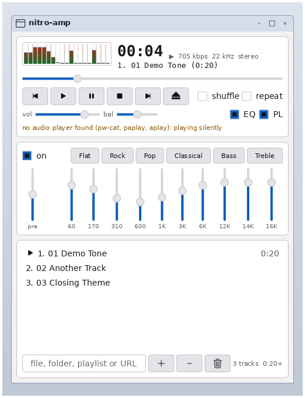

# nitro-amp

A Winamp-style music player for nitro: the main window, the ten-band
equaliser and the playlist editor docked beneath it, a spectrum analyser
and oscilloscope, and Winamp's keys — written the way every nitro app is,
as a state struct, a widget tree built once and callbacks, and scriptable
through `hey` with no code of its own for it.

It is a **reimplementation, not a port of the source**. Winamp's code is
Windows C++ under its own licence and its skins are somebody's artwork;
neither is copied. What is carried over is the behaviour a Winamp user's
hands expect.



```console
$ cargo run -p nitro-amp -- ~/Music            # a folder, files, .m3u or .pls
```

With nothing on the command line it reopens the playlist it had when it
quit (`$XDG_CONFIG_HOME/nitro/amp.m3u8`, settings in `amp.conf`).

## What plays it

| | how | without it |
|---|---|---|
| WAV | parsed in-process (`src/wav.rs`): 8/16/24/32-bit PCM, 32/64-bit float, extensible | — |
| everything else | `ffmpeg` child writing `f32le` to a pipe; `ffprobe` for tags and length | the status line says the file needs `ffmpeg` |
| output | `pw-cat`, else `paplay`, else `aplay`, fed on stdin | plays **silently** at real time, and says so |

No codec crate and no audio library: `DEPENDENCIES.md` has the argument.
The one crate this depends on is `nitro-ui`.

## Keys

| key | does | key | does |
|---|---|---|---|
| `z` | previous | `←` / `→` | seek 5 s |
| `x` | play | `↑` / `↓` | volume |
| `c` | pause / resume | `Ctrl+T` | elapsed ↔ remaining |
| `v` | stop | `Alt+G` | fold the equaliser |
| `b` | next | `Alt+E` | fold the playlist |
| `l` | open (the path field) | `Delete` | remove the selected track |
| `s` / `r` | shuffle / repeat | `Ctrl+Q` | quit |

**The window fits what is showing**, as Winamp's docked windows did.
Fold the playlist away and the window shrinks to the main window and
the equaliser, and its height locks there: those have one right height.
Unfold it and the window grows back to the list height you last dragged
it to, and is resizable again. Folding the equaliser takes exactly its
height off and leaves the list alone. The folds and the list height are
remembered across runs.

Letters and arrows only reach the player when no widget wants them: a
focused slider keeps its arrows, the path field its letters. Clicking the
clock flips it too, and clicking the visualiser cycles spectrum → scope →
off.

## Driving it with `hey`

```console
$ hey nitro-amp do window/path set_text ~/Music
$ hey nitro-amp do window/add click
$ hey nitro-amp do window/play click
$ hey nitro-amp get window/title value
1. Artist - Song (4:05)
$ hey nitro-amp do window/volume set_value 60
$ hey nitro-amp do window/preset_rock click
$ hey nitro-amp do window/eq_1k set_value -3
$ hey nitro-amp do window/vis set_value scope
$ hey nitro-amp do window/eq click              # fold the equaliser away
```

Every control is named: `prev play pause stop next eject`, `seek volume
balance`, `shuffle repeat eq pl`, `clock` (and its `clock_text`),
`title info status vis`, `eq_on preamp eq_60 … eq_16k preset_*`,
`playlist path add remove clear total`.

## How it is built

| module | what |
|---|---|
| `engine.rs` | the audio thread: decode → equalise → volume → output, and the status the window reads |
| `source.rs` | the WAV decoder and the `ffmpeg` one behind one `Source` trait |
| `sink.rs` | the output process, or silence |
| `dsp.rs` | RBJ peaking biquads for the equaliser, the gain, a radix-2 FFT and the analyser's fall/hold |
| `playlist.rs` | the list, shuffle (a permutation, so every track once per cycle) and repeat, M3U and PLS |
| `vis.rs` | the visualiser widget |
| `tap.rs` | a clickable container, for the clock |
| `fmt.rs` | the clock and the scrolling title |

**The audio is on its own thread** because playing is a blocking write
into a pipe that drains at the sound card's rate, and the app loop may
never block. The window sends commands down a channel and reads a status
snapshot on a 30 Hz tick while anything is moving. Seeks are coalesced,
so dragging the seek bar restarts `ffmpeg` once per burst, not once per
pointer move.

**Idle when idle.** Stopped or paused, the audio thread blocks on its
channel and the window has no timer once the analyser's bars have
fallen: nothing wakes, nothing is sent.
`the_visualiser_cycles_and_a_stopped_player_goes_idle` checks it.

**The clock is what you hear.** What has been written to the output is
ahead of what has come out of the speaker by about one pipe's worth. The
clock and the visualiser subtract that, and pausing rewinds the decoder
to the heard position, so the audio still in the pipe when the output is
stopped is played again on resume rather than lost.

**The visualiser costs one `SetBounds` per moving bar.** One gradient rect
fills the display and never changes. A background-coloured cover hangs
over each bar and shortens as the bar rises, so a frame sends only the
covers and peak caps that moved (`src/vis.rs` explains it).

Two toolkit features were added for it, both in `nitro-ui`: a vertical
`Slider` (`.vertical()`) for the equaliser, and `Ui::set_collapsed`, which
takes a section out of the layout entirely when the EQ or PL toggle is
switched off. See `docs/ui.md`.

## Tests

`cargo test -p nitro-amp`: the decoders, DSP, playlist and formatting as
unit tests; the engine end to end with fake `ffmpeg`, `ffprobe` and
`pw-cat` scripts (`tests/engine.rs`: the samples written to the fake
player are checked against the volume); and the window on a real server
through the harness (`tests/amp.rs`).
