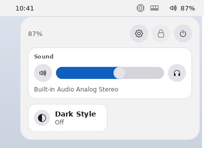
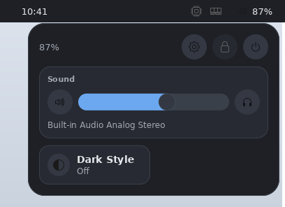
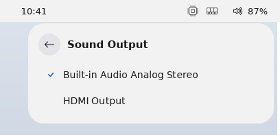
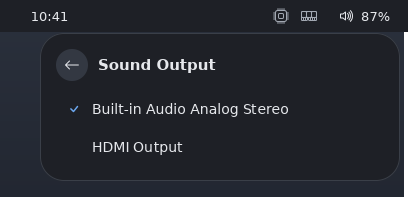

# nitro-bar

The desktop's **top bar**, and the first program written against the
[shell socket](../../docs/shell.md).

```text
┌────────────────────────────────────────────────────────────────────────┐
│ ≣  ▸ Calculator │ hello-dialog    09:41      87%+  ⚙ 0.4  ▤ 1.2/3.3G │
└────────────────────────────────────────────────────────────────────────┘
  launcher   ─── window list ───    clock     battery  load    memory
```

It is a `nitro-ui` app like any other — a state struct, a tree built
once, a callback per button — with exactly one difference: it connects to
`shell.sock` rather than `wire.sock`. That is what lets it live on the
`Top` layer, span the top edge of its output, and reserve 32 px of screen
space the rest of the desktop may not use. **The socket is the
capability**: the bar is privileged because of where it connected, not
because of anything it sent.

Run it against a server (`just fake` in another terminal):

```console
$ cargo run -p nitro-bar
```

`NITRO_BAR_HEIGHT` overrides the 32 px height (and the strip it
reserves). `NITRO_SHELL_SOCKET` overrides the socket path.

## What each section is

| section | name | what it does |
|---|---|---|
| launcher | `launcher` | fires the launcher's trigger (M3-D) |
| window list | `windows` | one button per window: click focuses, **middle-click closes** |
| clock | `clock` | local `HH:MM`, one update per minute |
| status pill | `status` | volume icon (`status_volume`) + battery; opens the quick-settings menu |
| battery | `battery` | inside the pill: `/sys/class/power_supply/*`, e.g. `87%+` |
| load | `load` | the 1-minute average from `/proc/loadavg`, one decimal |
| memory | `mem` | used/total from `/proc/meminfo`, e.g. `1.2/3.3G` |

The window list is **subscribed, not polled**: `WindowList` is answered
once and afterwards the server sends a `WindowInfo` whenever a window
appears, is retitled, changes state or takes focus, and a `WindowGone`
when one closes. The focused window's entry is marked `▸`.

Middle-click sends `CloseWindow`, which is a *request*: the owning client
is told and decides, so unsaved work survives a misclick. Both it and the
click are **silently refused** by the server when they cannot be honoured
— a stale window id names nothing — because a task list must not be able
to wedge the keyboard by naming the wrong row.

## Idle costs nothing

With nothing changing, the bar puts **zero bytes on the wire between
clock ticks**, and the clock ticks once a minute. Three mechanisms:

* the window list is subscribed rather than polled, so nothing is sent
  to ask "has anything changed?";
* the clock's timer is **aligned to the minute boundary** and re-armed
  from inside its own callback, so it fires at `:00` rather than every
  second to check whether the minute rolled over — and it cannot drift,
  because the interval is recomputed each time;
* the sensors are polled every 30 s and the poll's readings are compared
  against the last ones **before the tree is touched at all**, so an
  unchanged reading costs no mutation and no commit. (A `Label`'s setter
  also returns early on an unchanged string; that is a second line of
  defence, not the mechanism.)

### The sensor rule

> A sensor may only repaint when its **rendered** string changes, and no
> sensor renders more often than every **30 s**.

Both halves are load-bearing, and the second one was learned the
expensive way. At the 5 s poll the spec asked for, with the load average
rendered verbatim as the kernel's `%.2f`, an idle desktop painted **six
frames per ten seconds**: the load moved 0.17 → 0.23 → 0.21 while the CPU
did nothing, and every one of those was a `SetText`, a commit and a
server-side repaint of the label's region. Work proportional to change is
the right rule only when the change is one the user asked for.

So the load is rendered with **one decimal** (`0.17`, `0.23` and `0.21`
all become `0.2`) and every sensor polls at **30 s** — battery, load and
memory alike. Rounding narrows the noise rather than abolishing it — two
readings either side of a boundary still differ — which is why the 30 s
cap is the other half rather than a belt-and-braces addition. Nothing
real is lost either way: the kernel smooths the load average over a
minute, so twice a minute is as fresh as that number can be, and memory
in tenths of a GiB does not move faster. Together the two halves cap an
idle bar at what the clock costs, and leave the door open to panel
self-refresh, which a display flipping twice every ten seconds would
defeat.

The clock is **not** on that 30 s budget: it is minute-aligned, so it
repaints at `:00` and at no other time.

### Measured on the box

Test box (2-core Pentium, 1920×1080), the shell plus one application up,
pointer parked off the bar, `frames` from `nitro-shot --stats` over a
fixed wall interval. A frame counter is the right instrument here:
"does the display move at all" is a counting question, and `paint_us_mean`
at ~0.3 µs resolution answers a different one.

| | frames |
|---|---|
| 45 s containing **no** minute boundary | **0** |
| 4 minutes, sampled every 5 s | **2 per `:00` and at no other time** |
| whole desktop tree, 60 s idle (`just box-ps`) | **0.00 % CPU**, every process |

The sensor labels did not move once in those four minutes.

The before/after is the part worth keeping, because the first attempt to
measure it was wrong. On a quiet box the 1-minute load average sits at a
flat `0.00`, so even `%.2f` renders the same string every poll and the
old bar also shows 0 frames — a green number that says nothing about the
fix. Re-run against a small background load that keeps the average
jittering in its second decimal (the condition #543 reported), swapping
only the bar binary:

| 120 s, second-decimal jitter | frames | per 10 s |
|---|---|---|
| 5 s poll, load as `%.2f` | 52 | ~4.3 |
| 30 s poll, load at one decimal | 6 | 0.5 |

In the first row the label moved on *every* poll — 0.14, 0.13, 0.12,
0.11, 0.10, 0.09, 0.16 — at about two frames each. In the second the
same underlying readings render one string.

`a_settled_bar_is_silent_while_nothing_changes` asserts the first half
from the outside, over a window containing a dozen sensor polls;
`a_poll_that_finds_the_same_readings_does_not_touch_the_tree` asserts the
mechanism rather than the symptom; `a_sensor_that_changes_costs_one_set_text`
asserts that a reading which *does* change costs exactly one `SetText`;
and `the_sensors_render_no_more_often_than_every_thirty_seconds` pins the
interval, which the idle test cannot see because it shortens it to 20 ms.
The rendering half is `sensors.rs`'s own
`the_second_decimal_of_the_load_is_dropped_rather_than_drawn`.

## Quick settings

The status pill at the right end opens a **quick-settings menu**
(`src/quick.rs`): GNOME's structure with a few macOS touches, built from
`nitro_ui::quick`.

| light | dark |
|---|---|
|  |  |
|  |  |

* **Main view.** The top row has the battery reading plus round
  buttons for Settings (launches `nitro-settings`), Lock (asks
  `nitro-session` to `lock`, which starts `nitro-greeter --lock`) and
  Power. Below it is the
  **Sound** card: a mute toggle, a chunky volume slider, an output
  button, and the current device's name. Last comes a two-column tile
  grid, which holds only **Dark Style** for now. Wi-Fi, VPN and
  Bluetooth will each be one more entry in `build_main`'s tile list.
* **Outputs view** (drill-down): every sink from `wpctl status` /
  `pactl list sinks`, with the current one checked. A click runs
  `set-default` and returns to the main view.
* **Power view** (drill-down, and it is the confirm step): Suspend,
  Restart, Power Off and Log Out, each one request on `session.sock`
  (`nitro_system::session`). An `err …` answer keeps the view open and
  shows the reason.
* **Dark Style** rewrites `theme.scheme` in `server.conf` and nothing
  else (`nitro_system::conf::set_scheme`). The server's inotify reload
  then recolours the whole desktop, the open menu included.

The menu is a server **popup** with the pointer grab (`docs/wm.md`
§Popups). A press outside it, or Escape, dismisses it and is consumed,
so a second click on the pill closes the menu. Popups are fixed-size, so
a drill-down opens the new view's popup and removes the old one in the
same commit. The width stays at 360 px, so a view switch reads as a
height change.

With neither `wpctl` nor `pactl` installed, the card says so and its
controls are disabled. The pill then shows the `sliders` icon.

**Idle contract, extended.** A closed menu schedules nothing: no timer,
no subprocess. The mixer is read once at start-up (for the pill's icon),
when the menu opens, and after the menu changes something. The pill's
icon is re-set only when its *name* changes. A volume changed elsewhere
(a media key, another mixer) is therefore **stale in the pill until the
menu next opens**. `nitro-settings` makes the same trade.

```console
$ hey nitro-bar do status click              # open it
$ hey nitro-bar list                          # the menu is window[N]/quick/...
$ hey nitro-bar do 'window[1]/volume' set_value 0.3
$ hey nitro-bar do 'window[1]/dark' toggle
```

There is no global hotkey for the menu by default, because it would
fight the existing Super bindings. That is a follow-up.

**Super+L locks.** The bar binds it (`HOTKEY_LOCK`) when it is on the
shell socket, and sends `lock` to the session on the press, the same
request as the Lock button, without opening the menu. The server ignores
shell bindings while locked, so it cannot fire over the lock screen.

Follow-ups: a now-playing card (paired with nitro-amp); Wi-Fi, network,
VPN and Bluetooth tiles; a menu hotkey; live volume via a `pw-mon` subscription, if ever wanted.

`tests/quick.rs` covers the menu with a fake `wpctl` (a shell script
that keeps its state in files) and a fake `session.sock`. The
screenshots are regenerated with
`cargo test -p nitro-bar --test quick -- --ignored screenshots`. The
harness server starts from a `server.conf` with that scheme
(`Harness::shell_configured`), so the icons it tints get the right inks
too.

## Driving it with `hey`

Nothing below cooperates with the bar's code — `hey` is a separate binary
talking to the introspection socket every nitro app opens.

```console
$ hey nitro-bar list                       # the whole bar, one line per widget
$ hey nitro-bar get clock value            # 09:41
$ hey nitro-bar get load value             # 0.4
$ hey nitro-bar do launcher click
$ hey nitro-bar do windows/win3 click      # focus window 3
$ hey nitro-bar do windows/win3 alt_click  # ask it to close
```

Window-list entries are named `win<N>` after the server's own
`WindowRef`, which is never reused — so the path a script holds names the
same window for that window's whole life, and a stale one resolves to
nothing rather than to somebody else's window.

A clicked entry is **not** left `focused` in that listing. The bar's
window is `NO_FOCUS`, so the toolkit suppresses the focus a button takes
on click: the click still focuses the *window it names*, but nothing in
the bar draws a focus ring for a surface the server will never give keys
to. `docs/ui.md` §Shell surfaces has the toolkit half.

Checking that from a script needs a **real pointer click**, not `hey … do
windows/winN click`. A scripted `click` runs the widget's `activate`,
which is deliberately the input path's destination rather than the input
path itself — it never touched focus, so it answers `false` whether the
suppression is there or not. Focus, hover and press state can only be
checked by moving the pointer and pressing it.

## One bar per output

The bar is **one process, one shell connection, one `Ui`** — and one
*panel* (a window with its own copy of the tree) per connected output.
The main window is the panel on whichever output the server placed it;
every other output gets a panel opened with `Ui::add_surface_window` and
an anchor that names the output (`Anchor::top().on(id)`). That is what
`SetAnchor { output }` is for: the server moves the window to the named
output before anchoring it, so its exclusive zone comes off *that*
screen's work area, and it keeps the anchor following the output through
mode changes.

The panels follow hotplug by one rule, `reconcile`: **the extra panels'
outputs are exactly the last `Outputs` snapshot minus the main window's
output.** It runs at every `OutputsEnd` and whenever the server
re-places the main window (`Ui::on_window_placed`), and it is idempotent,
so the order those two arrive in does not matter. An unplug is handled
twice over: the server migrates the orphaned panel to the primary output,
and the rule then closes it because its output is gone — the two bars on
one screen that leaves last one commit. The bar keys on
`on_window_placed` rather than `on_resize` because the `Outputs` snapshot
is answered *before* the main window's first `Configure`, and until that
`Configure` the bar cannot know which output it must not duplicate.

Every panel shows the same thing: the window list, the clock and the
sensors write to every panel's labels, and the idle contract holds per
label. `hey nitro-bar` reaches the main panel at `window/...` and the
others at `window[N]/...`.

## Layout

The three groups are one `row()` with a `spacer().grow(1.0)` on each side
of the clock. That is what centres the clock **on the bar** rather than
in whatever space the window list happens to leave over — a clock that
slid sideways as windows opened would be the obvious wrong answer.

Window-list buttons are capped at 180 px and their labels elided at 22
characters, by character count rather than by byte, so a title in a
script that is not Latin is cut at the same visual length instead of
mid-codepoint. A window with neither title nor app id gets `(untitled)`
rather than an empty button nothing can be clicked on.

## Reading the sensors

`src/sensors.rs` is split into **pure formatters** that take the file's
text and **thin readers** that only open the file. That split is what
makes the parsers testable: a test that needed a real battery would only
ever run on somebody's laptop.

Every formatter **quantises** — the load to one decimal, memory to tenths
of a GiB, the battery to whole percent — because a readout is rendered no
finer than it is worth repainting for. See the sensor rule above.

Every reading is `Option<String>`, and `None` means *leave the widget
empty* rather than draw a zero. A bar that said `0%` on a desktop would
send the user looking for a fault in their machine instead of in the bar.

Memory is `MemTotal - MemAvailable`, not `MemTotal - MemFree`: `MemFree`
counts the page cache as used, which is the classic wrong answer and
makes a healthy Linux box look permanently out of memory.

`src/clock.rs` parses `/etc/localtime` (TZif, RFC 8536) itself, because
the crate's dependencies are `nitro-ui` and `rustix` and nothing else. It
never needs the date — only the time of day — so there is no calendar
arithmetic in it at all.

## Tests

`tests/bar.rs` drives the tree the binary builds, through a real server
on the shell socket:

* the exclusive zone really shrinks the desktop — a second, ordinary
  client that maximizes lands below the bar and is shorter by its strip;
* the window list follows a window appearing, being retitled, and
  closing, and the bar does **not** list itself;
* a real click on an entry focuses that window, and a real middle click
  makes the owning client receive `Closed`;
* the clock updates **exactly once** at the minute boundary and not at
  all inside the minute, costing one `SetText`;
* idle silence, with the sensors polling throughout;
* every section resolves by name, so `hey nitro-bar list` finds it;
* a hotplugged output gets a second panel on the same connection, listing
  the same windows and showing the same clock, and the unplug takes it
  away; the extra panels' outputs are exactly the snapshot minus the main
  window's.

The wall clock is faked (`Bar::with_fake_time_ms`) and so are the sensor
readings (`Bar::with_sensors`) — the latter because the idle claim is "a
poll that finds the same numbers costs nothing", and polling the real
`/proc` would instead be asserting that this machine's load average held
still, which is not the claim and is not reliably true.
