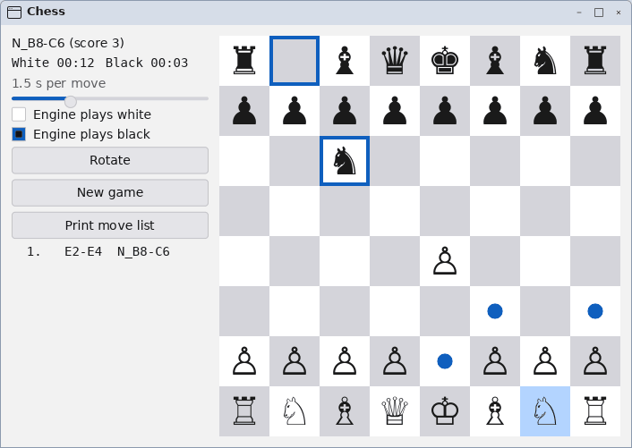

# nitro-chess

A chess GUI on `nitro-ui` for the **Salewski chess engine** — the same
program as Dr. Stefan Salewski's [`tiny-chess`] (egui) and
[`xilem-chess`] (Xilem), written a third time against a third toolkit,
over the very same engine file.



[`tiny-chess`]: https://github.com/StefanSalewski/tiny-chess
[`xilem-chess`]: https://github.com/StefanSalewski/xilem-chess

## Credits

**The engine and the app it is modelled on are Stefan Salewski's.**

* `src/engine.rs` is the Salewski chess engine, © 2015–2032 Dr. Stefan
  Salewski, under the MIT licence; its licence text is in
  [`LICENSE.salewski-chess`](LICENSE.salewski-chess), and its own header
  is kept as upstream wrote it. It was copied from `xilem-chess` at
  commit `5c326d62` (engine v0.6.0, the newer of the two copies).
  **One change** was made: upstream's `use num_traits::sign::signum` is
  replaced by a ten-line local `signum` for the two integer types the
  engine calls it on, so vendoring the engine adds no crate to the tree.
  The change is marked in the file; everything else is byte-for-byte
  upstream's, `#[rustfmt::skip]` and held to upstream's own lint
  allow-list so that it stays diffable.
* The app — its layout, its controls (seconds per move, engine plays
  white/black, rotate, new game, print move list, the two clocks, the
  move list), click-a-piece-then-a-square play, and the status line's
  score and "checkmate in N" arithmetic — follows `xilem-chess` and
  `tiny-chess`. The code is new; the design is theirs.

The rest of this crate is under the workspace's licence (Apache-2.0),
hence `license = "Apache-2.0 AND MIT"` in `Cargo.toml`.

`xilem-chess` bundles the Noto Sans Symbols 2 font; this app does not.
nitro apps ship no fonts — the server shapes text with the system's, and
its fallback chain finds the chess symbols (DejaVu Sans has them).

## Running it

```console
$ just fake                          # a server on the fake backend, elsewhere
$ cargo run --release -p nitro-chess
```

Release, as upstream advises: the engine is slow without optimisation.

Click a piece to pick it up — its legal squares get a dot — then click a
destination. Click the piece again, or press `Escape`, to put it back.
`Ctrl+N` is a new game and `Ctrl+Q` quits. Pawns promote to queens (the
engine's rule).

## Driving it with `hey`

The board takes `click <square>` and `move <from><to>`; both run the
callback a pointer click runs, so a script is held to exactly the rules a
user is. Its value is the position, rank 8 first, FEN letters:

```console
$ hey nitro-chess do window/board move e2e4
$ hey nitro-chess get window/board value
r . b q k b n r
p p p p p p p p
. . n . . . . .
. . . . . . . .
. . . . P . . .
. . . . . . . .
P P P P . P P P
R N B Q K B N R
$ hey nitro-chess get window/status value
N_B8-C6 (score 3)
$ hey nitro-chess do window/engine_white toggle     # let it play itself
$ hey nitro-chess do window/new_game click
```

The other names: `status`, `white_clock`, `black_clock`, `speed`,
`seconds` (the slider), `engine_white`, `engine_black`, `rotate`,
`new_game`, `print`, `moves`.

## Shape

| file | what is in it |
|---|---|
| `src/engine.rs` | the Salewski engine, vendored; see Credits |
| `src/board.rs` | the board: one widget, a slot per square, piece and hint; `click`/`move` actions; 4 unit tests |
| `src/lib.rs` | the state struct, the tree, the engine thread |
| `src/main.rs` | connect and run |
| `tests/chess.rs` | 11 tests against a real server on the fake backend, with the real engine thread |

**The board is one widget, not 64 buttons.** `xilem-chess` builds a grid
of buttons; `tiny-chess` paints into a canvas. Here it is a custom
widget with a slot per square, per piece and per move hint, so the
toolkit's per-slot diff decides what crosses the wire: a move sends the
squares that changed and nothing for the rest. The colours are palette
roles (`surface`/`track` squares, `selection` for the picked-up piece,
`accent` for the dots and the last-move ring), so the board follows the
desktop's light/dark switch; the pieces are the Unicode glyphs in the
text colour, outlined for white and solid for black.

**The game is moved onto the engine thread, not shared.** Upstream keeps
the game in an `Arc<Mutex<_>>` and polls a channel every 100 ms. Here the
`engine::Game` is *moved* to the thread and comes back with the move, so
the UI cannot touch it while the engine thinks; the thread wakes the loop
with one byte down a `std::io::pipe` registered with `Ui::add_fd`
(`docs/ui.md`, "Long work off the loop"). Nothing polls: between moves
the app sleeps in `epoll`, and a finished game sets no timer at all.

**Checkmate and stalemate are the engine's verdict, whoever is to
move.** When the side to move has no legal move — the human's side as
much as the engine's — the engine is asked (at its minimum time) to
reply, and its answer's state says which it is. Both upstream GUIs learn
of a mate only from a reply the engine makes for its *own* side, so a
mated human is left in front of a board that accepts no move, and
stalemate is never reported. (`xilem-chess` also applies that reply's
move before looking at its state; for a mated engine the move is h1 to
h1, which empties h1.)

## Code size

Measured 2026-09-24. Lines are "code" lines — not blank, not a comment
(`//`, `///`, `//!`) — of the UI, which is what differs; the engine is
the same file in all three (2 047 code lines in `xilem-chess`'s copy,
2 104 in `tiny-chess`'s older one, 2 062 here with the shim).

| | `tiny-chess` (egui 0.32) | `xilem-chess` (Xilem, git) | **`nitro-chess`** |
|---|---|---|---|
| UI source files | `main.rs` | `main.rs` | `lib.rs`, `board.rs`, `main.rs` |
| UI lines, total | 467 | 551 | 1 152 |
| UI lines, code | 331 | 452 | 820 |
| of which, the board | (in `main.rs`) | (in `main.rs`) | 301 (`board.rs`, without its tests) |
| tests | — | — | 218 + 52 code lines: 11 harness tests, 4 unit tests |
| crates in the build (`cargo tree -e normal`) | 229 | 314 | **14**, 5 of them nitro's own |
| release binary | 8 473 432 B | 17 392 352 B | **754 056 B** |
| RSS after start | not measured (needs a display) | not measured (needs a display) | ~560 MB, nearly all of it the engine's table |

Binaries are each project's own `[profile.release]`: `tiny-chess` and
nitro build with fat LTO and strip; `xilem-chess` builds at
`opt-level = 2` without LTO and embeds its 1.2 MB Noto font, so its
number is the least like-for-like. Crate counts are unique packages in
`cargo tree -e normal`, proc-macros included.

Why the UI is longer, in the order it matters:

* **The board is a widget of its own** (301 code lines): measure, paint,
  hit test, the `click`/`move` actions and the text diagram `hey` reads.
  egui and Xilem give an app a painter or a grid of buttons with a
  background colour; nitro-ui deliberately has neither a canvas nor
  per-button colours (a colour is a role, and there is no role for "a
  chess square"), so the board is where a custom widget belongs.
* **nitro-ui is retained, not immediate or declarative.** egui redraws
  from the state every frame and Xilem rebuilds a view tree from it;
  here the tree is built once and the app pushes changes into it
  (`Ids::refresh`). That is the price of an idle app sending nothing.
* **Things upstream does not do**: named widgets and actions for `hey`,
  the engine's mate/stalemate verdict, discarding a stale answer after a
  New Game, handing a side back to the human mid-thought, and stopping
  the clock when a game ends. Each is a handful of lines.

The **binary** is small because the toolkit is: nitro-ui draws nothing
itself (the server rasterises), links no font or GPU stack, and pulls no
async runtime. The **RSS is the engine's**: its transposition table is
2 M entries allocated up front (`TTE_SIZE`), about 560 MB, in every one
of the three GUIs. It is far outside the budget `docs/budget.md` sets
for a nitro client, and it is left as upstream sized it; a smaller table
is a one-constant change to the engine, to make with upstream rather
than in a vendored copy.
