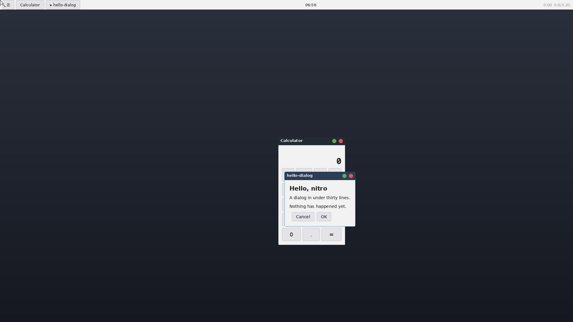
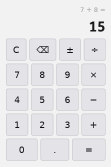

# Size and memory budget

Goal 2 of `DESIGN.md` is "small": low memory, few dependencies, short
build. This is the table that keeps it honest. Regenerate the dev-machine
rows with `just size` (and `just size 5` for the five-window row); the box
rows come from the same binaries running on the test box, which is the
number that actually matters — 3.3 GB and **no swap**.

All figures are release builds, measured after this branch was rebased
onto M2-pre (`nitro-text`). That matters: text moved almost every number
on this page. The server was **2.5× over its RSS budget** because of it;
the lazy font loading of issue #528 has since brought it back inside. See
the resident-memory section for both numbers.

The `nitro-calc` rows and section are the M2 exit measurement (#3684),
taken on the box against the server as it stood at #528. The app numbers
do not move with the server's: a client's own RSS and binary size are
independent of how the compositor stores its fonts.

`[profile.release]` sets `strip = true`, so the binaries are already
stripped and a separate `strip(1)` pass would measure nothing but whether
the tool is installed.

## Binaries

| binary | bytes | budget | verdict |
|---|---|---|---|
| `nitro-calc` | 560 360 | ≤ 1 MB (client) | **ok**, 56 % of budget |
| `nitro-demo` | 481 240 | ≤ 1 MB (client) | **ok**, 48 % |
| `hello_client` | 393 344 | ≤ 1 MB (client) | **ok**, 39 % |
| `hey` | 368 008 | — | ok |
| `nitro-shot` | 330 160 | — | ok |
| `nitro-server` | 2 047 016 | — | see below |

Identical on the dev machine and the box (same artefact, `rsync`ed, and
`sha256sum`-verified on both sides for the M2 row below).

**`nitro-calc` is the number M2 exists to produce**: a complete
application — two labels, twenty buttons, a state machine, a formatter
and a scriptable introspection socket — in **560 KB**, against a 1 MB
client budget. It carries no font library, no rasterizer and no
compositor: a label is a string on the wire and the server owns the
glyphs. Of that, ~68 KB is the introspection protocol, monomorphised per
app-state type (`docs/ui.md`, *Measured*); the de-monomorphisation that
would share one copy across a program is M3.

It is 79 KB above `nitro-demo`, and that gap is the toolkit's own cost:
the arena, eleven widgets, the flex solver, the passes and the socket,
against `nitro-demo` building its scene by hand. Buying a widget toolkit
for 79 KB over talking to the wire directly is the trade goal 2 asks
for, and it is the reason the toolkit exists.

The server tripled, from 737 736 bytes before M2-pre to 2 047 016 after:
that is `swash` and its shaping tables, and it buys text end to end. There
is no stated binary-size budget for the server — it is one process on a
desktop, not a per-app cost — so this is recorded rather than flagged. The
*client* number is the one with a budget, because it is paid once per
running app, and it did not move: `nitro-demo` grew 3 280 bytes across the
rebase and neither client links the text engine at all. That split is
working exactly as intended — shaping lives in the server, so a client
sends a string and pays nothing for the machinery that draws it.

(The server grew 49 864 bytes against the same tree without this change —
1 997 152 → 2 047 016 — which is the lazy font index, its LRU and the
hand-written cache format. It bought 11.4 MB of RSS back, a trade worth
making twice. The 1 988 608 figure this page carried before is from an
earlier commit on this branch.)

The two clients remain within a hundred kilobytes of each other despite
`nitro-demo` doing considerably more, which is the useful signal: nearly
all of a client's size is `nitro-wire` plus the Rust runtime and panic
machinery, not its own code. A toolkit client starts from about the same
floor.

## Resident memory

`VmRSS` is what is resident at the sample; `VmHWM` is the high-water mark
— the peak is what matters on a box with no swap, and it is the number a
steady-state `top` never shows you.

`VmRSS` is also **two different things added together**, which is why this
section now splits them everywhere (#538). `RssAnon` is the heap: private
to the process, unreclaimable on a box with no swap, and the only half
that moves when a window opens. `RssFile` is page-cache — the binary's own
text and rodata plus every shared library — shared with every other
process mapping the same file and reclaimable under pressure. A budget
written against the sum cannot tell "we allocated a megabyte" from "we
linked another library", which is how the server's "≤ 8 MB" line survived
as long as it did. The server's current, audited line is in
**"The server's 17.8 MB, audited"**; `just box-ps` prints both columns.

### Test box (real KMS, 1920×1080@60)

| process | windows | VmRSS | VmHWM | budget | verdict |
|---|---|---|---|---|---|
| `nitro-server` | 1 | 8 240 kB | 8 240 kB | ≤ 8 MB with 5 windows | over by 1 % — superseded, see below |
| `nitro-server` | 5 | 8 344 kB | 8 344 kB | ≤ 8 MB with 5 windows | over by 2 % — superseded, see below |
| `nitro-server` **+ shadow (#539)** | 2 | **15 888 kB** | 18 460 kB | — | **deliberately over; see "The 8 MB the shadow buffer costs"** |
| `nitro-server`, **anon only**, `NITRO_SHADOW=0` (#538) | 0 | **2 424 kB** | — | `RssAnon` ≤ 2.5 MB | **ok**, 97 % |
| `nitro-server`, **anon only**, `NITRO_SHADOW=0` (#538) | 5 | **3 980 kB** | — | + 100 kB/window → 2.9 MB | over — the #547 allocator ratchet, see below |
| `nitro-server`, **file-backed** (#538) | 0–5 | **7 252 kB** | — | `RssFile` ≤ 7.5 MB | **ok**, and flat in windows |
| `nitro-calc` | 1 | **2 752 kB** | **2 752 kB** | ≤ 3 MB (client) | **ok**, 92 % |
| `nitro-demo` | 1 | 3 132 kB | 3 132 kB | ≤ 3 MB (client) | over by 4 % |
| `nitro-demo` | 5 | 3 224 kB | 3 224 kB | ≤ 3 MB (client) | over by 7 % |

The last three `nitro-server` rows are the #538 audit and are the ones
with a live budget attached; the first two are the M3-A measurement, kept
because the paragraphs below describe them. The five-window anon row is
**over**, and it is left flagged rather than adjusted: the overrun is
1 556 kB of released font bytes that glibc keeps (#547), not per-window
growth. With that allocator behaviour pinned out, the same five windows
measure 2 112 kB, inside the line.

The first two `nitro-server` rows are the pre-#539 measurement and are
kept as the floor they establish: they are what the process costs
*without* the shadow buffer, which is still exactly what it costs today
under `NITRO_SHADOW=0`.

**The first app is inside the client budget**, at 2 752 kB against 3 MB,
and it stays there: 2 776 kB after 120 keypresses, so typing allocates
nothing that is not freed. It is *lighter* than `nitro-demo` despite
being a real application with a widget tree, because `nitro-demo` uploads
a 16 kB image and keeps two frames of scratch. One thread, and no second
one anywhere — the introspection socket is served by the app's own
`epoll` loop between events, which is what makes "scriptable" cost
neither a thread nor a lock.

**The server is back inside its budget**, within rounding: 19 676 → 8 240 kB
with one window, 19 804 → 8 344 kB with five. The fix is #528's: `nitro-text`
no longer reads every font file at scan time and keeps it. It indexes the
faces (family, attributes, `(path, face index)`), reads a file only when a
face is actually shaped or rasterized with, caps what is resident with
`NITRO_FONT_CACHE_MB` (default 8 MB), and hands the bytes back when the event
loop next goes idle — which is exactly the state this table is measured in.
The atlas keeps the rendered masks, so a release costs one re-read the next
time a *new* glyph appears (53 µs against 20 µs for a warm line) and never a
redraw. On the box: 47 faces indexed, **0 bytes** of font data resident in the
settled state, 1.9 MB at the moment a label is being painted.

The 48–152 kB over 8 192 is flagged rather than declared a pass. It is not
fonts: with `NITRO_FONT_DIRS` pointed at nothing the same binary sits at
8 012 kB, so the floor is the binary's own text and data (1.9 MB resident of
a 2.0 MB image), libc, libinput/libudev/libglib pulled in by the seat, and one
1 MiB atlas page. Those are the things to attack next if 8 MB is to be a hard
ceiling; the per-process font cost, which is what blew the budget, is gone.

With a text-heavy client (`hello_client`, three labels in two faces) the same
server measures 8 804 kB settled and peaks at 10 632 kB (`VmHWM`) while the
faces are loaded and the glyphs rasterized — the peak is the honest number for
a box with no swap, and it is the one the cap bounds.

Five windows cost the server **104 kB** over one — 21 kB per window, which is
the scene nodes (18 per window) and the per-client id maps, and nothing that
scales with pixels. The server's *scanout* framebuffers are not in RSS: they
are dumb buffers owned by the GPU and mapped, not anonymous memory. Its
shadow buffers are — see the next section, which is the one exception to
"nothing scales with pixels".

(Both figures in that paragraph were superseded by the #538 audit, and it
is kept because the M2 row above is the measurement it describes. A
decorated window costs **86 kB**, not 21 kB, and the frame is **6** scene
nodes, not 18 — the 18 was the client's own tree counted as the server's.
The dominant term is neither: it is the 64 KiB receive buffer `nitro-wire`
allocates per *connection*. See "The server's 17.8 MB, audited".)

### The 8 MB the shadow buffer costs, and what it buys

Since #539 each output owns a heap-resident shadow buffer, and unlike the
dumb buffers it **is** anonymous memory and **is** in RSS. Measured on the
box, same binary, `NITRO_SHADOW=0` against the default, two decorated
windows (`hello_client` + `hello_dialog`), two runs each:

| | `NITRO_SHADOW=0` | shadow (default) | delta |
|---|---|---|---|
| `VmRSS`, no client | 7 800 / 7 688 kB | 15 888 / 15 844 kB | **+8 072 kB** |
| `VmRSS`, two windows | 10 428 / 10 296 kB | 18 460 / 18 396 kB | +8 064 kB |
| per-window cost | 2 628 / 2 608 kB | 2 572 / 2 552 kB | unchanged |
| `shadow_bytes` (reported by `stats`) | 0 | 8 294 400 | — |

The overhead is **exactly `1920 × 1080 × 4` = 8 294 400 bytes**, once per
output, and it does not move with the number of windows. On this box that
roughly **doubles the server's resident set**, from 7.7 MB to 15.9 MB.

That is a large number against an 8 MB budget and it is recorded here
rather than explained away. Three things make it the right trade:

- **What it buys is 9.3× on the frame path**: 6233 µs of paint becomes
  418 µs of paint plus 251 µs of copy (`docs/latency.md` §4.5). Nothing
  else available to us moves a compositor number by that factor, and the
  alternative — asking for a non-write-combined mapping of a dumb buffer
  — is not something userspace can request.
- **It scales with screens, not with work.** One allocation per output,
  made when the output appears and freed when it goes; a desktop with
  fifty windows pays the same 8 MB as one with none. It is the only thing
  in the server that is proportional to pixels, and pixels are a property
  of the hardware, not of what the user is doing.
- **It is one environment variable away from being given back.**
  `NITRO_SHADOW=0` restores the pre-#539 numbers exactly, which is what
  the first two rows of the table above are. A build for a
  memory-constrained target has the lever without a code change.

The 8 MB server budget was written for a process whose framebuffers lived
in GPU memory. This section proposed restating it for M4 as "≤ 8 MB plus
one scanout-sized buffer per output"; the #538 audit went further, because
"8 MB" does not say whether it means anon or total and so cannot tell "we
allocated a megabyte" from "we linked another library". The line that
replaces it is in **"The revised budget line"** below, and it is split:
`RssAnon` ≤ 2.5 MB + 100 kB per decorated window, plus one shadow buffer
per output; `RssFile` ≤ 7.5 MB and not a per-window cost.

The scan also stopped costing a 12 MB read per boot: the index is cached in
`$XDG_CACHE_HOME/nitro/fonts.idx`, validated against the directory walk (paths,
sizes, mtimes) and discarded on any mismatch. Box: **5.2 ms cold, 0.4 ms
warm**, 47 faces, 5 520-byte cache file.

The client is over its 3 MB budget by 4–7 %, and is flagged rather than
quietly rounded down. It is worth noting what it is *not*: five windows
cost it 92 kB, so this is fixed overhead — the Rust runtime, the wire
buffers, the 16 kB image it uploads — not a leak or a per-window cost. A
client that opens five windows for the price of one is the property worth
having; the constant is what to attack if 3 MB is a hard limit, and the
first place to look is the 64 KiB `recv` scratch buffer each `Socket`
allocates.

### The M3 desktop (whole tree, real KMS, 1920×1080@60)

The M3-E exit measurement: `nitro-session` supervising the compositor,
the wallpaper, the bar and the launcher, plus the two applications that
make it a desktop. Taken with `just box-ps` (60 s window), pointer parked
off-screen, from a `just deploy` of the same artefacts.

| process | VmRSS | RssAnon | RssFile | RssShmem | threads | idle CPU, 60 s |
|---|---|---|---|---|---|---|
| `nitro-session` | **2 788 kB** | **212 kB** | 2 576 kB | 0 | 1 | **0.00 %** |
| `nitro-server` | 19 620 kB | 12 444 kB | 7 176 kB | 0 | 1 | 0.02 % |
| `nitro-wallpaper` | **2 616 kB** | **208 kB** | 2 408 kB | 0 | 1 | **0.00 %** |
| `nitro-bar` | **2 780 kB** | **248 kB** | 2 532 kB | 0 | 1 | **0.00 %** |
| `nitro-launcher` | **2 896 kB** | **260 kB** | 2 636 kB | 0 | 1 | **0.00 %** |
| **whole desktop** | **30 700 kB** | **13 372 kB** | 17 328 kB | 0 | 5 | — |

All four memory columns are read from the **same** `/proc/<pid>/status`
sample, so `VmRSS = RssAnon + RssFile + RssShmem` closes on every row and
down the total — check it. (An earlier draft of this table paired the
28 968 kB `VmRSS` column from the M3-E exit run with a split measured
later, which made anon+file *exceed* `VmRSS` by 696 kB. A table whose
arithmetic does not close is exactly what this page exists not to be, so
the whole row set was re-measured in one pass. The configuration is the
M3-E one: `nitro-session` with wallpaper, bar and launcher, plus
`hello_client` and `hello_dialog` as the two applications, settled — six
windows, three decorated.)

**`RssShmem` is 0 for every process**, which is worth stating rather than
omitting because the server is the one process that maps memory it did not
allocate. Client buffers arrive as memfd mappings accounted to the **file**
half, and the scanout buffers are GPU-owned dumb buffers outside the
resident set entirely — so the third column is structurally zero on this
workload, not merely small. It is carried in the table and in
`just box-ps` so that a future workload which *does* put something there
shows up instead of quietly inflating `RssFile`.

The anon/file split is the #538 addition, and it changes how this table
reads. **The four shell processes are ~230 kB of private memory each**;
over 90 % of each one's `VmRSS` is file-backed — the same libc and the
same `nitro-ui` text, mapped once per process and counted once per
process. So the 17 328 kB `RssFile` total is an *upper bound*, not a cost:
summing it across the tree double-counts every shared page. The `RssAnon`
column is the one that is genuinely additive, and it says the whole
desktop's private memory is **13.4 MB, of which 8.1 MB is the server's one
shadow buffer**. A supervisor, a compositor and four shell clients come to
about 5 MB of private memory between them.

(The server's 12 444 kB anon here against the 10 532 kB in the audit
table's "desktop, shadow on" row is not a discrepancy: this row has two
applications on screen and three decorated windows where that one has
none, and the #547 allocator ratchet has had more font files pass through
it. Both are honest samples of different workloads; neither is the floor,
which is the 2 424 kB `NITRO_SHADOW=0` figure.)

(The unit also contains systemd's own `(sd-pam)` helper at 4 392 kB,
forked into the logind session by `PAMName=login`. It is listed by
`box-ps` for honesty and left out of the total: it is systemd's process,
not ours.)

| binary | bytes |
|---|---|
| `nitro-session` | **510 984** |
| `nitro-wallpaper` | 522 424 |
| `nitro-bar` | 602 064 |
| `nitro-launcher` | 704 736 |
| `nitro-server` | 2 164 200 |

**The whole desktop is under 29 MB and five processes, one thread each.**
For scale, that is less than a single tab of a browser, and it is the
number goal 2 exists to produce.

**Idle really is idle, for the tree and not just for the server.** Four
of the five processes used *zero* jiffies in sixty seconds. The
exception is the server's 0.02 %, and it is the bar's clock: the bar
re-renders `06:56` once a minute, the server composites that damage, and
the measurement window caught it. The spec allows the clock tick
explicitly. Note what is *not* there — the session itself is 0.00 %,
which is the claim `crates/nitro-session` is built around: a supervisor
that watches its children through pidfds rather than a poll timer costs
nothing to be running.

**`nitro-session` is the cheapest process in the tree**, at 2 792 kB and
511 KB of binary — smaller than any of the shell clients it starts,
because it is `rustix` + `nitro-wire` + `signal-hook` and no toolkit.

#### The server's 17.8 MB, audited (#538)

It is 9 MB over the "≤ 8.5 MB" the M3-E spec asked for, and the note that
used to sit here blamed the whole gap on #539's shadow buffer and called
the rest "the server proper" without saying what that was. The audit
behind #538 took the number apart. It splits four ways, and only the last
one is a defect.

All rows below are the same binary on the box, `nitro-session` with
wallpaper, bar and launcher up, plus *N* `hello_dialog` windows, settled
(the state the idle sweep has run in). `RssAnon` and `RssFile` are read
from `/proc/<pid>/status`; `just box-ps` now prints both.

| | `VmRSS` | `RssAnon` | `RssFile` | `RssShmem` |
|---|---|---|---|---|
| desktop, shadow on (as shipped) | 17 764 kB | 10 532 kB | 7 232 kB | 0 |
| desktop, `NITRO_SHADOW=0` | **9 676 kB** | **2 424 kB** | 7 252 kB | 0 |
| difference | 8 088 kB | 8 108 kB | ~0 | 0 |

`RssShmem` is **0** in every sample taken for this audit, and the column
is carried rather than dropped because the server is the one process that
maps memory it did not allocate: client buffers arrive as memfd mappings
accounted to the *file* half, and the scanout buffers are GPU-owned dumb
buffers outside the resident set entirely. So the third term is
structurally zero here, not merely small — and `VmRSS = RssAnon +
RssFile + RssShmem` means the two columns that are non-zero must account
for the whole of `VmRSS`, which is the check every table on this page is
meant to survive.

**First: 7.2 MB of the 17.8 is file-backed, and it is not the server's
heap at all.** `RssFile` does not move when a window opens, is shared with
every other process mapping the same library, and is reclaimable under
pressure — on a box with no swap that is the difference between memory
that can be given back and memory that cannot. Top mappings by `Rss`, from
`/proc/<pid>/smaps` with five windows open:

| `Rss` | `Anon` | mapping |
|---|---|---|
| 1 696 kB | 0 | `nitro-bin/nitro-server` (`r-xp`, its own text) |
| 1 248 kB | 0 | `libc.so.6` (`r-xp`) |
| 512 kB | 0 | `libglib-2.0.so.0` (`r-xp`) |
| 424 kB | 16 kB | `libc.so.6` (`r--p`, rodata + relro) |
| 368 kB | 48 kB | `nitro-bin/nitro-server` (`r--p`) |
| 344 kB | 0 | `libm.so.6` (`r-xp`) |
| 260 kB | 4 kB | `libglib-2.0.so.0` (`r--p`) |
| 220 kB | 0 | `libgobject-2.0.so.0` (`r-xp`) |
| 200 kB | 0 | `libinput.so.10` (`r-xp`) |
| 192 kB | 8 kB | `libxkbcommon.so.0` (`r--p`) |

So it is the binary's own 2.0 MB image (1.7 MB of it resident), libc, and
the libinput/libglib/libgobject/libxkbcommon stack the seat drags in.
`glib` is there because `libinput` links it; we do not call it. **No font
file appears in this list**, which is worth stating plainly: `nitro-text`
reads faces with `std::fs::read` into the heap, so font bytes are *anon*,
not file-backed, and the "font files mmapped" guess in #538 is wrong.

**Second: 8.1 MB is the shadow buffer**, exactly `1920 × 1080 × 4` =
8 294 400 bytes, and `stats` reports it as `shadow_bytes`. The section
above argues that trade (9.3× on the frame path); it is one allocation per
*screen*, not per window, and `NITRO_SHADOW=0` hands it back.

**Third: what is left is 2 424 kB of anon** — the server proper, with four
shell connections, six windows and every glyph on screen. Of that:

| | bytes | how it is known |
|---|---|---|
| glyph atlas | **1 048 576** | `atlas_bytes`, one 1024×1024 A8 page |
| scene nodes | 206 × 240 = **49 440** | `nodes` × `size_of::<Node>()` |
| per wire connection | ~**66 000** each | `nitro-wire`'s 64 KiB `RECV_CHUNK` receive scratch, allocated in `Socket::from_fd` before the handshake; measured by opening 5 idle sockets that never send a byte (+332 kB) |
| font bytes, settled | **0** | `font_bytes`; see below |

**The atlas is 43 % of the server's anonymous memory**, and one page is
enough: the whole desktop, the calculator and the launcher together
rasterize 115 masks, and the full printable ASCII range at the three sizes
a nitro desktop uses (13 px title bar, 14 px UI, 20 px heading) in all
four subpixel buckets still fits one page — pinned by
`text.rs::a_ui_worth_of_glyphs_fits_in_one_atlas_page`. A page is
allocated whole and never shrinks, so `atlas_bytes` is its real cost
whatever fraction is packed.

**Font residency is working, and now provably so.** #538 asked whether
the idle sweep releases what it should. `font_bytes` alone cannot answer
it: a settled server reports 0 both when the sweep is doing its job and
when no face was ever loaded. `stats` therefore now carries `font_loads`,
`font_releases` and `font_evictions`. On the box, every configuration
measured, at every window count: **`font_loads == font_releases`, and
`font_evictions` is 0**. The sweep hands back every file it reads, and the
8 MB cap never fires — it is the sweep that keeps the steady state small,
exactly as `crates/nitro-text/README.md` claims.

#### Fourth: the 1.6 MB the allocator keeps, which is a real defect

With the fonts released and `font_bytes` at 0, the server's `RssAnon`
**still ratchets up 1 556 kB over the first two decorated windows and
never comes back down** — not when the windows close, not after any
number of open/close cycles. Ten cycles of one `hello_dialog`, settling
between each, hold `RssAnon` flat at the post-first-window figure: the
process is not leaking, it has ratcheted once.

The cause is glibc, not our code. `FontDb::load` reads a whole font file
in one `malloc` — DejaVuSans is 759 720 bytes. glibc serves an allocation
that large with `mmap` and unmaps it on `free`, so the *first* such file
costs nothing lasting. But glibc also **raises its `mmap` threshold to the
size of any mmap'd block it frees**, so the *second* font file of that
size is served from the main arena instead — and an arena only shrinks
from the top. The sweep's `free` is honest and the bytes never leave the
process. The counters agree it released them; `RssAnon` disagrees.

Pinning the threshold (`MALLOC_MMAP_THRESHOLD_=131072`, which only
disables the *dynamic adjustment*) is enough to show that is the whole
story. Same binary, same desktop, `NITRO_SHADOW=0`, `RssAnon` in kB:

| windows | 0 | 1 | 2 | 3 | 4 | 5 |
|---|---|---|---|---|---|---|
| glibc default | 2 424 | 3 240 | 3 980 | 3 980 | 3 980 | 3 980 |
| threshold pinned | **1 684** | 1 804 | 1 864 | 1 972 | 2 040 | **2 112** |

The default row is not a per-window cost at all: it is two font files
ratcheting in, after which five windows cost **nothing measurable**. The
pinned row is what a decorated window actually costs — **428 kB over five
windows, 86 kB each** (deltas 120/60/108/68/72 kB), which is the ~66 kB
wire receive buffer plus 6 scene nodes plus the shaped title. And the
floor drops from 2 424 kB to **1 684 kB**, a 740 kB saving on an idle
desktop.

The arithmetic closes exactly: with the shadow on and the threshold
pinned, `RssAnon` at zero dialogs is 9 784 kB, and 9 784 − 8 100 (the
1080p shadow) = **1 684 kB**, identical to the no-shadow floor.
`MALLOC_TRIM_THRESHOLD_` alone does the same work, because it is the same
dynamic-adjustment machinery; setting both is no better than either.

**This is recorded, not fixed, and deliberately so.** The fix is either an
environment variable in the unit — which does not travel with the binary
and which `docs/testbox.md` would have to carry as a footgun — or reading
font files into an allocation that does not go through the general
allocator at all, which means `mmap` in `nitro-text` and a new `unsafe`
exception, or the `memmap2` already in the tree via `xkbcommon` becoming a
direct dependency. Both are real changes with a real review cost, and
neither belongs in an audit. Filed as #547 with these numbers.

### The revised budget line

The old line — "server RSS ≤ 8 MB" — was written for a process whose
framebuffers lived in GPU memory and before the shadow buffer existed. It
is unmeasurable against today's server in the sense that matters: it does
not say whether it means anon or total, so it cannot distinguish "we
allocated a megabyte" from "we linked another library", and the biggest
single term in it is a hardware constant. The replacement:

> **Server: `RssAnon` ≤ 2.5 MB + 100 kB per decorated window, plus one
> scanout-sized shadow buffer per output. `RssFile` ≤ 7.5 MB, and is not
> a per-window cost.**

Measured against the box today (`NITRO_SHADOW=0`, glibc as it actually
ships, so the allocator ratchet is *inside* the number rather than
excused): floor **2 424 kB**, five windows **3 980 kB**, `RssFile`
**7 252 kB**, shadow **8 100 kB**. Nothing here is rounded down: 2.5 MB is
above the measured 2 424 kB floor, and the 100 kB/window is above the
86 kB measured with the allocator behaving, chosen so the line still holds
when the ratchet is fixed and the floor drops to 1 684 kB.

What the 9.5 MB of a real, shipped, shadow-on server with a desktop on it
consists of, in one paragraph: **7.2 MB is file-backed** — the server's
own 2.0 MB binary plus libc, libinput, libglib, libgobject and
libxkbcommon, shared with every process that maps them and reclaimable —
and **2.4 MB is anonymous**, of which 1.0 MB is the single glyph atlas
page, 0.4 MB is wire receive buffers at 64 KiB per connected client, 0.05
MB is the 206 scene nodes at 240 bytes each, 0.7 MB is font-file bytes the
idle sweep released and glibc kept, and the remainder is the xkb keymap,
the libinput device state and the event-loop scratch. Zero of it is font
data the server still thinks it needs; `font_loads == font_releases` on
every measurement taken. The 8.1 MB shadow buffer sits on top of that and
is a property of the screen, not of the workload.



Wallpaper, bar with a live window list, two decorated applications
placed by the server's centred cascade, and the launcher hidden where it
belongs. Every process in that picture was started and is supervised by
`nitro-session`.

### Dev machine (fake backend, 1280×720)

| process | windows | VmRSS | VmHWM |
|---|---|---|---|
| `nitro-server` | 1 | 13 824 kB | 13 824 kB |
| `nitro-server` | 5 | 14 092 kB | 14 092 kB |
| `nitro-calc` | 1 | 2 632 kB | 2 632 kB |
| `nitro-demo` | 1 | 2 904 kB | 2 904 kB |
| `nitro-demo` | 5 | 3 040 kB | 3 040 kB |

The server is 5.5 MB *heavier* here than on the box, and the reason is the
fake backend, not the fonts: it keeps its "framebuffers" as ordinary heap
allocations (two 1280×720×4 buffers = 7 MB) where real KMS puts them in
GPU-owned dumb buffers outside RSS. `nitro-demo` on the fake backend draws
no text, so no font file is ever loaded on this row — which is why the two
machines no longer differ by what they happen to have installed. The box
row is the one to quote; it is the one with a budget attached.

## First frame on the wire

What a client spends to get its first pixels on screen, counted by
`nitro-demo --stats` (`wire:` line). `tx_bytes` is every byte of every
message it sent, framing included; the image pixels are **not** in it —
they travel through a memfd passed by `SCM_RIGHTS`, which is the whole
point of the buffer design.

| | box | dev machine |
|---|---|---|
| `tx_bytes` (client → server, first frame) | 1 755 | 1 972 |
| `rx_bytes` (server → client) | 120 | 152 |
| `connect()` → first `Presented` | 31.6 ms | 18.5 ms |

**Under two kilobytes** to put a window with a gradient, four bordered
rounded rects, an image and ten more nodes on screen — 18 scene nodes for
1 755 bytes, under 100 bytes a node. That is the number that matters for
goal 4 (remote from the same code): a full first frame fits in a single
TCP segment, and subsequent frames are far smaller (a pointer-follow
commit is ~180 bytes).

The two machines differ by a couple of hundred bytes because the window is
configured to a different size on a 1280×720 fake output than on
1920×1080, so the `SetBounds` payloads differ slightly — there is no
per-machine overhead in the protocol.

`connect()` → first `Presented` is dominated by waiting for a vblank, not
by work: the handshake, the transaction and the first paint together are
well under a millisecond. It varies run to run by roughly a frame
depending on where in the refresh cycle the client happens to connect.

## The first app: `nitro-calc`

M2's exit criterion, measured on the box against the real KMS server with
`sha256sum` verified on both sides before the run.

| what | value |
|---|---|
| app source, excluding tests | **489 lines** (292 engine + 197 UI) |
| binary, release, stripped | **560 360 bytes** (560 KB) |
| RSS / HWM on the box | **2 752 kB**, and 2 776 kB after 120 keypresses |
| threads | 1 |
| idle CPU over 10 s, app *and* server | **0.0 %**, 0 voluntary context switches each |
| one keypress on the wire | **2 mutations: `SetText`, `Commit`** |
| keypress-to-photon (server `i2p_*`, 3 runs of 60 presses) | **min 1.9 ms, mean 11.7–13.3 ms, max 36.6–43.7 ms** |



That screenshot is `hey nitro-calc shot`, downscaled 2× — the app
screenshotting itself over its own introspection socket, from an ssh
session, with no cooperation from its code. The PNG is 223×334, which is
exactly the window's `bounds` (`0,0,223,334`), not the 1920×1080 output.

**One keypress is one `SetText` and the `Commit` that carries it.** Not
"about one" — the mutation tap records exactly `["SetText", "Commit"]`,
asserted by `crates/nitro-calc/tests/calc.rs::one_keypress_is_one_set_text`.
The twenty buttons do not repaint, nothing is re-measured but the label,
and the history line stays silent because its string did not change.
That is the whole retained-tree claim, checked from outside the process.

**Idle is zero, not low.** Ten seconds with the app on screen and the
server running: no CPU time and no voluntary context switches in either
process. Both block in `epoll_wait` and no bytes move. (An app with a
`hey watch` attached is the documented exception, waking 100×/s; see
`docs/introspection.md`.)

### On the latency number

The i2p figures are the **server's** view (libinput timestamp → vblank of
the frame that consumed it), which is the only view available here:
`nitro-demo` measures the client half by instrumenting itself, and
`nitro-calc` is an ordinary app with no stopwatch in it. Three runs of 60
`ydotool` keypresses at ~4/s agree to within 1.6 ms of mean — the third
after the #528 font rework, which did not move the app's numbers.

The mean sits above the 9.3 ms `nitro-demo` reports in `docs/latency.md`,
and the difference is real rather than noise: a keypress makes the client
**re-measure a new string** (`MeasureText` is a synchronous round trip in
M2; `docs/ui.md`) and only then commit, where a pointer-follow frame
commits from state the client already has. Every digit is a string the
cache has not seen, so every keypress pays one turnaround. The cache is
why the number is a per-*string* cost and not a per-frame one, and the
async measurement path is M3 — this is the first measurement that puts a
price on that decision.

The run was checked against the trap `docs/latency.md` section 5 warns
about: **1.7 flips/s** over the typing run, nowhere near the 60.0 that
would mean the queue was full and the number was backlog rather than
latency.

## Dependency count

`cargo tree -e normal --prefix none | sort -u | wc -l` = **70** at M3
(60 at M2, 48 at M1), matching `DEPENDENCIES.md`. **Distinct external
crate names are 34.**

That line count is three different kinds of line added together, which is
what makes it easy to quote wrongly:

| | M1 `7e9be25` | M2 `6d79420` | M3 `329faf3` |
|---|---|---|---|
| total lines | 48 | 60 | **70** |
| external package entries | 29 | 36 | 37 |
| our workspace crates | 8 | 10 | 17 |
| cargo `(*)` dedup markers | 10 | 13 | 15 |
| blank separator line | 1 | 1 | 1 |
| **distinct external crate names** | — | 34 | **34** |

The first four rows are disjoint and sum to the total at every commit
(29 + 8 + 10 + 1 = 48; 36 + 10 + 13 + 1 = 60; 37 + 17 + 15 + 1 = 70) —
which is the property the old paragraph lacked. Each column is a `sort -u`
of the tree at that commit, re-measured for this table rather than carried
forward. Note the blank line is a real row: `cargo tree` separates each
root's subtree with one, and `sort -u` keeps it.

So **48 → 60** across M2-pre decomposes as **+7 external package entries**
(`swash` and its six transitive crates: `skrifa`, `read-fonts`,
`font-types`, `yazi`, `zeno`, `once_cell`), **+2 workspace crates** that
are not dependencies at all (`nitro-text` and `nitro-demo`), and **+3
`(*)` marker lines**, cargo's "subtree already printed above" notation
that `sort -u` counts as distinct — `bytemuck (*)`, `signal-hook v0.4.4
(*)` and `nitro-text (*)`. 7 + 2 + 3 = 12, and 48 + 12 = 60.

The sentence this replaces — "`swash` and its seven transitive crates,
plus the `nitro-demo` and second `signal-hook (*)` lines" — named the
right arrivals and mis-stated the arithmetic, which is how it summed to
58 (#530). Two corrections: `swash` brings **six** transitive crates, not
seven; and its "plus" clause names two of the five remaining lines
(`nitro-demo` and `signal-hook v0.4.4 (*)`), silently omitting
`nitro-text`, its `(*)` marker, and `bytemuck (*)`. That gives 7 + 2 = 9
where the true total is 7 + 2 + 3 = 12. The second `signal-hook v0.4.4
(*)` line **does** arrive at M2 with `nitro-demo`, exactly as it said.

**60 → 70** across M3 is **+1 external package entry**, **+7 workspace
crates** (`nitro-bar`, `nitro-launcher`, `nitro-wallpaper`,
`nitro-session`, `nitro-ui`, `nitro-calc`, `nitro-hey`) and **+2 `(*)`
markers**. 1 + 7 + 2 = 10. The one external entry is a second
`signal-hook` **version** — `0.3.18`, which `nitro-session` takes from the
workspace pin where the server takes `0.4.4` — and it is worth keeping
distinct from the M2 event above: M2 added a second *line* for one
version, M3 added a second *version*. Neither is a new crate **name**,
which is why that figure is 34 at both.

Verify with:

```sh
cargo tree -e normal --prefix none | sort -u | wc -l                    # 70
cargo tree -e normal --prefix none | sort -u | grep -c '(\*)'           # 15
cargo tree -e normal --prefix none | sort -u | grep -c '^nitro-'        # 24 lines,
                                                                        # 17 crates
                                                                        # + 7 markers
cargo tree -e normal --prefix none | awk 'NF{print $1}' |
    grep -v '^nitro-' | sort -u | wc -l                                 # 34
```

**`awk 'NF'`, not a bare `awk '{print $1}'`**, in the last one:
`cargo tree` separates each root's subtree with a **blank line**, the bare
form turns every blank into an empty string, and `sort -u` keeps one — so
it reports **35** for 34 crates. That off-by-one is where the "35 distinct
external crate names" this page and `DEPENDENCIES.md` both used to carry
came from; the figure was never 35, at M2 or at M3. A `Cargo.lock` count
is a third number again — **37** — because the lock file also carries
`pkg-config`, `windows-sys` and `windows-link`: one build dependency and
two `cfg(windows)` entries that no Linux build ever compiles.

**The entire M3 shell added none of them.** `nitro-bar`,
`nitro-launcher`, `nitro-wallpaper` and `nitro-session` between them
contributed six lines to the count and zero crates. The session is the
one worth naming, because it is the crate `DESIGN.md` licensed to bring
in D-Bus: `zbus` would have been ~40 crates against a tree of 34, so the
power actions go through `systemctl` instead and the licence is still
unspent (`crates/nitro-session/README.md`).

`nitro-calc` adds **zero** of them, which is the point worth recording:
the first real application on the toolkit needed nothing that was not
already in the tree. Its only dependency is `nitro-ui`, and the four
lines the count rose by are the new `nitro-calc` and `nitro-ui (*)`
entries, not new crates. `hey` likewise depends on `std` and `rustix`
alone.

`nitro-demo` adds **zero** of them: it uses `nitro-wire`, `nitro-core`,
`rustix` and `signal-hook`, all of which the tree already carried. Its PNG
writer for `--save-small` is a small deflate encoder rather than the `png`
crate, for the same reason `nitro-shot` has one. `DEPENDENCIES.md` has the
per-crate justification for every external name in the table above.
