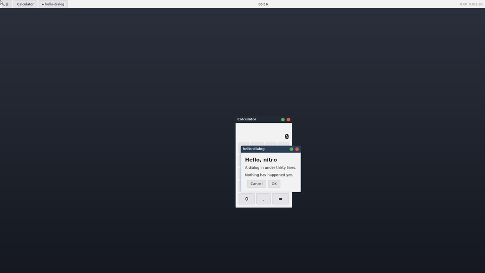
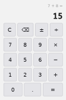

# Size and memory budget

Goal 2 of `DESIGN.md` is "small": low memory, few dependencies, short
build. This is the table that keeps it honest. Regenerate the dev-machine
rows with `just size` (and `just size 5` for the five-window row); the box
rows come from the same binaries running on the test box, which is the
number that actually matters — 3.3 GB and **no swap**.

All figures are release builds, measured after this branch was rebased
onto M2-pre (`nitro-text`). That matters: text moved almost every number
on this page. The server was **2.5× over its RSS budget** because of it;
the lazy font loading of issue #528 has since brought it back inside. See
the resident-memory section for both numbers.

The `nitro-calc` rows and section are the M2 exit measurement (#3684),
taken on the box against the server as it stood at #528. The app numbers
do not move with the server's: a client's own RSS and binary size are
independent of how the compositor stores its fonts.

`[profile.release]` sets `strip = true`, so the binaries are already
stripped and a separate `strip(1)` pass would measure nothing but whether
the tool is installed.

## Footprint baseline and the surface delta rule

`just footprint [SECS]` (`deploy/footprint.sh`) prints one report with
three parts. The first is the stripped size of every binary in
`box_bins` plus `nitro-gpu` and `nitro-video`, which show as `absent`
until those crates exist. The second is the two `cargo tree` numbers
from "Dependency count" below. The third is the box's idle desktop tree
from `deploy/box-ps.sh`. Before it measures, it compares the md5 of the
local `nitro-server` with the box's and prints a WARNING if they differ.
In that case run `just deploy` first. `NITRO_FOOTPRINT_NO_BOX=1` skips
the box part.

The script builds with `--bins --examples`, exactly like
`just deploy-bins`. A `--bins`-only build unifies features differently:
eight of the client binaries come out 1–2 KB smaller and the server's
md5 differs, so a report from that build would not describe what is
deployed.

### Baseline

Taken at `13f69e2` on 2026-09-29. Before measuring, `just deploy` put
that same build on the box, so the md5s matched. The tree was
"dirty" only because of this task's script and docs, which change no
binary. The desktop was idle: session, wallpaper, bar and launcher, no
apps open. The idle window was 60 s.

| binary | bytes |
|---|---|
| `nitro-server` | 2 977 592 |
| `nitro-session` | 510 608 |
| `nitro-shot` | 333 352 |
| `nitro-demo` | 527 760 |
| `nitro-bench` | 664 560 |
| `nitro-calc` | 664 872 |
| `nitro-amp` | 1 241 856 |
| `nitro-term` | 785 904 |
| `nitro-files` | 1 015 832 |
| `nitro-bar` | 874 928 |
| `nitro-launcher` | 822 240 |
| `nitro-wallpaper` | 594 672 |
| `nitro-settings` | 944 608 |
| `hey` | 370 384 |
| `nitro-gpu` | absent (see "GPU helper" below: the binary is `nitro-gpu-vulkan`) |
| `nitro-video` | absent |
| **sum** | **12 329 168** |

| dependencies | |
|---|---|
| `cargo tree -e normal --prefix none \| sort -u \| wc -l` | **89** |
| distinct external crate names | **37** |

| box, idle (kB) | VmRSS | RssAnon | RssFile | VmHWM | cpu % |
|---|---|---|---|---|---|
| `nitro-session` | 2 808 | 228 | 2 580 | 2 808 | 0.00 |
| `nitro-server` | 18 404 | **10 388** | 8 016 | 19 076 | 0.02 |
| `nitro-wallpaper` | 2 752 | 224 | 2 528 | 2 752 | 0.00 |
| `nitro-bar` | 3 032 | 268 | 2 764 | 3 032 | 0.00 |
| `nitro-launcher` | 3 056 | 276 | 2 780 | 3 056 | 0.00 |
| **TOTAL** (without `(sd-pam)`) | 30 052 | **11 384** | 18 668 | | |

RssShmem was 0 on every row.

### Baseline: testhost2 (#3917)

The same report for the second box (`docs/testbox.md` §testbox2), at
`76d438e` (main) on 2026-09-29, `just box=testhost2 deploy` first
(md5 `ea1fbf68…` on both ends). The session ran under a temporary copy
of box1's `nitro-dev` unit (same `MALLOC_MMAP_THRESHOLD_`), not GDM,
so the rows compare with box1's. eDP-1 **2560×1440@60**, idle desktop, 60 s
window. Binary sizes and dependencies are the build's, not the box's:
at this sha `nitro-server` is 3 176 280 bytes, the sum 12 603 144, and
`cargo tree` is still 89 / 37.

| testhost2, idle (kB) | VmRSS | RssAnon | RssFile | VmHWM | cpu % |
|---|---|---|---|---|---|
| `nitro-session` | 3 028 | 224 | 2 804 | 3 028 | 0.00 |
| `nitro-server`, scale 1.25 | 50 352 | **40 796** | 9 556 | 68 080 | 0.00 |
| `nitro-server`, scale 1 | 51 620 | **42 080** | 9 540 | 68 048 | 0.00 |
| `nitro-wallpaper` | 2 868 | 220 | 2 648 | 2 868 | 0.00 |
| `nitro-bar` | 3 104 | 268 | 2 836 | 3 104 | 0.00 |
| `nitro-launcher` | 3 356 | 412 | 2 944 | 3 356 | 0.00 |
| **TOTAL**, scale 1.25 (without `(sd-pam)`) | 62 708 | **41 920** | 20 788 | | |

The server's RssAnon is **~2.2× box1's 18.6 MB** (with the atlas), and it
splits like this, from `/proc/PID/smaps` and a fresh restart per arm:

| part | kB |
|---|---|
| shadow buffer (`shadow_bytes` 14 745 600) | 14 400 |
| overview atlas (`overview_atlas_bytes` 14 745 600) | 14 400 (measured: 43 788 on, **28 888** with `NITRO_OVERVIEW_ATLAS=0`, Δ 14 900) |
| everything else | ~12 000–13 000 |

The two output-sized buffers are 1.78× box1's because the panel is. The
rest is ~5× box1's ~2.4 MB, and it is the box's **content**, not the
build: this Arch install indexes **856 fonts** (box1: 47) and
**313 `.desktop` entries** (box1: 14), and three 3.4–4.4 MB anonymous
mappings sit next to a 2.6 MB heap. It is the number to watch on a
normal desktop install, where box1's near-empty font set flatters the
server.

**Audited by #3928.** The anonymous blocks are not font files. `font_bytes`
is 0–0.6 MB, and the lazy loader and idle sweep work. They are swash's
**shaping cache**: strace -k on a debuginfo build shows each block growing
by `mremap` doubling inside `Layout::run` → `ShapeContext`
(`FeatureEntry` vectors, `CharmapProxy::from_font`). Every cached face
keeps its compiled GSUB/GPOS feature store, which is hundreds of KB for
Noto Sans and the fallback faces testhost2 resolves to. Before #3926 each
shape minted a fresh cache key, so all 16 default entries filled. After
#3926 the keys are stable, but the cache still holds the entries for the
server's lifetime. The rest, from a bare-server bisect at 640×480: the
856-face font index is ~0.25 MB, and the 313-entry desktop index plus
icon-theme data is ~0.5 MB.

The fix: the shaper and scaler caches are bounded to 4 faces, and
`TextEngine::release_idle_fonts` hands them back at the idle point after
any shape or glyph render (`shape_cache_releases` in `stats`). The two
indexes drop their growth slack. Idle server under the temporary
`nitro-dev` unit, 2560×1440 at scale 1.25, full session, overview atlas
off (the #3916 default):

| testhost2, idle (kB) | VmRSS | RssAnon | anon blocks > 500 kB |
|---|---|---|---|
| main `d286a1f` | 30 856 | **21 312** | shadow 15 028, **3 784**, `[heap]` 2 020 |
| #3928 | 27 208 | **17 680** | shadow 15 192, `[heap]` 2 016 |

That is −3.6 MB. The server is now shadow + ~2.7 MB, the same shape as
box1. `shape_us_mean` stays in the few-hundred-µs lifetime range of a
cold start on this box (282 → 384 µs over ~50 layouts, mostly startup
labels with font reads). The cost of a release is one feature-store
rebuild on the next shape after idle.

### GPU helper (#3920)

`nitro-gpu` is a library (protocol, loop, sandbox); nothing shipped links
it yet. The helper binary is `nitro-gpu-vulkan`: **582 624 bytes**
stripped (budget stated up front: ≤ 1.0 MB). The 15 existing binaries
are **byte-identical** to main `471a976` (compared with `cmp` on a
`--bins --examples` release build of both trees). Dependencies:
`cargo tree` **90 → 96** lines, external names **37 → 40** (`ash`,
`libloading`, `cfg-if`). The helper is built but not installed on the
boxes yet (server integration is a later task), so the box idle tables
above are unchanged.

Helper process, measured by the ignored `footprint` test in
`crates/nitro-gpu-vulkan/tests/pixels.rs` (`just box-gpu-test`). RSS/PSS
are the helper's own `/proc/self` (it is non-dumpable, so it reports
them over `GetStats`); driver memory is DRM fdinfo `drm-total-*` /
`drm-resident-*` summed per client. MiB:

| stage | box1 HSW / hasvk: RSS | PSS | drm total | drm resident | testhost2 KBL / anv: RSS | PSS | drm total | drm resident |
|---|---|---|---|---|---|---|---|---|
| idle after init (spawn → `HelloReply`: 13 ms / 11 ms) | 10.8 | 7.1 | 1.0 | 0.1 | 12.6 | 7.2 | 8.1 | 4.4 |
| + 3-slot 1080p XR24 ring | 10.9 | 7.1 | 24.9 | 0.1 | 12.8 | 7.4 | 31.8 | 4.5 |
| + 1080p shadow (udmabuf) + first full frame | 11.4 | 7.5 | 32.8 | 16.5 | 13.2 | 7.6 | 41.8 | 41.8 |

Target was ≤ 12 MB RSS / ≤ 10 MB PSS idle on KBL: PSS is met (7.2),
RSS is 12.6 — 0.6 MB over, all of it shared file pages (libvulkan +
the anv ICD; PSS is what the process costs). The ring is 3 × 7.9 MB of
driver memory (1080p × 4 B, X-tiled), system RAM on these iGPUs and
not in RSS; it becomes resident once rendered into. The udmabuf shadow
costs no driver memory of its own (the pages are the server's memfd);
the first frame's resident growth is the ring slot plus the pinned
shadow pages. First frame submit 2.6 ms (HSW) / 6.8 ms (KBL, includes
lazy pipeline creation), GPU done at 9 ms on both; a steady frame's
`Composited` reply comes ~0.3 ms after the request.

### The rule

Every task tagged `surface` (the GPU/video work of design #3894) must
do the following:

1. **State a budget up front** in its plan: the growth it expects in
   server RssAnon and in each binary it touches.
2. **Run `just footprint`** after `just deploy` of its branch, so there
   is no md5 WARNING. It then reports **the delta against this table**
   (or against a `just footprint` run on its merge base, if main has
   moved) in its final task message. The report covers:
   - bytes for every binary it changed, including new ones such as
     `nitro-gpu` and `nitro-video`. For the rest, a statement that they
     are byte-identical;
   - both dependency numbers;
   - server VmRSS and **RssAnon**, plus the tree TOTAL RssAnon.
3. **Justify any overrun.** If server RSS or any binary grows by more
   than the stated budget, the message must justify it. The
   justification is also recorded as a section on this page, the way the
   M4-G/H sections below do it. An unjustified overrun is a review
   failure.

RssAnon is the RSS number that counts. RssFile moves with what the
binary links, and that is already measured by the binary-size column.
A new dependency is a delta even if it costs zero bytes: say which crate
it is and why.

## Binaries

| binary | bytes | budget | verdict |
|---|---|---|---|
| `nitro-calc` | 560 360 | ≤ 1 MB (client) | **ok**, 56 % of budget |
| `nitro-term` | 650 136 | ≤ 900 KB (M4-A) | **ok**, 72 % |
| `nitro-settings` | 719 240 | ≤ 700 KB (M4-C) | **over by 2.7 %**, see below |
| `nitro-demo` | 481 240 | ≤ 1 MB (client) | **ok**, 48 % |
| `nitro-bench` | 626 016 | ≤ 1 MB (client) | **ok**, 63 % |
| `hello_client` | 393 344 | ≤ 1 MB (client) | **ok**, 39 % |
| `hey` | 368 008 | — | ok |
| `nitro-shot` | 330 160 | — | ok |
| `nitro-server` | 2 047 016 | — | see below |

The `nitro-bench` row is measured on the box rather than here, because
that is the only machine it is ever deployed to. It is 144 776 bytes
above `nitro-demo`, and the gap is entirely its own: sixteen scenarios,
six demo effects with their palettes and sine table, a hand-written JSON
reader/writer and a markdown table generator — against `nitro-demo`'s one
scene and one histogram. It links the same two crates (`nitro-wire`,
`nitro-core`) and adds **no external dependency**: the workspace is still
at 37 crates, because the effects' PRNG and sine table are twenty lines
each and the report's JSON is hand-rolled rather than serde. What it
buys is in `docs/bench.md`.

**M4-G (icons)** moved five of these; the row that needs an argument is
the server's. Measured on the box, mine against main's binary, same
build flags:

| binary | main | M4-G | delta |
|---|---|---|---|
| `nitro-server` | 2 232 064 | **2 500 504** | **+268 440 (+12.0 %)** |
| `nitro-bar` | 617 624 | 623 464 | +5 840 |
| `nitro-settings` | 750 312 | 754 704 | +4 392 |
| `nitro-launcher` | 720 544 | 722 488 | +1 944 |
| `nitro-files` | 844 000 | 845 800 | +1 800 |
| `nitro-calc` | 593 088 | 594 872 | +1 784 |
| `nitro-term` | 677 480 | 677 944 | +464 |
| `hey` | 370 400 | 370 400 | **+0** (links no toolkit) |

The server's +268 KB is not what it looks like, and the split was
measured rather than reasoned about — by rebuilding with the icon
**table** cut to one entry and everything else (zeno, the `IconEngine`,
the wire op) left in place, so exactly one variable moved:

| | bytes | what it is |
|---|---|---|
| main | 2 232 064 | |
| + zeno and the `IconEngine`, one icon | 2 457 504 | **+225 440 — code** |
| + the other 46 icons | 2 500 520 | **+43 016 — data, 935 B/icon** |

So **84 % of the delta is zeno's rasteriser**, linked into the server for
the first time, and 16 % is the artwork. That matters for the decision it
justifies: the marginal cost of an icon is under a kilobyte, so the set
can grow to a few hundred without this row moving appreciably, and the
one-off is paid whether the set has one icon or fifty. It is also the
number to point at if anyone proposes a *second* rasteriser.

The clients pay 0.5–1 KB each for the `Icon` widget and nothing for the
artwork, which is the whole point of the server owning it: `hey` links no
toolkit and is byte-identical.

### Surface step 1: plane discovery + `TEST_ONLY` (#3895)

Measured with `just footprint 60` at `cccc30e` after `just deploy` of the
branch (md5s matched), against the baseline above.

| | baseline | #3895 | delta |
|---|---|---|---|
| `nitro-server` bytes | 2 977 592 | 3 043 688 | **+66 096** (+2.2 %) |
| every other binary | | | byte-identical |
| `cargo tree` lines / external names | 89 / 37 | 89 / 37 | 0 / 0 |
| server VmRSS / RssAnon (kB) | 18 404 / 10 388 | 18 468 / 10 452 | +64 / **+64** |
| tree TOTAL RssAnon (kB) | 11 384 | 11 432 | +48 |

The binary growth is the new `nitro-kms` code the server links but does
not call yet. That covers the `planes` vocabulary, the DRM discovery
(IN_FORMATS parser, enum-name reads), scanout buffers and `test_layout`,
plus the fake backend's plane inventory and rule-based acceptor: the
server builds `FakeBackend` for `--fake`, so it links both backends.
Each new `Backend` method adds a vtable entry and a body per backend. No
dependency was added: `drm_ffi::mode::get_property` was already
reachable.

The RSS delta is one 64 kB step in server RssAnon. The heap discovery
actually holds is three `PlaneInfo`s with their format lists (about
2 kB on the box). That is below the allocator's granularity, so the
step is noise in the idle measurement, not a cost this change adds. No
budget was stated before the work began, which the rule asks for; the
budget it should have stated is "≤ 100 kB of binary, no RSS", and the
measurement is within it.

### M4-H2: the frame's icons and the `.desktop` hop (#3715)

The title bar's application icon, the three symbolic button glyphs, and
the `app_id → <app_id>.desktop → Icon=` index behind them. Measured on
the box against the set that was on it, release, same flags:

| binary | before | #3715 | delta |
|---|---|---|---|
| `nitro-server` | 2 599 008 | **2 613 488** | **+14 480 (+0.56 %)** |

A twentieth of what the symbolic set cost and a seventh of the theme
lookup, because almost nothing new is *code*: the artwork was already
compiled in at M4-G, the theme walk and the PNG decoder at M4-H, and what
#3715 adds is a 200-line `basename -> Icon=` scanner plus the frame
nodes. No client grew at all — the frame is the server's own tree, so
there is no wire message and no toolkit change for a client to link.

**Residency** is the index itself: `basename -> Icon=` for every
`.desktop` on the search path, held as two `String`s per entry. The box
has 12 entries with `~/.local/share/applications` populated and 8
without; a developer machine with a full desktop installed has ~300,
which is tens of kilobytes of `String` — against `desktop_entries` in
`stats` so it can be watched rather than assumed. Server RSS with the
index live and one decorated window open: **VmRSS 18 200 kB, RssAnon
10 400 kB**.

The per-frame node count is the other half of this task's cost and has
its own section above; the short version is +5 nodes, 1 200 bytes per
decorated window, under the granularity `RssAnon` is reported at.

### M4-H: the application icons (#3714)

The other half — the XDG theme lookup, `nitro-png` and the coloured tile
cache. Measured the same way, my branch against main `c843f59`, release,
same flags:

| binary | main | M4-H | delta |
|---|---|---|---|
| `nitro-server` | 2 501 560 | **2 598 928** | **+97 368 (+3.9 %)** |
| `nitro-launcher` | 721 184 | **731 096** | **+9 912 (+1.4 %)** |
| `nitro-bar` | 622 304 | **628 616** | **+6 312 (+1.0 %)** |
| `nitro-calc` | 594 272 | **599 184** | **+4 912 (+0.8 %)** |
| `nitro-settings` | 753 592 | **758 016** | **+4 424 (+0.6 %)** |

The server's +95 KB is the PNG decoder, the theme parser and the
resampler. It is a third of what the symbolic set cost, and the shape of
the comparison is worth keeping: M4-G's +268 KB was 84 % *somebody else's
rasteriser* linked in for the first time, while this row is code we own —
#3711 measured the alternative at **+130 KB** for the `png` crate and its
eight dependencies, so the decision made there is worth 33 KB and eight
crates here. `DEPENDENCIES.md` has that table.

The clients pay 4–10 KB for the leading-icon `Button` mode, the tint enum
and the fallback latch — no artwork and no decoder, which is the same
bargain as before. `nitro-launcher` pays most because it also gained
`Icon=` parsing.

### M4-I: the file listing's type icons (#3716)

`Row` gaining a named icon in `nitro-ui`, and `nitro-files` resolving one
per row from its MIME type. **No server change**, which is the point of
by-name and shows in the table: the artwork was already there.

Dev machine, my branch against main `6019fde`, release, same flags, both
built in their own worktree from a clean `target`:

| binary | main | M4-I | delta |
|---|---|---|---|
| `nitro-files` | 849 520 | **857 440** | **+7 920 (+0.9 %)** |
| `nitro-bar` | 628 600 | 628 632 | **+32** |
| `nitro-launcher` | 732 184 | 732 216 | +32 |
| `nitro-settings` | 758 016 | 758 048 | +32 |
| `nitro-calc` | 599 200 | 599 232 | +32 |
| `nitro-term` | 679 520 | 679 552 | +32 |
| `nitro-server` | — | — | **+0**, byte-identical |

Confirmed on the box, where the comparison is against the binary it was
actually carrying rather than against a rebuild: `nitro-files`
**850 696 → 860 336 (+9 640, +1.1 %)**, and `nitro-server`
**md5-identical** — the "+0" row is verified rather than argued.

`nitro-files` stays inside its **1 MB client budget at 86 %**, up from
85 %. Its +7.9 KB is `mime::icon_for`'s four match tables and the
per-family predicates around them, which is string data and a jump table;
the +32 bytes on every other toolkit client is `List`'s icon branch, and it
is the honest figure for "a widget gained a feature five apps do not use".

The row worth reading is the server's zero. A per-type icon column on a
thousand-row listing added **no bytes at all** to the process that draws
it, because the client sends `"file-earmark-code"` and the artwork was
already compiled in — which is the arithmetic form of the argument
`docs/icons.md` opens with, and the reason M4-G's +268 KB was a one-off
rather than a per-consumer cost.

**Resident memory**, on the box, same directory both arms:

| `nitro-files` RSS | before | after |
|---|---|---|
| 10-row test directory | 3 156 kB | **3 152 kB** |
| `/usr/bin`, 1 860 rows | 3 716 kB | **3 656 kB** |

Both **down**, and not claimed as a win: the icon names are `&'static
str`, so the `Entry` grew two words and lost nothing, and 60 kB is three
orders of magnitude more than that. The honest reading is the same one
@3712 recorded — a differently-sized binary rearranging glibc's arenas
against the `MALLOC_MMAP_THRESHOLD_` the unit pins. Recorded because
measured; not attributed. What the row does establish is that a per-row
icon column costs **no** resident memory in the client, which is what
"the server owns the artwork" predicts.

**Resident memory.** The tile cache is the only new allocation, and it is
bounded at 4 MiB with an LRU (`IconEngine::APP_MAX_BYTES`). Server VmRSS
with five 24 px tiles cached against a fresh server with none — three
interleaved pairs, each arm its own process, because the cache survives a
reload and there is no honest way to empty it in place:

| pair | none | 5 tiles cached | delta |
|---|---|---|---|
| 1 | 17 700 kB | 17 788 kB | **+88 kB** |
| 2 | 17 684 kB | 17 776 kB | **+92 kB** |
| 3 | 17 640 kB | 17 720 kB | **+80 kB** |

`app_icon_bytes` says 11 520 for those five (5 × 24² × 4), so ~80 kB of
the ~87 kB mean is the decoder's transient and the allocator's rounding
rather than the tiles. That is the cost `nitro-png`'s README predicts and
names as its one real trade: it holds the whole filtered raster *and* the
output buffer at once. At icon sizes it is tens of kilobytes; the fix, if
a consumer ever decodes something large, is a streaming unfilter and not
a dependency.

**Decode time**, the number the lazy-decode decision rests on:
`app_icon_decode_us_max` after loading every application icon the box can
resolve was **214–510 µs** across runs, for 48×48 hicolor PNGs resampled
to 24 device px. #3711 measured 2 178 µs for a 256×256 on this CPU, so a
large icon really would be a frame — which is why the decode is on the
first *paint* and never on the commit or on a repaint.

Identical on the dev machine and the box (same artefact, `rsync`ed, and
`sha256sum`-verified on both sides for the M2 row below).

**`nitro-calc` is the number M2 exists to produce**: a complete
application — two labels, twenty buttons, a state machine, a formatter
and a scriptable introspection socket — in **560 KB**, against a 1 MB
client budget. It carries no font library, no rasterizer and no
compositor: a label is a string on the wire and the server owns the
glyphs. Of that, ~68 KB is the introspection protocol, monomorphised per
app-state type (`docs/ui.md`, *Measured*); the de-monomorphisation that
would share one copy across a program is M3.

It is 79 KB above `nitro-demo`, and that gap is the toolkit's own cost:
the arena, eleven widgets, the flex solver, the passes and the socket,
against `nitro-demo` building its scene by hand. Buying a widget toolkit
for 79 KB over talking to the wire directly is the trade goal 2 asks
for, and it is the reason the toolkit exists.

**`nitro-settings` is the first binary to miss its budget**, at 719 240
bytes against 700 KB — 2.7 % over, 19 KB. It is recorded rather than
rounded away, and it is not a regression in anything: the app is three
sections (displays, keyboard, audio) against `nitro-calc`'s one keypad,
and it carries a `server.conf` renderer and parser, a control-socket
client and a subprocess audio backend that no previous app needed. The
budget was set before any of those were specified.

The lever is already known and is not specific to this app: ~68 KB of
every one of these binaries is the introspection protocol, monomorphised
per app-state type (see `nitro-calc` above). De-monomorphising it — one
shared copy per program instead of one per `S` — would take roughly a
tenth off every client in this table at once and put `nitro-settings`
comfortably inside its budget. That is the fix to make when it is worth
making, rather than shaving a section off an app to hit a round number.

The server tripled, from 737 736 bytes before M2-pre to 2 047 016 after:
that is `swash` and its shaping tables, and it buys text end to end. There
is no stated binary-size budget for the server — it is one process on a
desktop, not a per-app cost — so this is recorded rather than flagged. The
*client* number is the one with a budget, because it is paid once per
running app, and it did not move: `nitro-demo` grew 3 280 bytes across the
rebase and neither client links the text engine at all. That split is
working exactly as intended — shaping lives in the server, so a client
sends a string and pays nothing for the machinery that draws it.

(The server grew 49 864 bytes against the same tree without this change —
1 997 152 → 2 047 016 — which is the lazy font index, its LRU and the
hand-written cache format. It bought 11.4 MB of RSS back, a trade worth
making twice. The 1 988 608 figure this page carried before is from an
earlier commit on this branch.)

The two clients remain within a hundred kilobytes of each other despite
`nitro-demo` doing considerably more, which is the useful signal: nearly
all of a client's size is `nitro-wire` plus the Rust runtime and panic
machinery, not its own code. A toolkit client starts from about the same
floor.

**`nitro-term` is the M4-A number**, and it is the same story one
milestone on: **650 136 bytes** against a 900 KB budget, for an
application containing a VT escape-sequence parser, a cell grid with a
10 000-line scrollback ring and an alternate screen, an xterm key
encoder, a 256-colour palette and a pty. That is **90 KB more than the
calculator** — the whole cost of being a terminal rather than a keypad —
because both are a widget tree and a state struct on the same toolkit,
and neither contains a font, a rasterizer or a compositor. The only
external dependency in it is `vte`, whose contribution is a parser state
table.

## Resident memory

`VmRSS` is what is resident at the sample; `VmHWM` is the high-water mark
— the peak is what matters on a box with no swap, and it is the number a
steady-state `top` never shows you.

`VmRSS` is also **three things added together**, which is why this section
now splits them everywhere (#538): `VmRSS = RssAnon + RssFile +
RssShmem`, and every table below closes on that identity. `RssAnon` is the
heap: private to the process, unreclaimable on a box with no swap, and the
only part that moves when a window opens. `RssFile` is page-cache — the
binary's own text and rodata plus every shared library — shared with every
other process mapping the same file and reclaimable under pressure.
`RssShmem` is resident *shared* memory (tmpfs, shmem, shared-anon), and is
0 everywhere here because the server copies client buffers rather than
mapping them; the reason is under the M3 desktop table, and it is the
column that would move if that ever changed. A budget written against the
sum cannot tell "we allocated a megabyte" from "we linked another
library", which is how the server's "≤ 8 MB" line survived
as long as it did. The server's current, audited line is in
**"The server's 17.8 MB, audited"**; `just box-ps` prints all three.

No compositor publishes these columns. No public source reports
`RssAnon`, `RssFile` or PSS for Xorg, gnome-shell, kwin, sway or weston,
only `ps rss`, `top RES` or whole-system `free -m`. So there is no
external figure to hold against the numbers below. The nearest ones are
collected, with caveats, in [`external.md`](external.md) §2.

### Test box (real KMS, 1920×1080@60)

| process | windows | VmRSS | VmHWM | budget | verdict |
|---|---|---|---|---|---|
| `nitro-server` | 1 | 8 240 kB | 8 240 kB | ≤ 8 MB with 5 windows | over by 1 % — superseded, see below |
| `nitro-server` | 5 | 8 344 kB | 8 344 kB | ≤ 8 MB with 5 windows | over by 2 % — superseded, see below |
| `nitro-server` **+ shadow (#539)** | 2 | **15 888 kB** | 18 460 kB | — | **deliberately over; see "The 8 MB the shadow buffer costs"** |
| `nitro-server`, **anon only**, `NITRO_SHADOW=0` (#538) | 0 | **2 424 kB** | — | `RssAnon` ≤ 2.5 MB | **ok**, 97 % |
| `nitro-server`, **anon only**, `NITRO_SHADOW=0` (#538) | 5 | **3 980 kB** | — | + 100 kB/window → 2.9 MB | over — the #547 allocator ratchet, see below |
| `nitro-server`, **anon only**, unit's `MALLOC_MMAP_THRESHOLD_` (#547) | 3 | **10 060 kB** shadow on, i.e. **1 960 kB** anon | — | + 100 kB/window → 2.8 MB | **ok** — the ratchet mitigated, 64–128 kB per window |
| `nitro-server`, **file-backed** (#538) | 0–5 | **7 252 kB** | — | `RssFile` ≤ 7.5 MB | **ok**, and flat in windows |
| `nitro-calc` | 1 | **2 752 kB** | **2 752 kB** | ≤ 3 MB (client) | **ok**, 92 % |
| `nitro-settings` (M4-C) | 1 | **2 872 kB** | **2 872 kB** | ≤ 3.5 MB (M4-C) | **ok**, 82 % |
| `nitro-settings` (M4-G, four heading icons) | 1 | **3 004 kB** | **3 004 kB** | ≤ 3.5 MB (M4-C) | **ok**, 86 % |
| `nitro-bar` (M4-G, three icons) | — | **2 744 kB** | **2 744 kB** | — | +0 kB against M4-F's 2 744 |
| `nitro-demo` | 1 | 3 132 kB | 3 132 kB | ≤ 3 MB (client) | over by 4 % |
| `nitro-demo` | 5 | 3 224 kB | 3 224 kB | ≤ 3 MB (client) | over by 7 % |

The last three `nitro-server` rows are the #538 audit and are the ones
with a live budget attached; the first two are the M3-A measurement, kept
because the paragraphs below describe them. The five-window anon row is
**over**, and it is left flagged rather than adjusted: the overrun is
1 556 kB of released font bytes that glibc keeps (#547), not per-window
growth. With that allocator behaviour pinned out, the same five windows
measure 2 112 kB, inside the line.

The first two `nitro-server` rows are the pre-#539 measurement and are
kept as the floor they establish: they are what the process costs
*without* the shadow buffer, which is still exactly what it costs today
under `NITRO_SHADOW=0`.

**The first app is inside the client budget**, at 2 752 kB against 3 MB,
and it stays there: 2 776 kB after 120 keypresses, so typing allocates
nothing that is not freed. It is *lighter* than `nitro-demo` despite
being a real application with a widget tree, because `nitro-demo` uploads
a 16 kB image and keeps two frames of scratch. One thread, and no second
one anywhere — the introspection socket is served by the app's own
`epoll` loop between events, which is what makes "scriptable" cost
neither a thread nor a lock.

**`nitro-settings` costs the server nothing measurable to watch its
file.** The claim under test for M4-C was that an inotify watch plus a
parsed config are free, and the honest answer is that they are **below
what this box can resolve**. Three interleaved A/B pairs — the same
desktop with no `server.conf` at all, then with one present and watched —
gave **+68, +744 and +36 kB**, against an A-side spread of ~110 kB within
that series and 668 kB in an earlier one. Two of the three agree with
what the mechanism predicts (one fd, one 4 KiB drain buffer, a struct of
three `Option`s); the 744 kB outlier is larger than the effect being
measured. So no mean is quoted: a number here would imply a precision a
3.3 GB box with no swap does not offer. The interleaving matters for the
reason `docs/latency.md` and M4-B4 both record — a block design would
confound the difference with drift across the series.

The idle half is unambiguous, because it is a count rather than a
difference: **30 s with the watch armed and nothing happening is 0 CPU
ticks**, for the server and for `nitro-settings` alike. An inotify fd
with no queued event is simply not readable, so it never wakes the loop —
the same bargain the defer timerfd and the uevent socket make.

**The server is back inside its budget**, within rounding: 19 676 → 8 240 kB
with one window, 19 804 → 8 344 kB with five. The fix is #528's: `nitro-text`
no longer reads every font file at scan time and keeps it. It indexes the
faces (family, attributes, `(path, face index)`), reads a file only when a
face is actually shaped or rasterized with, caps what is resident with
`NITRO_FONT_CACHE_MB` (default 8 MB), and hands the bytes back when the event
loop next goes idle — which is exactly the state this table is measured in.
The atlas keeps the rendered masks, so a release costs one re-read the next
time a *new* glyph appears (53 µs against 20 µs for a warm line) and never a
redraw. On the box: 47 faces indexed, **0 bytes** of font data resident in the
settled state, 1.9 MB at the moment a label is being painted.

The 48–152 kB over 8 192 is flagged rather than declared a pass. It is not
fonts: with `NITRO_FONT_DIRS` pointed at nothing the same binary sits at
8 012 kB, so the floor is the binary's own text and data (1.9 MB resident of
a 2.0 MB image), libc, libinput/libudev/libglib pulled in by the seat, and one
1 MiB atlas page. Those are the things to attack next if 8 MB is to be a hard
ceiling; the per-process font cost, which is what blew the budget, is gone.

With a text-heavy client (`hello_client`, three labels in two faces) the same
server measures 8 804 kB settled and peaks at 10 632 kB (`VmHWM`) while the
faces are loaded and the glyphs rasterized — the peak is the honest number for
a box with no swap, and it is the one the cap bounds.

Five windows cost the server **104 kB** over one — 21 kB per window, which is
the scene nodes (18 per window) and the per-client id maps, and nothing that
scales with pixels. The server's *scanout* framebuffers are not in RSS: they
are dumb buffers owned by the GPU and mapped, not anonymous memory. Its
shadow buffers are — see the next section, which is the one exception to
"nothing scales with pixels".

(Both figures in that paragraph were superseded by the #538 audit, and it
is kept because the M2 row above is the measurement it describes. A
decorated window costs **86 kB**, not 21 kB, and the frame is **6** scene
nodes, not 18 — the 18 was the client's own tree counted as the server's.
The dominant term is neither: it is the 64 KiB receive buffer `nitro-wire`
allocates per *connection*. See "The server's 17.8 MB, audited".)

### The icon cache, and why it is not in the server's RSS row

The server's RSS went **down**, not up, with icons on screen. Three
interleaved pairs (@3706's method), same clients up in both arms, both
binaries stashed and swapped by md5:

| pair | arm | VmRSS | RssAnon | VmHWM |
|---|---|---|---|---|
| 1 | M4-G | 17 840 kB | 10 272 kB | 19 152 kB |
| 1 | main | 18 264 kB | 10 996 kB | 18 624 kB |
| 2 | M4-G | 17 716 kB | 10 280 kB | 19 036 kB |
| 2 | main | 18 200 kB | 10 996 kB | 18 732 kB |
| 3 | M4-G | 17 872 kB | 10 272 kB | 19 184 kB |
| 3 | main | 18 220 kB | 10 996 kB | 18 820 kB |

**−400 kB VmRSS and −720 kB RssAnon, the same sign in all three pairs**,
against +400 kB VmHWM. The direction is consistent enough to be a signal
rather than this box's drift, but it is **not attributed to the icons**:
the cache itself is 1 792 bytes (see below), three orders of magnitude
too small to explain it. The honest reading is that a 268 KB larger
binary rearranges the allocator's arenas and the glibc mmap threshold the
unit pins (#547), and the peak rising while the steady state falls is
what that looks like. Recorded because it was measured; not claimed as a
win.

The cache is small enough that its row is a footnote rather than a
budget line. On the box with the bar and settings open:

| | measured | what it is |
|---|---|---|
| `icons_cached` | **7** | exactly the distinct `(name, px)` pairs on screen: the bar's `list`/`cpu`/`memory` and settings' `display`/`keyboard`/`speaker`/`palette`, all at 16 |
| `icon_bytes` | **1 792** | 7 × 16² — one A8 byte per pixel, no padding |
| `icon_renders` | **7** | one per entry, and it **stops there**: unmoved across a scheme flip, 10 repaints and two 45 s idle windows |
| `icon_refusals` | **0** | nothing was ever refused for want of room |
| at scale 2 | `icons_cached` **11**, `icon_bytes` **5 888** | +4 × 32² exactly: four masks re-rasterised at the device size |

For scale, the glyph atlas beside it is **1 048 576 bytes** for 186
glyphs — the icon cache is 0.17 % of it. That is the number the
no-eviction decision rests on: all 47 icons at all four recommended sizes
is about 190 KB against a 2 MiB ceiling, so the set has a hard bound
rather than a policy, and `icon_refusals` is how the server would say
that reasoning was wrong.

### A decorated frame's nodes: 6 → 11 (#3715)

The server's own contribution to the `nodes` counter, per decorated
window. `nodes` × 240 bytes is what this page multiplies, so the figure
is pinned by a test
(`a_frame_costs_eleven_scene_nodes_and_a_fixed_window_nine`) rather than
remembered:

| | nodes | what they are |
|---|---|---|
| before #3715 | **6** | frame group, background, bar, title, 2 buttons |
| after | **11** | \+ app icon, and each button is a disc **and** a glyph |
| `FIXED_SIZE` | **9** | no maximize, so two fewer |
| undecorated | **0** | unchanged: opting out still costs nothing |

At 240 bytes a node that is **+1 200 bytes per decorated window** — under
the 4 kB granularity `RssAnon` is reported at, which is why the 86 kB
per-window figure above is not restated as if it had moved.

The five are argued in `wm::build_frame`, and the argument is that each
is a thing no other node can be: a rect has a fill and no artwork, an
icon has artwork and no fill. The alternative worth recording is **one**
hover disc moved between the buttons rather than three fixed ones, since
only one is ever lit — nine nodes and seven, a saving of 480 bytes per
window. It was not taken because a disc whose bounds change on every
hover damages its old rectangle *and* its new one, where three fixed
discs each damage only themselves: twice the pixels per hover, paid on
the motion path, to save half a kilobyte of a 9.5 MB process.

### The cursor's seventeen shapes: 39 168 bytes, once (#3724, #3771)

The software cursor used to be one 24 × 24 arrow converted to ARGB8888 at
startup: 2 304 bytes, too small to appear on this page. #3724 made it six
shapes — the arrow, four resize double-arrows and the move cross — at
6 × 24 × 24 × 4 = 13 824 bytes. M5-E (#3771) added eleven more for
clients' `SetCursor` (the I-beam, the hand, the hourglass and the rest a
browser needs), so the figure is now **17 × 24 × 24 × 4 = 39 168 bytes**,
pinned by `every_shape_has_the_documented_size`.

That is 38.25 kB of a 2.5 MB `RssAnon` line, or **1.5 %** (it was
11.5 kB, 0.5 %), and it is a constant: one allocation per server, not
per output, per window or per pointer. What it buys is the affordance the
frame could not carry — a band that says what it does before you press
it — and it buys it without touching the two things this page is strict
about:

* **No scene nodes.** The cursor is a blit after the paint list, not a
  node in it, so 11 nodes per decorated frame is unchanged.
* **No per-motion allocation.** The masks are converted once and
  immutable; a shape change is two damage rects and a different index.

Why the extra 25 kB is the right trade: a browser without an I-beam over
text and a hand over links is not a browser, and the alternative —
converting a mask on demand — puts a 2 304-byte conversion on the motion
path, which is the path this page is strictest about. Against the
`RssAnon ≤ 2.5 MB` budget line, the 38 kB is spent out of the headroom
that line has left, and it is spent once.

The alternative was converting on demand and caching one shape, which
would save 11.5 kB and put a 2 304-byte conversion on the *motion* path
every time the pointer crossed a window edge. Half a frame of work to
save half a page of memory is the trade this page exists to refuse.

At `scale = 2` the **painted** cursor is 48 × 48 device pixels, but no
more memory: the magnification is nearest-neighbour blocks drawn straight
from the 24 × 24 art (`crates/nitro-server/src/cursor.rs`), not a second
bitmap. The damage follows the painted size, so a 2× output damages
2 304 device pixels per cursor rect against 576 at 1× — four times the
pixels for four times the resolution, which is the same physical area.


### The 8 MB the shadow buffer costs, and what it buys

Since #539 each output owns a heap-resident shadow buffer, and unlike the
dumb buffers it **is** anonymous memory and **is** in RSS. Measured on the
box, same binary, `NITRO_SHADOW=0` against the default, two decorated
windows (`hello_client` + `hello_dialog`), two runs each:

| | `NITRO_SHADOW=0` | shadow (default) | delta |
|---|---|---|---|
| `VmRSS`, no client | 7 800 / 7 688 kB | 15 888 / 15 844 kB | **+8 072 kB** |
| `VmRSS`, two windows | 10 428 / 10 296 kB | 18 460 / 18 396 kB | +8 064 kB |
| per-window cost | 2 628 / 2 608 kB | 2 572 / 2 552 kB | unchanged |
| `shadow_bytes` (reported by `stats`) | 0 | 8 294 400 | — |

The overhead is **exactly `1920 × 1080 × 4` = 8 294 400 bytes**, once per
output, and it does not move with the number of windows. On this box that
roughly **doubles the server's resident set**, from 7.7 MB to 15.9 MB.

That is a large number against an 8 MB budget and it is recorded here
rather than explained away. Three things make it the right trade:

- **What it buys is 9.3× on the frame path**: 6233 µs of paint becomes
  418 µs of paint plus 251 µs of copy (`docs/latency.md` §4.5). Nothing
  else available to us moves a compositor number by that factor, and the
  alternative — asking for a non-write-combined mapping of a dumb buffer
  — is not something userspace can request.
- **It scales with screens, not with work.** One allocation per output,
  made when the output appears and freed when it goes; a desktop with
  fifty windows pays the same 8 MB as one with none. It is the only thing
  in the server that is proportional to pixels, and pixels are a property
  of the hardware, not of what the user is doing.
- **It is one environment variable away from being given back.**
  `NITRO_SHADOW=0` restores the pre-#539 numbers exactly, which is what
  the first two rows of the table above are. A build for a
  memory-constrained target has the lever without a code change.

The 8 MB server budget was written for a process whose framebuffers lived
in GPU memory. This section proposed restating it for M4 as "≤ 8 MB plus
one scanout-sized buffer per output"; the #538 audit went further, because
"8 MB" does not say whether it means anon or total and so cannot tell "we
allocated a megabyte" from "we linked another library". The line that
replaces it is in **"The revised budget line"** below, and it is split:
`RssAnon` ≤ 2.5 MB + 100 kB per decorated window, plus one shadow buffer
per output; `RssFile` ≤ 7.5 MB and not a per-window cost.

The scan also stopped costing a 12 MB read per boot: the index is cached in
`$XDG_CACHE_HOME/nitro/fonts.idx`, validated against the directory walk (paths,
sizes, mtimes) and discarded on any mismatch. Box: **5.2 ms cold, 0.4 ms
warm**, 47 faces, 5 520-byte cache file.

The client is over its 3 MB budget by 4–7 %, and is flagged rather than
quietly rounded down. It is worth noting what it is *not*: five windows
cost it 92 kB, so this is fixed overhead — the Rust runtime, the wire
buffers, the 16 kB image it uploads — not a leak or a per-window cost. A
client that opens five windows for the price of one is the property worth
having; the constant is what to attack if 3 MB is a hard limit, and the
first place to look is the 64 KiB `recv` scratch buffer each `Socket`
allocates.

### A wallpaper per output: what each extra output costs (#3931)

Arithmetic, not a box measurement: the change landed while the server's
second-output paint was broken (#3936), so there is no honest two-screen
RSS row yet. The costs, for an `--image` wallpaper:

| where | cost | lifetime |
|---|---|---|
| `nitro-wallpaper` RssAnon: the decoded source | `w * h * 4` of the **image** (8 MB for 1920x1080) | the session — once, however many outputs |
| `nitro-wallpaper`: each output's scaled copy | `W * H * 4` of **that output** (8 MB at 1080p, 14.7 MB at 1440p) | transient: built, written to a memfd, dropped at the next paint |
| server `RssShmem`: each output's buffer | `W * H * 4` of that output | while the output is plugged; released on unplug |
| scene: one window, two widgets' nodes | a few hundred bytes | while the output is plugged |

So each extra output costs **one output-sized buffer**, shared between the
client (its memfd pages) and the server (the mapping) rather than one copy
each; the client's peak rises by one output's copy while it scales. The
one-window wallpaper kept no source at all (its state was `Copy`); keeping
it is the price of scaling for an output plugged in later without
re-reading the file. A gradient or a solid colour costs nothing per output
beyond the window. Re-measure the M3 table's wallpaper row on two screens
once #3936 lands.

### The M3 desktop (whole tree, real KMS, 1920×1080@60)

The M3-E exit measurement: `nitro-session` supervising the compositor,
the wallpaper, the bar and the launcher, plus the two applications that
make it a desktop. Taken with `just box-ps` (60 s window), pointer parked
off-screen, from a `just deploy` of the same artefacts.

| process | VmRSS | RssAnon | RssFile | RssShmem | threads | idle CPU, 60 s |
|---|---|---|---|---|---|---|
| `nitro-session` | **2 788 kB** | **212 kB** | 2 576 kB | 0 | 1 | **0.00 %** |
| `nitro-server` | 19 620 kB | 12 444 kB | 7 176 kB | 0 | 1 | 0.02 % |
| `nitro-wallpaper` | **2 616 kB** | **208 kB** | 2 408 kB | 0 | 1 | **0.00 %** |
| `nitro-bar` | **2 780 kB** | **248 kB** | 2 532 kB | 0 | 1 | **0.00 %** |
| `nitro-launcher` | **2 896 kB** | **260 kB** | 2 636 kB | 0 | 1 | **0.00 %** |
| **whole desktop** | **30 700 kB** | **13 372 kB** | 17 328 kB | 0 | 5 | — |

All four memory columns are read from the **same** `/proc/<pid>/status`
sample, so `VmRSS = RssAnon + RssFile + RssShmem` closes on every row and
down the total — check it. (An earlier draft of this table paired the
28 968 kB `VmRSS` column from the M3-E exit run with a split measured
later, which made anon+file *exceed* `VmRSS` by 696 kB. A table whose
arithmetic does not close is exactly what this page exists not to be, so
the whole row set was re-measured in one pass. The configuration is the
M3-E one: `nitro-session` with wallpaper, bar and launcher, plus
`hello_client` and `hello_dialog` as the two applications, settled — six
windows, three decorated.)

**`RssShmem` was 0 for every process when these rows were measured**, and
the reason is worth stating precisely, because it is the column's whole
justification. `RssShmem` counts resident **shared** mappings — tmpfs,
shmem, shared-anon — and at the time the server made none: a client's
buffer arrived as a memfd and the server *copied* it, `pread`ing the pixels
into a `Vec<u8>`, because a client can shrink a memfd under a live mapping
and turn the server's reads into `SIGBUS`. So a client buffer was **anon**
in the server, not shared and not file-backed.

**#569 moved that term.** The server now maps the client's sealed memfd
instead of copying it (see `crates/nitro-shm/README.md` for why that is
sound), so client buffer pixels are a resident **shared** mapping: they
leave `RssAnon` and appear in `RssShmem`, which is no longer structurally
zero. The *total* is what improves — the server stops holding a second
copy of every client's pixels at all, so the 64 MB-per-buffer worst case
below is now one allocation shared between client and server rather than
one each. The tables on this page predate the change and are **not**
re-measured here; they are labelled with the sha they were taken at, and
the column to watch on the next pass is `RssShmem` rather than `RssAnon`.

The scanout buffers *are* mapped — `nitro-kms` calls
`map_dumb_buffer` and keeps the mapping for the life of the output — but a
DRM dumb-buffer mapping is a device mapping (`VM_PFNMAP`/`VM_IO`) that the
kernel does not account to any RSS bucket at all.

So the third column is zero **because the server never makes a shared
mapping**, not because nothing is mapped. That is what makes it worth
carrying rather than dropping: the day someone takes the zero-copy path
for client buffers — sealing plus `mmap`, the revisit
`clients::read_buffer` already names — the bytes move out of `RssAnon` and
into **`RssShmem`**, and this is the column that would show it. A reader
watching only `VmRSS` would see a large improvement and a large
regression cancel to nothing.

The anon/file split is the #538 addition, and it changes how this table
reads. **The four shell processes are ~230 kB of private memory each**;
over 90 % of each one's `VmRSS` is file-backed — the same libc and the
same `nitro-ui` text, mapped once per process and counted once per
process. So the 17 328 kB `RssFile` total is an *upper bound*, not a cost:
summing it across the tree double-counts every shared page. The `RssAnon`
column is the one that is genuinely additive, and it says the whole
desktop's private memory is **13.4 MB, of which 8.1 MB is the server's one
shadow buffer**. A supervisor, a compositor and four shell clients come to
about 5 MB of private memory between them.

(The server's 12 444 kB anon here against the 10 532 kB in the audit
table's "desktop, shadow on" row is not a discrepancy: this row has two
applications on screen and three decorated windows where that one has
none, and the #547 allocator ratchet has had more font files pass through
it. Both are honest samples of different workloads; neither is the floor,
which is the 2 424 kB `NITRO_SHADOW=0` figure.)

(The unit also contains systemd's own `(sd-pam)` helper at 4 392 kB,
forked into the logind session by `PAMName=login`. It is listed by
`box-ps` for honesty and left out of the total: it is systemd's process,
not ours.)

| binary | bytes |
|---|---|
| `nitro-session` | **510 984** |
| `nitro-wallpaper` | 522 424 |
| `nitro-bar` | 602 064 |
| `nitro-launcher` | 704 736 |
| `nitro-server` | 2 164 200 |

**The whole desktop is 30.7 MB across five processes, one thread each —
and 13.4 MB of that is private.** For scale, the resident total is less
than a single tab of a browser, and it is the number goal 2 exists to
produce. The private figure is the stricter one and the one that scales:
8.1 MB of it is the server's single shadow buffer, so a supervisor, a
compositor and four shell clients hold about 5 MB of private memory
between them.

(This row set supersedes the "under 29 MB" the M3-E exit run reported. The
difference is not a regression: that sample had two fewer windows on
screen, and the #547 allocator ratchet accounts for most of the server's
share. It is quoted at the re-measured figure because every column here
comes from one sample and closes — see the table above.)

**Idle really is idle, for the tree and not just for the server.** Four
of the five processes used *zero* jiffies in sixty seconds. The
exception is the server's 0.02 %, and it is the bar's clock: the bar
re-renders `06:56` once a minute, the server composites that damage, and
the measurement window caught it. The spec allows the clock tick
explicitly. Note what is *not* there — the session itself is 0.00 %,
which is the claim `crates/nitro-session` is built around: a supervisor
that watches its children through pidfds rather than a poll timer costs
nothing to be running.

**`nitro-session` is the cheapest process in the tree**, at 2 788 kB and
511 KB of binary — smaller than any of the shell clients it starts,
because it is `rustix` + `nitro-wire` + `signal-hook` and no toolkit.

#### The server's 17.8 MB, audited (#538)

It is 9 MB over the "≤ 8.5 MB" the M3-E spec asked for, and the note that
used to sit here blamed the whole gap on #539's shadow buffer and called
the rest "the server proper" without saying what that was. The audit
behind #538 took the number apart. It splits four ways, and only the last
one is a defect.

All rows below are the same binary on the box, `nitro-session` with
wallpaper, bar and launcher up, plus *N* `hello_dialog` windows, settled
(the state the idle sweep has run in). `RssAnon` and `RssFile` are read
from `/proc/<pid>/status`; `just box-ps` now prints all three.

| | `VmRSS` | `RssAnon` | `RssFile` | `RssShmem` |
|---|---|---|---|---|
| desktop, shadow on (as shipped) | 17 764 kB | 10 532 kB | 7 232 kB | 0 |
| desktop, `NITRO_SHADOW=0` | **9 676 kB** | **2 424 kB** | 7 252 kB | 0 |
| difference | 8 088 kB | 8 108 kB | ~0 | 0 |

`RssShmem` is **0** in every sample taken for this audit, and the column
is carried rather than dropped because it is the one that would move if
the server ever stopped copying. It since has: **#569** maps client buffers
instead of `pread`ing them, so on any measurement taken after that commit
this column is where a client's pixels live. At the time of these samples
`RssShmem` counts resident **shared** mappings and the server made none:
client buffers were `pread` into a `Vec<u8>` (anon), and the scanout
buffers, though genuinely `mmap`ed by
`nitro-kms`, are device mappings the kernel accounts to no RSS bucket. The
mechanism is spelled out under the M3 desktop table above. So the third
term is structurally zero here, not merely small — and `VmRSS = RssAnon +
RssFile + RssShmem` means the two columns that are non-zero must account
for the whole of `VmRSS`, which is the check every table on this page is
meant to survive.

**First: 7.2 MB of the 17.8 is file-backed, and it is not the server's
heap at all.** `RssFile` does not move when a window opens, is shared with
every other process mapping the same library, and is reclaimable under
pressure — on a box with no swap that is the difference between memory
that can be given back and memory that cannot. Top mappings by `Rss`, from
`/proc/<pid>/smaps` with five windows open:

| `Rss` | `Anon` | mapping |
|---|---|---|
| 1 696 kB | 0 | `nitro-bin/nitro-server` (`r-xp`, its own text) |
| 1 248 kB | 0 | `libc.so.6` (`r-xp`) |
| 512 kB | 0 | `libglib-2.0.so.0` (`r-xp`) |
| 424 kB | 16 kB | `libc.so.6` (`r--p`, rodata + relro) |
| 368 kB | 48 kB | `nitro-bin/nitro-server` (`r--p`) |
| 344 kB | 0 | `libm.so.6` (`r-xp`) |
| 260 kB | 4 kB | `libglib-2.0.so.0` (`r--p`) |
| 220 kB | 0 | `libgobject-2.0.so.0` (`r-xp`) |
| 200 kB | 0 | `libinput.so.10` (`r-xp`) |
| 192 kB | 8 kB | `libxkbcommon.so.0` (`r--p`) |

So it is the binary's own 2.0 MB image (1.7 MB of it resident), libc, and
the libinput/libglib/libgobject/libxkbcommon stack the seat drags in.
`glib` is there because `libinput` links it; we do not call it. **No font
file appears in this list**, which is worth stating plainly: `nitro-text`
reads faces with `std::fs::read` into the heap, so font bytes are *anon*,
not file-backed, and the "font files mmapped" guess in #538 is wrong.

**Second: 8.1 MB is the shadow buffer**, exactly `1920 × 1080 × 4` =
8 294 400 bytes, and `stats` reports it as `shadow_bytes`. The section
above argues that trade (9.3× on the frame path); it is one allocation per
*screen*, not per window, and `NITRO_SHADOW=0` hands it back.

**Third: what is left is 2 424 kB of anon** — the server proper, with four
shell connections, six windows and every glyph on screen. Of that:

| | bytes | how it is known |
|---|---|---|
| glyph atlas | **1 048 576** | `atlas_bytes`, one 1024×1024 A8 page |
| scene nodes | 206 × 240 = **49 440** | `nodes` × `size_of::<Node>()` |
| per wire connection | ~**66 000** each | `nitro-wire`'s 64 KiB `RECV_CHUNK` receive scratch, allocated in `Socket::from_fd` before the handshake; measured by opening 5 idle sockets that never send a byte (+332 kB) |
| client buffer pixels | one mapping per buffer | **Since #569** the server `mmap`s each client memfd rather than `pread`ing it, so a client's pixels are a *shared* mapping (`RssShmem`) of the client's own pages, not a second anon copy. Small here — the shell clients are a wallpaper and two thin bars — and `MAX_BUFFER_BYTES` is still **64 MB** apiece, but it is now one allocation between the two processes rather than one each. The rows above were measured before the change, when this was an anon `Vec<u8>`. |
| font bytes, settled | **0** | `font_bytes`; see below |

**The atlas is 43 % of the server's anonymous memory**, and one page is
enough: the whole desktop, the calculator and the launcher together
rasterize 115 masks, and the full printable ASCII range at the three sizes
a nitro desktop uses (13 px title bar, 14 px UI, 20 px heading) in all
four subpixel buckets still fits one page — pinned by
`text.rs::a_ui_worth_of_glyphs_fits_in_one_atlas_page`. A page is
allocated whole and never shrinks, so `atlas_bytes` is its real cost
whatever fraction is packed.

**Font residency is working, and now provably so.** #538 asked whether
the idle sweep releases what it should. `font_bytes` alone cannot answer
it: a settled server reports 0 both when the sweep is doing its job and
when no face was ever loaded. `stats` therefore now carries `font_loads`,
`font_releases` and `font_evictions`. On the box, every configuration
measured, at every window count: **`font_loads == font_releases`, and
`font_evictions` is 0**. The sweep hands back every file it reads, and the
8 MB cap never fires — it is the sweep that keeps the steady state small,
exactly as `crates/nitro-text/README.md` claims.

#### Fourth: the 1.6 MB the allocator keeps, which is a real defect

With the fonts released and `font_bytes` at 0, the server's `RssAnon`
**still ratchets up 1 556 kB over the first two decorated windows and
never comes back down** — not when the windows close, not after any
number of open/close cycles. Ten cycles of one `hello_dialog`, settling
between each, hold `RssAnon` flat at the post-first-window figure: the
process is not leaking, it has ratcheted once.

The cause is glibc, not our code. `FontDb::load` reads a whole font file
in one `malloc` — DejaVuSans is 759 720 bytes. glibc serves an allocation
that large with `mmap` and unmaps it on `free`, so the *first* such file
costs nothing lasting. But glibc also **raises its `mmap` threshold to the
size of any mmap'd block it frees**, so the *second* font file of that
size is served from the main arena instead — and an arena only shrinks
from the top. The sweep's `free` is honest and the bytes never leave the
process. The counters agree it released them; `RssAnon` disagrees.

Pinning the threshold (`MALLOC_MMAP_THRESHOLD_=131072`, which only
disables the *dynamic adjustment*) is enough to show that is the whole
story. Same binary, same desktop, `NITRO_SHADOW=0`, `RssAnon` in kB:

| windows | 0 | 1 | 2 | 3 | 4 | 5 |
|---|---|---|---|---|---|---|
| glibc default | 2 424 | 3 240 | 3 980 | 3 980 | 3 980 | 3 980 |
| threshold pinned | **1 684** | 1 804 | 1 864 | 1 972 | 2 040 | **2 112** |

The default row is not a per-window cost at all: it is two font files
ratcheting in, after which five windows cost **nothing measurable**. The
pinned row is what a decorated window actually costs — **428 kB over five
windows, 86 kB each** (deltas 120/60/108/68/72 kB), which is the ~66 kB
wire receive buffer plus 6 scene nodes plus the shaped title. And the
floor drops from 2 424 kB to **1 684 kB**, a 740 kB saving on an idle
desktop.

(Those numbers are the M4-hygiene measurement and are kept as taken. The
frame is **11 scene nodes** since #3715 — see *A decorated frame's nodes*
below — which adds 5 × 240 B = 1.2 kB per window to the arithmetic:
within the 4 kB granularity `RssAnon` is reported at, so the 86 kB figure
is unchanged and it would be dishonest to restate it as though it had
been re-measured.)

The arithmetic closes exactly: with the shadow on and the threshold
pinned, `RssAnon` at zero dialogs is 9 784 kB, and 9 784 − 8 100 (the
1080p shadow) = **1 684 kB**, identical to the no-shadow floor.
`MALLOC_TRIM_THRESHOLD_` alone does the same work, because it is the same
dynamic-adjustment machinery; setting both is no better than either.

**Mitigated on the box, not fixed in the product** (issue #547, resolved by
the M4 hygiene pass). `deploy/nitro-dev.service` now sets
`MALLOC_MMAP_THRESHOLD_=131072`, and the unit carries the full reasoning
beside the line. Re-measured with the shadow **on** (as shipped), `RssAnon`
in kB, `nitro-session` desktop plus N `hello_dialog` windows, settled:

| windows | 0 | 1 | 2 | 3 |
|---|---|---|---|---|
| glibc default | 9 800 | 11 360 | 12 096 | 12 096 |
| **threshold pinned** | **9 800** | **9 928** | 9 992 | **10 060** |
| per-window delta, pinned | — | 128 | 64 | 68 |

Two runs of each, the pinned pair identical to within 4 kB. Subtracting the
8 100 kB shadow, the pinned floor is **1 700 kB** against the 1 684 kB the
no-shadow measurement predicted — the ratchet is gone, and the residual
16 kB is one page-rounded allocation, not a third mechanism. The default
row ratchets **2 296 kB** over two windows and never returns; the pinned row
shows what a decorated window really costs, ~86 kB, which is the ~66 kB wire
receive buffer plus 6 scene nodes (11 since #3715, below) plus the shaped
title. `stats` at every
sample: `font_bytes 0`, `font_loads == font_releases` (11/11),
`font_evictions 0` — the sweep is doing its job and the residue is entirely
the allocator's.

**It is a mitigation because it does not travel with the binary.** A server
started outside the unit still ratchets, which is a footgun
`docs/testbox.md` now carries: two `RssAnon` numbers taken inside and
outside the unit differ by ~2 MB and are not comparable.

**The real fix is option 3 of the issue — make the font bytes file-backed —
and it is not available under this tree's lints.** `FontDb::load` would
`mmap` the file instead of `std::fs::read`-ing it, which is what a font file
wants anyway (read-only, page-aligned, shareable between processes, and
evictable by the kernel) and is what the #538 audit assumed was already
happening. Promoting `memmap2` — already in the tree transitively via
`xkbcommon`, so no new external crate — to a direct dependency of
`nitro-text` was the preferred route and **does not work**: every
file-mapping entry point it offers is an `unsafe fn` (`Mmap::map`,
`MmapOptions::map`, `map_copy_read_only`; `map_raw` is safe but hands back
a raw pointer that needs `unsafe` to read). The `unsafe` genuinely is at
*our* call site, not inside the dependency, because the hazard is real: a
mapped file truncated under us is a SIGBUS, and only the caller can promise
it will not be. `mallopt(M_MMAP_THRESHOLD, …)` (option 2) is libc FFI and
the same problem, for a glibc-specific knob that is a no-op on musl.

So the trade was: **2 MB of resident memory on one test box against the
`unsafe_code = "deny"` rule, which at the time had a single sanctioned
exception.** The rule was worth more. The revisit condition recorded here
was "if `memmap2` ever offers a safe file mapping, or if the server
acquires a sanctioned `unsafe` boundary for some other reason — at which
point option 3 is a small change and the right one."

**That boundary now exists.** #569 added `nitro-shm`, a scoped `unsafe`
exception that owns the tree's one `mmap`/`munmap` for client pixel
buffers, so the tree now has two exceptions rather than one. Mapping the
font file is therefore a small change rather than a new rule — but it is
filed as a follow-up (issue #594) rather than done here, because the font
case needs its **own** argument and does not inherit this one: it is a
read-only mapping of a file *we did not create and cannot seal*, so
nothing stops a package upgrade truncating it under the mapping. That is
the same `SIGBUS` hazard, without the tool that closed it for client
buffers — which is exactly the kind of reasoning that must not ride along
on an unrelated task.

### The revised budget line

The old line — "server RSS ≤ 8 MB" — was written for a process whose
framebuffers lived in GPU memory and before the shadow buffer existed. It
is unmeasurable against today's server in the sense that matters: it does
not say whether it means anon or total, so it cannot distinguish "we
allocated a megabyte" from "we linked another library", and the biggest
single term in it is a hardware constant. The replacement:

> **Server: `RssAnon` ≤ 2.5 MB + 100 kB per decorated window, plus one
> scanout-sized shadow buffer and one thumbnail atlas per output. `RssFile` ≤ 7.5 MB, and is not
> a per-window cost.**

Measured against the box today (`NITRO_SHADOW=0`, glibc as it actually
ships, so the allocator ratchet is *inside* the number rather than
excused): floor **2 424 kB**, five windows **3 980 kB**, `RssFile`
**7 252 kB**, shadow **8 100 kB**. Nothing here is rounded down: 2.5 MB is
above the measured 2 424 kB floor, and the 100 kB/window is above the
86 kB measured with the allocator behaving, chosen so the line still holds
when the ratchet is mitigated and the floor drops to ~1 700 kB.

It now is, under the unit: with `MALLOC_MMAP_THRESHOLD_` set the same box
reads **1 700 kB** at the floor and **1 960 kB** at three windows (shadow
on, minus the 8 100 kB shadow), so both halves of the line have room. The
figures above are kept as the *unmitigated* measurement, because the
mitigation is a property of the unit rather than of the binary — see the
#547 section — and a budget that quotes only the lucky configuration is the
kind of number this page exists to avoid.

What the 9.5 MB of a real, shipped, shadow-on server with a desktop on it
consists of, in one paragraph: **7.2 MB is file-backed** — the server's
own 2.0 MB binary plus libc, libinput, libglib, libgobject and
libxkbcommon, shared with every process that maps them and reclaimable —
and **2.4 MB is anonymous**, of which 1.0 MB is the single glyph atlas
page, 0.4 MB is wire receive buffers at 64 KiB per connected client, 0.05
MB is the 206 scene nodes at 240 bytes each, 0.7 MB is font-file bytes the
idle sweep released and glibc kept, and the remainder is the xkb keymap,
the libinput device state and the event-loop scratch. Zero of it is font
data the server still thinks it needs; `font_loads == font_releases` on
every measurement taken. The 8.1 MB shadow buffer sits on top of that and
is a property of the screen, not of the workload.



Wallpaper, bar with a live window list, two decorated applications
placed by the server's centred cascade, and the launcher hidden where it
belongs. Every process in that picture was started and is supervised by
`nitro-session`.

### Dev machine (fake backend, 1280×720)

| process | windows | VmRSS | VmHWM |
|---|---|---|---|
| `nitro-server` | 1 | 13 824 kB | 13 824 kB |
| `nitro-server` | 5 | 14 092 kB | 14 092 kB |
| `nitro-calc` | 1 | 2 632 kB | 2 632 kB |
| `nitro-demo` | 1 | 2 904 kB | 2 904 kB |
| `nitro-demo` | 5 | 3 040 kB | 3 040 kB |

The server is 5.5 MB *heavier* here than on the box, and the reason is the
fake backend, not the fonts: it keeps its "framebuffers" as ordinary heap
allocations (two 1280×720×4 buffers = 7 MB) where real KMS puts them in
GPU-owned dumb buffers outside RSS. `nitro-demo` on the fake backend draws
no text, so no font file is ever loaded on this row — which is why the two
machines no longer differ by what they happen to have installed. The box
row is the one to quote; it is the one with a budget attached.

## Overview thumbnail atlas (#3902)

Each output owns one opaque XR24 buffer of its own device size, the
overview's thumbnail atlas: `w × h × 4` bytes, **8 294 400** at 1080p. It
is allocated when the output appears (and again on a mode change), and an
explicit zero fill pre-faults it, so the RSS is paid at startup and never
on a Super press. Nothing on the overview path allocates a buffer that
scales with window count. The only per-thumbnail additions are two
scene nodes (an image and a badge group), and only while in overview.
`stats` reports it as `overview_atlas_bytes`.

**Since #3916 the atlas is opt-in** (`overview.animate = true`, default
off; `NITRO_OVERVIEW_ATLAS=1|0` overrides), so an idle server's RssAnon
is back at its pre-#3902 baseline by default. With the setting off,
overview snaps with a direct repaint, as it did before #3902. A failed
allocation falls back the same way. Design: `docs/wm.md` §The thumbnail
atlas; the key: `docs/settings.md` §`overview.animate`.

### #3916: off by default, measured on box1

`just footprint 30` on box1 (HSW, 1920×1080@120), branch task-3916
deployed, idle desktop, fresh `nitro-dev` restart per row. The "on" row
uses a temporary `NITRO_OVERVIEW_ATLAS=1` drop-in (server.conf untouched):

| server, kB | VmRSS | RssAnon | tree TOTAL RssAnon |
|---|---|---|---|
| pre-#3902 (`feff632`, from §Measured on both boxes) | 18 504 | 10 456 | 11 444 |
| task-3916, default (setting off) | 18 780 | **10 540** | 11 520 |
| task-3916, setting on | 26 760 | **18 580** | 19 572 |

Off: +84 kB RssAnon against pre-#3902, which is allocator noise at this
scale, and **−8 028 kB** against main with #3902. On: +8 040 kB, the
8 100 kB atlas (`overview_atlas_bytes` 8 294 400) as before. The
`nitro-server` binary is 3 191 904 bytes, and the dependency count is
unchanged (89 lines, 37 names). The snap path's entry-frame cost after
the fast scaled blit is in `docs/wm.md` §The thumbnail atlas.

### Measured on both boxes (#3915)

#3902 merged with an estimate and no `just footprint` report. These are
the measured figures, at `e2124f7` (main, #3902's last commit), with
`just deploy` on both boxes and matching md5s. The pre-#3902 reference is
its merge base `43f95bf`.

**Binaries and dependencies.** `nitro-server` is 3 120 800 → **3 134 720**
bytes (**+13 920**, +0.45 %). Every other binary is byte-identical, and
`cargo tree` is still 89 lines / 37 external names.

**box1 (HSW, HDMI-A-1 1920×1080@120), idle desktop, 30 s window, fresh
`nitro-dev` restart for each row:**

| server, kB | VmRSS | RssAnon | tree TOTAL RssAnon |
|---|---|---|---|
| before (`feff632`, pre-#3902) | 18 504 | 10 456 | 11 444 |
| `e2124f7` | 26 628 | **18 568** | 19 544 |
| `e2124f7`, `NITRO_OVERVIEW_ATLAS=0` | 18 644 | 10 456 | 11 444 |
| **delta** | +8 124 | **+8 112** | +8 100 |

The estimate was right, and **the full atlas is resident from startup
whether or not the overview is ever opened.** The 8 112 kB matches the
8 100 kB atlas (`overview_atlas_bytes` 8 294 400) to within one allocator
step. The zero fill pre-faults it, and nothing on this idle desktop
pressed Super. With the atlas switched off the server's RssAnon comes
back to the pre-#3902 number exactly, so none of the rest of #3902
(offscreen windows, scene changes) is resident cost. Server RssAnon is
now ~1.8× its pre-#3902 size on this box: the shadow buffer and the atlas
are 16.2 MB of its 18.6 MB.

**testhost2 (KBL, eDP-1 2560×1440).** The new build is installed in
`/usr/local/bin` (md5 matches), but the live session still runs the
previous one. Getting the new build live means restarting GDM, which ends
the human's session, and this measurement is not worth that. The atlas
term was instead measured on the same machine as an A/B pair of private
fake-backend servers at 2560×1440 (`NITRO_BACKEND=fake`, own
`XDG_RUNTIME_DIR`, `MALLOC_MMAP_THRESHOLD_=131072`, the deployed binary):

| fake 2560×1440 server, kB | VmRSS | RssAnon |
|---|---|---|
| `NITRO_OVERVIEW_ATLAS=0` | 52 076 | 44 864 |
| atlas on | 66 580 | **59 268** |
| **delta** | +14 504 | **+14 404** |

`overview_atlas_bytes` is 14 745 600 = 14 400 kB, so the atlas again
costs exactly its size, from startup. The fake backend's absolute numbers
include its heap framebuffers (see §Dev machine), so only the delta
transfers to the live session. For reference, the live pre-#3902 server
there read VmRSS 70 752 / RssAnon **61 380 kB** idle, against 10.4 MB on
box1. That gap predates #3902 and is not explained here. Adding the
atlas would put it at ~75.8 MB after the next login.

**Paint cost.** Each row is `nitro-demo --windows N` (800×500 windows),
then `overview on` / `overview off` over the control socket, three
repetitions. `thumb_render_us` is the delta of that stat across one entry.
Entry-frame `paint_us` is every frame logged by `samples paint` during
the animation, excluding the settled 1 µs frames. Ranges span all three
repetitions.

| box1, 1920×1080 | N=4 | N=8 | N=16 |
|---|---|---|---|
| one thumbnail render | 1.7–2.3 ms | 0.77–0.90 ms | 0.45–0.60 ms |
| all renders, one entry | 6.8–9.2 ms | 6.1–7.2 ms | 7.2–9.7 ms |
| entry frame 1 `paint_us` | 2.6 ms | 2.7 ms | 2.6–2.8 ms |
| entry frames 2… `paint_us` | **10.3–13.7 ms** | **10.4–13.3 ms** | **10.6–15.4 ms** |
| snap path (`ATLAS=0`), frame 1 / rest | | 11.7–15.0 / 0.47–1.05 ms | |

| testhost2 fake, 2560×1440 | N=4 | N=8 | N=16 |
|---|---|---|---|
| one thumbnail render | 1.6–2.0 ms | 1.2–1.4 ms | 0.69–0.86 ms |
| all renders, one entry | 6.3–7.9 ms | 9.7–11.4 ms | 11.1–13.7 ms |
| entry frame 1 `paint_us` | 0.9 ms | 1.8–2.0 ms | 1.9–2.0 ms |
| entry frames 2… `paint_us` | 5.8–13.1 ms | 6.0–14.0 ms | 6.0–14.6 ms |
| snap path, frame 1 / rest | 9.2–10.9 / 0.13–0.44 ms | 11.5–13.5 / 0.24–0.74 ms | 13.1–15.8 / 0.43–1.36 ms |

The thumbnail renders agree with #3902's fake-backend figures
(`docs/wm.md` §The thumbnail atlas). The animation frames do not. #3902
quoted 1.6–4.0 ms at 1080p. On box1 every animation frame after the first
costs **10–15 ms, independent of N**, so the cost is the full-output
repaint and not the thumbnails. That is over the **8.3 ms frame at
120 Hz**, the rate box1 runs at, and just inside a 60 Hz frame. On
testhost2 the frames grow from ~6 to ~14 ms as the animation proceeds,
which is consistent with the scrim's alpha fill getting more expensive
as its opacity rises. That cause is not isolated here. The snap path
inverts the profile: one 12–16 ms frame of scaled blits, then ~1 ms
frames. So the atlas's gain is a cheap *first* frame (2.6 ms against
12–15 ms on box1), bought with ~14 whole-output frames that each cost
about what the snap path's single frame did.

### testhost2 on real KMS (#3917)

The #3915 rows above were a fake backend, because the live session could
not be restarted then. With the box released this is the real thing:
main `76d438e`, eDP-1 2560×1440@60, the same method (`nitro-demo --windows
N`, `overview on`/`off`, three repetitions, `samples paint`). #3916
(snap default + `overview.animate`) had not merged, so the arms are the
atlas default and `NITRO_OVERVIEW_ATLAS=0`. Governor `powersave` (intel_pstate).

| testhost2 KMS, scale 1.25 | N=4 | N=8 | N=16 |
|---|---|---|---|
| one thumbnail render | 2.5–2.9 ms | 1.2–1.7 ms | 0.68–0.94 ms |
| all renders, one entry | 9.9–11.6 ms | 9.6–13.8 ms | 10.9–15.0 ms |
| entry frame 1 `paint_us` | **2.0–2.3 ms** | **2.4–2.5 ms** | **2.4–2.6 ms** |
| entry frames 2… `paint_us` | 7.3–8.6 ms | 7.3–8.8 ms | 7.9–8.6 ms |
| snap (`ATLAS=0`), frame 1 | **20.0–37.3 ms** | **12.9–35.0 ms** | **15.4–18.9 ms** |
| snap, frames 2… | 0.15–0.98 ms | 0.40–1.2 ms | 0.90–2.2 ms |

| testhost2 KMS, scale 1 | N=4 | N=8 | N=16 |
|---|---|---|---|
| one thumbnail render | 1.8–2.3 ms | 1.3–1.6 ms | 0.74–0.94 ms |
| entry frame 1 `paint_us` | 1.7 ms | 1.9–2.0 ms | 2.0 ms |
| entry frames 2… `paint_us` | 7.4–9.8 ms | 7.5–8.1 ms (one rep 10–17) | 7.9–9.2 ms |

(Snap was measured at 1.25 only.) Against box1: the atlas path's
animation frames cost **7.3–9.8 ms here against 10–15 ms on box1**, on a
1.78× larger output, and are flat in N as there. They fit a 60 Hz frame
with ~8 ms to spare. The snap path's single frame is the expensive one:
**13–37 ms**, i.e. one or two missed vblanks at the governor's idle clock
(the first frame after idle, `docs/latency.md` §8). The atlas buys a
2–2.6 ms first frame against that. The snap numbers are what #3916's
`blit_xrgb_scaled` change is meant to cut.

## First frame on the wire

What a client spends to get its first pixels on screen, counted by
`nitro-demo --stats` (`wire:` line). `tx_bytes` is every byte of every
message it sent, framing included; the image pixels are **not** in it —
they travel through a memfd passed by `SCM_RIGHTS`, which is the whole
point of the buffer design.

| | box | dev machine |
|---|---|---|
| `tx_bytes` (client → server, first frame) | 1 755 | 1 972 |
| `rx_bytes` (server → client) | 120 | 152 |
| `connect()` → first `Presented` | 31.6 ms | 18.5 ms |

**Under two kilobytes** to put a window with a gradient, four bordered
rounded rects, an image and ten more nodes on screen — 18 scene nodes for
1 755 bytes, under 100 bytes a node. That is the number that matters for
goal 4 (remote from the same code): a full first frame fits in a single
TCP segment, and subsequent frames are far smaller (a pointer-follow
commit is ~180 bytes).

The two machines differ by a couple of hundred bytes because the window is
configured to a different size on a 1280×720 fake output than on
1920×1080, so the `SetBounds` payloads differ slightly — there is no
per-machine overhead in the protocol.

`connect()` → first `Presented` is dominated by waiting for a vblank, not
by work: the handshake, the transaction and the first paint together are
well under a millisecond. It varies run to run by roughly a frame
depending on where in the refresh cycle the client happens to connect.

## The first app: `nitro-calc`

M2's exit criterion, measured on the box against the real KMS server with
`sha256sum` verified on both sides before the run.

| what | value |
|---|---|
| app source, excluding tests | **489 lines** (292 engine + 197 UI) |
| binary, release, stripped | **560 360 bytes** (560 KB) |
| RSS / HWM on the box | **2 752 kB**, and 2 776 kB after 120 keypresses |
| threads | 1 |
| idle CPU over 10 s, app *and* server | **0.0 %**, 0 voluntary context switches each |
| one keypress on the wire | **2 mutations: `SetText`, `Commit`** |
| keypress-to-photon (server `i2p_*`, 3 runs of 60 presses) | **min 1.9 ms, mean 11.7–13.3 ms, max 36.6–43.7 ms** |



That screenshot is `hey nitro-calc shot`, downscaled 2× — the app
screenshotting itself over its own introspection socket, from an ssh
session, with no cooperation from its code. The PNG is 223×334, which is
exactly the window's `bounds` (`0,0,223,334`), not the 1920×1080 output.

**One keypress is one `SetText` and the `Commit` that carries it.** Not
"about one" — the mutation tap records exactly `["SetText", "Commit"]`,
asserted by `crates/nitro-calc/tests/calc.rs::one_keypress_is_one_set_text`.
The twenty buttons do not repaint, nothing is re-measured but the label,
and the history line stays silent because its string did not change.
That is the whole retained-tree claim, checked from outside the process.

**Idle is zero, not low.** Ten seconds with the app on screen and the
server running: no CPU time and no voluntary context switches in either
process. Both block in `epoll_wait` and no bytes move. (An app with a
`hey watch` attached is the documented exception, waking 100×/s; see
`docs/introspection.md`.)

### On the latency number

The i2p figures are the **server's** view (libinput timestamp → vblank of
the frame that consumed it), which is the only view available here:
`nitro-demo` measures the client half by instrumenting itself, and
`nitro-calc` is an ordinary app with no stopwatch in it. Three runs of 60
`ydotool` keypresses at ~4/s agree to within 1.6 ms of mean — the third
after the #528 font rework, which did not move the app's numbers.

The mean sits above the 9.3 ms `nitro-demo` reports in `docs/latency.md`,
and the difference is real rather than noise: a keypress makes the client
**re-measure a new string** (`MeasureText` is a synchronous round trip in
M2; `docs/ui.md`) and only then commit, where a pointer-follow frame
commits from state the client already has. Every digit is a string the
cache has not seen, so every keypress pays one turnaround. The cache is
why the number is a per-*string* cost and not a per-frame one, and the
async measurement path is M3 — this is the first measurement that puts a
price on that decision.

The run was checked against the trap `docs/latency.md` section 7 warns
about: **1.7 flips/s** over the typing run, nowhere near the 60.0 that
would mean the queue was full and the number was backlog rather than
latency.

## Rasterizer time budget

The other half of "small" is how long a frame takes to paint. The
`nitro-raster` benchmark's targets live in `crates/nitro-raster/README.md`
("Against the targets"); the milestone-level statement belongs here, because
the targets were **revised at M4 on a human decision** (issue #522) rather
than met.

| scene (box, 1920×1080, single-threaded) | old target | **target** | measured |
|---|---|---|---|
| (a) `solid_fill` | < 1.5 ms | at memory speed | 1.83 ms |
| (e) `ui_frame` | < 4 ms | **≤ 5.3 ms** | 5.22 ms |
| (d) `blits` | < 10 ms | **≤ 37 ms** | 36.09 ms |

The measurements are unchanged and their history is kept in full in the
raster README — what moved is the line drawn against them. Four reasons,
recorded so a future milestone can re-open the decision on the same terms:

1. **The running compositor does not pay `ui_frame`.** Since the shadow
   buffer (#539/#3695) the server paints ~**0.4 ms of damage per frame**
   (§4.5 of `docs/latency.md`); `ui_frame` is a *full-frame synthetic*
   painting 1.77 M pixels, 85 % of the screen, over 20 clip rects. The 4 ms
   target was set when a full-screen repaint was the plausible worst case.
2. **Nothing but SIMD closes the remaining gap.** Two rounds (#3693, #3702)
   took `ui_frame` 9.36 → 5.22 ms and blits 38.05 → 36.09 ms, and both ended
   at the same wall: per-pixel blend throughput on an SSE4.2-only CPU. An
   instrumented breakdown puts an *alpha-free* bilinear blit at 11.4 ms on the
   **faster** machine, i.e. above the old 10 ms blit target as a pure bound.
   Explicit SIMD means `std::arch` — an `unsafe` exception in a crate whose
   point is `#![forbid(unsafe_code)]` — or `std::simd`, which is nightly.
   Neither is worth it here; see `DEPENDENCIES.md` on the `unsafe` rule.
3. **The blit scene stresses a path the desktop barely uses.** Instrumented,
   the whole running desktop sends **0.288 % of its painted pixels** through
   `blit_scaled`.
4. **There is a natural time to revisit**: M5's Wayland adapter and dma-buf
   import decide whether full-screen image blits go through the CPU rasterizer
   at all. If they do, the decision gets re-made against the real workload.

## Surface CPU path (#3897)

`nitro-demo --video` on box1 (Pentium G3240, HDMI 1920×1080), branch
task-3897, `samples paint`/`samples damage` over an 8 s run with the first
30 paints dropped. The client damages only what moved (the box, its old
position, the frame counter), so these are **per-frame partial** costs;
the first full-frame paint is the `max` column.

| run | paints | `paint_us` p50 | mean | p95 | max (full frame) | `damage_px` mean | presented / dropped |
|---|---|---|---|---|---|---|---|
| 1280×720 windowed, 30 fps | 453 | — | 371 (≈ 740 per video frame) | 740 | 2 225 | 51 422 | 239 / 0 |
| 1280×720 windowed, 60 fps | 452 | 676 | 679 | 705 | 2 205 | 49 281 | 478 / 0 |
| 1920×1080 fullscreen, 60 fps | 453 | 1 364 | 1 388 | 1 432 | 6 118 | 110 938 | 478 / 0 |

At 30 fps every video frame is followed by an age-2 carry frame that has
nothing to rasterize (`paint_us` ≈ 1), so the mean over all paints is half
the per-video-frame cost. A full 1080p NV12 frame through the fused
converter is ~6 ms, inside a 60 Hz budget but not a 120 Hz one; the plane
path (#3899) is what removes it.

**Memory.** The client's ring is 3 NV12 buffers at 1.5 B/px: **4.1 MB** at
720p, **9.3 MB** at 1080p, mapped read-only by the server (no copy) and
counted against the per-client buffer caps.


### testhost2 (#3917)

The same runs on testhost2 (i5-8250U, eDP-1 2560×1440@60, governor
`powersave`), main `76d438e`, 8 s, first 30 paints dropped; `paint_us`
per *video* frame (non-zero paints; at 30 fps the carry frames are ~1 µs
as above).

| run | scale | `paint_us` p50 | p95 | max | `damage_px` mean | presented / dropped |
|---|---|---|---|---|---|---|
| 1280×720 windowed, 30 fps | 1 | 646 | 675 | 1 904 | 51 439 | 239 / 0 |
| 1280×720 windowed, 60 fps | 1 | 610 | 644 | 3 379 | 49 280 | 478 / 0 |
| 2560×1440 fullscreen, 60 fps | 1 | **2 060** | 2 144 | 3 527 | 198 725 | 478 / 0 |
| 1280×720 windowed, 30 fps | 1.25 | 14 150 | 14 676 | 14 859 | **1 441 939** | 239 / 0 |
| 1280×720 windowed, 60 fps | 1.25 | **12 659** | 12 868 | 12 968 | **1 441 935** | 478 / 0 |
| 2560×1440 fullscreen, 60 fps | 1.25 | 2 087 | 2 143 | 3 560 | 198 864 | 478 / 0 |

At scale 1 the windowed partial update costs what it costs on box1
(~600–650 µs), and a **full 2560×1440 NV12 frame is ~11.6 ms**
(`max` over the run, i.e. the first full paint, 11 925–12 303 µs; it
includes the rest of the desktop under the window) against box1's 6.1 ms for
1080p: 1.78× the pixels at roughly the same ns/px (~3.2 against 2.95).
Fullscreen streams at 2.1 ms/frame because only the moving box is damaged.

**At scale 1.25 a windowed video is ~20× more expensive**: every video
frame damages the whole 1600×900 device rectangle (1.44 M px, not ~50 k)
and paints in 12.7–14.2 ms. With a non-integer scale the Surface is
scaled onto the output, and the damage figure is consistent with the
scaled path redrawing the whole node instead of propagating the
client's damage rects. That cause was inferred from `damage_px`; the
code was not traced. That is 76 % of a
60 Hz frame for one 720p window, and it is the human's everyday setting.
Fullscreen at 1.25 is unaffected (the buffer is 2560×1440 device, 1:1).
It is a finding for the plane path (#3899) and for damage propagation
through a scaled Surface, not fixed here.

**Fixed by #3927.** The cause was in the scene, not the painter:
`partial_device_rect` (nitro-scene `update.rs`) only mapped buffer damage
for a whole-pixel translate or an integer scale and damaged the whole node
otherwise, and at 1.25 every window root carries a 1.25 scale. It now
bounds every axis-aligned mapping (texels rounded out to chroma pairs,
widened by the samplers' reach, mapped as floats, rounded out and padded
by one device pixel). Only rotated, sheared or flipped mappings still
damage the whole node. Re-measured on testhost2 at
scale 1.25 (task-3927, same method, two runs each, `nitro-dev` unit as
above):

| run | scale | `paint_us` p50 | p95 | max | `damage_px` mean | video paints |
|---|---|---|---|---|---|---|
| 1280×720 windowed, 30 fps | 1.25 | 2 565–2 569 | 2 631–2 645 | 4 389 | **82 264–82 308** | 255 |
| 1280×720 windowed, 60 fps | 1.25 | **2 420–2 430** | 2 470–2 488 | 3 929 | **78 885–78 887** | 510 |

Damage is ~1.56× the scale-1 figure, the area ratio of 1.25², instead of
18× it, and paint drops ~5× (12.7 → 2.4 ms). The remaining gap to scale 1
(~0.6 ms) is the per-pixel cost of the scaled NV12 path against the 1:1
one, on ~1.6× the pixels. That is the plane path's work (#3899), not
damage's.

## Multi-plane frame path in nitro-kms (#3913)

`just footprint` (release, stripped), base `e25e494` → task-3913:

| binary | before | after | Δ |
|---|---|---|---|
| nitro-server | 3 134 720 | 3 155 112 | **+20 392** |
| every other binary | — | — | 0 (byte-identical) |

That is the `set_plane_state`/`commit_planes`/fence/release/export
surface on both backends, since the server links the fake one too: the
DRM request builder (`flip_layout`, `add_config`, shared with
`test_layout`), `PlaneTrack` (one copy, used by both backends), and the
fake's parity. The first measurement was +25.5 KB. Three changes brought
it inside the +20 KB surface rule: `Vec`s instead of a `HashSet` and a
second `HashMap` (each hashbrown instantiation costs ~1.3 KiB of rehash
code), and dropping the fake's check of the default layout. The
`nitro-shm` edge adds nothing, because the server links it already.
Dependencies are unchanged: 37 external names.

**RssAnon: ~0.** Per output there are a few empty `Vec`s (staged and
shown layouts, fences, refs) until a layout is staged. A staged layout
is a handful of 64-byte `PlaneConfig`s. The default frame path still
clones the same template request and allocates nothing more.

## Server-allocated scanout buffers (#3914)

`just footprint` (release, stripped), base main `76d438e` → task-3914:

| binary | before | after | Δ | budget |
|---|---|---|---|---|
| nitro-server | 3 176 280 | 3 191 160 | **+14 880** | ≤ +15 KB |
| nitro-demo | 566 808 | 575 608 | **+8 800** | ≤ +15 KB |

No new crate; 37 external names, 89 `cargo tree` lines, unchanged.

**Memory.** The pool is dumb-buffer memory owned by the kernel. It is
**not** in the server's `RssAnon`, and it is counted against the
per-client buffer caps and reported by `stats scanout_buffer_bytes`. At
the kernel's padded pitch, a 3-buffer pool measured on box1 is:
720p YUYV **5.5 MB** (`scanout_buffer_bytes` 5 529 600) and 1080p YUYV
**12.4 MB** (12 441 600). 1080p NV12 would be ~9.3 MB. The server's own
cost is a read-only mapping (page tables) and one `HeldBuffer` per
buffer.

**Paint cost, box1 (HSW, 1920×1080, 60 fps).** `samples paint` over 8 s,
first 30 paints dropped. The CPU path reads the same frame from the
client's memfd and from the server's mapping of the dumb-buffer export:

| run | memfd `paint_us` mean / p95 | scanout `paint_us` mean / p95 |
|---|---|---|
| 1280×720 YUYV windowed | 716 / 736 | 719 / 743 |
| 1920×1080 YUYV fullscreen | 1 491 / 1 537 | 1 475 / 1 500 |

**No measurable penalty** for reading a write-combined dumb buffer.
The fused 4:2:2 converter is compute-bound, not load-bound, at these
rates. The default format on box1 came out `YUYV`, because HSW's sprite
lists no NV12. An explicit `--format nv12` request is refused by the
kernel (`AllocSurfaceBuffersFailed { Failed }`: i915 on Gen7 rejects an
NV12 framebuffer at `AddFB2`), and the demo fell back to memfds as
designed.

## Planes (#3899)

The `planes` module (`crates/nitro-server/src/planes.rs`) puts a visible
Surface with a KMS framebuffer on a hardware plane. Its later frames flip
with `commit_planes`: no raster, no copy. The runs below use `nitro-demo
--video --scanout` at 60 fps. Server CPU is utime+stime over 10 s after a
10 s warm-up (100 ticks = one core-second). `plane_flips`/`paints` are
deltas over the same 10 s.

**box1** (HSW, 1920×1080, YUYV: the overlay's format):

| run | mode | server CPU | plane flips | paints |
|---|---|---|---|---|
| 1080p fullscreen, `--no-controls` | 3 (overlay, primary off) | **2.0 %** | 602 | 0 |
| 720p windowed, `--no-controls` | 1 (overlay above the UI) | **2.1 %** | 602 | 0 |
| 720p windowed, control bar over it | 0 (composite) | 7.1 % | 0 | 602 |
| 1080p fullscreen, control bar over it | 0 (composite) | 12.0 % | 0 | 602 |

**testhost2** (KBL, 2560×1440, NV12):

| run | mode | server CPU | plane flips |
|---|---|---|---|
| 1080p fullscreen, upscaled on the primary | 3 | 2.7 % | 602 |
| 720p fullscreen (2× upscale) | 3 | 2.7 % | 601 |
| 720p windowed, `--no-controls` | 1 (overlay above) | 2.9 % | 602 |
| 720p windowed, control bar over it | 1 (**underlay by primary swap**: video on the primary, AR24 UI with a hole on the overlay) | 3.1 % | 580 |

HSW has no underlay, so any nitro content over the video puts it back on
the CPU path (the #3897 numbers above). What remains in the ~2 % is the
per-frame wire/latch/flip work and the demo's own commits. A plane frame
is never painted (`samples paint` unchanged over the window).

**Cost.** The server binary is +44 KB (3 282 800 → 3 326 880 bytes,
release, x86-64), 4 KB over the +40 KB budget. The module is ~500 lines
plus glue. Heap: at most 8 cached decisions per output (each a few
`PlaneConfig`s), under 2 KB, so RssAnon does not move. Buffers are the
#3914 scanout buffers, already counted above.

## GPU helper in the server (#3922)

Stated budget: server binary +≤80 KB, RssAnon +≤200 KB, helper
byte-identical, other binaries byte-identical.

- **Server binary: +140 KB** (3 337 416 → 3 481 184 bytes, release,
  x86-64), **60 KB over budget** — accepted by the human on 2026-09-30.
  `cargo bloat` diff against 4383588
  (#3946): ~46 KB is `gpu.rs` and the other `gpu_*` code, ~41 KB is
  the mode-2 planner and frame path (`paint`, `paint_shadow`,
  `Planner::decide`), ~30 KB is `std::process::Command` (spawn, and the
  `env` map for `NITRO_GPU_IDLE_EXIT`), and ~10 KB is other `std` and
  `nitro_wire`. The `nitro-gpu` codec is only ~7 KB, almost all of it
  `ToHelper` encode (inlined into `Conn::send`) and `FromHelper` decode.
  Fat LTO already drops the halves the server does not call, so
  splitting the codec would save nothing, and it was not done (#3946).
  Nothing else is worth trimming: dropping `Command` means `unsafe`
  fork/exec, and moving the env var to argv changes the helper.
- **RssAnon:** the texture map, the fence dups and the ring bookkeeping
  are a few KB. The shadow of the output in mode 2 moves from RssAnon to
  RssShmem (8 MB at 1080p, page-padded), only on an output that has
  entered mode 2.
- **nitro-gpu-vulkan and nitro-gpu:** unchanged, so byte-identical. Other
  binaries do not link `nitro-server` and are unchanged.
- **Helper process** (always-on, `gpu.helper = on`): ~11–13 MB RSS /
  ~7 MB PSS idle, and 33–42 MB driver memory while compositing (#3920
  numbers). The server reports the live figures as `gpu_helper_rss`,
  `gpu_helper_pss` and `gpu_helper_drm_total`. `gpu.helper = on-demand`
  pays this only while something is composited; `off` pays nothing.
- **Measured on box1** (Haswell, hasvk, 1920×1080@60, `just deploy` +
  `just footprint` at d345146). Two `nitro-demo --video --scanout
  --format xr24 --no-controls` windows overlap: one on the overlay, the
  other composited by the helper (`planes_mode 2`):

  | quantity | value |
  |---|---|
  | `gpu_composite_us` (`Composite` → `Composited`) | avg 435 µs, max 1.0–1.7 ms |
  | `gpu_busy_us` over 10 s | 3.73 s for 601 frames (submit → fence seen in epoll, so it includes wakeup latency: an upper bound) |
  | server CPU, 10 s | 66 ticks with the helper vs 44 with `gpu.helper = off` (same scene, mode 1 + CPU); 36–37 vs 39 since #3947, below |
  | helper idle | VmRSS 11 048 kB, RssAnon 1 260 kB, Pss 7 267 kB |
  | helper compositing | VmRSS 11 804 kB, Pss ~7.4 MB, `drm-total` ~1 MB |
  | server RssAnon, idle desktop | 10 464 kB (helper on) vs 10 468 kB (`off`): no change |
  | server RssAnon in mode 2 | 2 620 kB: the 8 MB shadow moved to RssShmem, as designed |
  | idle desktop tree (`just footprint`) | 30 668 → 41 724 kB VmRSS, the difference being the helper process |

  `kill -9` of the helper mid-video: `gpu_crashes 1`, `gpu_fallbacks 1`,
  respawned (`gpu_spawns 2`) and back in mode 2 within a second. A VT
  switch away (`chvt 1`) stopped it (`gpu_state 0`, `planes_mode 0`), and
  switching back respawned it and returned to mode 2.
- **Not measured on testhost2** (Kaby Lake/anv, the human's GDM session).
- **Steady mode 2 rasterizes nothing** (#3945). The #3922 reading of
  `raster_px_mean` 631 702 and `paint_us_mean` ~1.2 ms came from stale
  samples: `paint_gpu` pushed paint samples only on frames that
  rasterized, so the 120-frame windows still held startup and
  invalidation frames. Re-measured on the same scene: `samples paint`
  took 1 sample in 10 s, against ~600 helper frames. `damage_px_mean`
  921 600 is the composited Surface's 1280×720 rect, which is the
  correct helper damage. Since #3945 a composite that rasterizes nothing
  counts as a 0 sample. Server CPU re-measured at 50 ticks/10 s (vs 44
  with `off`); perf puts the difference in syscall/epoll/allocation
  churn, not raster. Fixed in #3947, next item.
- **Per-frame syscalls (#3947).** Same scene on box1, `strace -c -f -p`
  over 10 s (~600 frames), ticks from `/proc/PID/stat` utime+stime over
  10 s **without** strace attached:

  | | mode 2 before | mode 2 after | `off` before | `off` after |
  |---|---|---|---|---|
  | server ticks / 10 s | 48–49 | **36–37** | 41–44 | **39** |
  | syscalls / 10 s | 34 738 | **12 692** | 21 517 | **7 372** |
  | per frame | ~58 | **~21** | ~36 | **~12** |
  | `epoll_ctl` | 20 434 | 1 201 | 13 206 | 0 |
  | `recvmsg` (EAGAIN) | 3 606 (1 803) | 1 801 (0) | 2 402 (1 201) | 1 202 (0) |
  | `timerfd_settime` | 1 202 | 39 | 0 | 0 |

  What changed: every `settle` re-armed every wire client with an
  unconditional `EPOLL_CTL_MOD`, so the modify now happens only when
  `OUT` interest flips (wire and control clients); the helper timer is
  re-set only when its deadline moves earlier (a spurious early fire is
  a re-evaluation); a short `recvmsg` ends a read (epoll is
  level-triggered), for wire clients and the helper socket; and
  `plan_planes`/`gpu_inputs`/`paint_gpu` reuse scratch buffers instead of
  allocating per plan. The epoll fix is not mode-2 specific, which is why
  `off` improved too. Mode 2 is now at or below `off`.

  Left on purpose, ~4 per frame: the fence dup (`fcntl`), its epoll
  ADD/DEL and `close`. The release of a sampled buffer must wake when the
  fence signals, and the `sync_file` itself goes to `IN_FENCE_FD`.
  Also left: the DRM `read` until `EAGAIN` (inside the `drm` crate) and
  the uevent `recvfrom` on each flip (1 each per frame).


## Translucent Surfaces through the GPU helper (#3952)

- **Server binary: +16 KB** (3 481 384 → 3 497 496 bytes, release,
  x86-64): the O/R split in `gpu_layers`, `opaque_only` holes, the
  `COMPOSITE` feedback bit, one counter.
- **RssAnon:** no new per-frame allocation that outlives a frame; one
  `Vec<(u32, u64)>` of the helper's XR24/AR24 pairs (9 on KBL). Not
  measurable against the noise.
- **Helper:** unchanged (it already had `PremulOver` and AR24 sampling).
- **What it buys** (testhost2, Chromium CSD window, `chromium-bench
  dmabuf`): server paint 2.7–3.0 ms → **0 ms** (`planes_mode 2`), server
  CPU over the scroll 24–33 % → **7 %** of a core (box1: 2.1 ms → 0,
  21 % → 6 %); the window's buffers
  are X-tiled AR24 instead of linear. See `docs/chromium.md`.

## Client dma-bufs (#3918)

Release builds, stripped, with main `a769355` as the base:

| binary | before | after | Δ | stated budget |
|---|---|---|---|---|
| nitro-server | 3 213 472 | 3 245 272 | **+31 800** | ≤ +25 KB |
| nitro-demo | 575 584 | 579 264 | **+3 680** | ≤ +3 KB |

**Over budget, and accepted.** The server's overrun is ~7 KB. Most of it
is the fence-aware latch queue, which replaced a map of single frames
with a map of small vectors. That adds three result vectors and the
generic partition/drain code, instantiated for `Queued`. The rest is
two `Hints`-style trackers, now that per-node feedback exists. Every
client binary pays for the three new `nitro-wire` messages. For the
demo that is +3.7 KB against a planned 3 KB, because
`CreateDmabufBuffer` carries a fixed four-plane layout table. No new
crate: rustix `event::poll`/`fs::fstat` and the `drm` crate are
already in the tree, and `drm` is a dev-dependency of the demo example
only.

**Memory.** A dma-buf's pages belong to its exporter. They are not in
the server's `RssAnon` and not counted against the byte caps, except
when a CPU-path buffer is mapped: its mapped bytes then count like a
memfd's. Each buffer costs the server one `HeldBuffer`, plane 0's fd,
and a read-only mapping (page tables) when it is on the CPU path. A
pending fence costs one fd and one epoll entry. An idle server holds
none of these.

**testhost2 (KBL, i915, 2560×1440 at scale 1.25)**, `nitro-demo`
example `dmabuf_import`:

| source | layout | path | `dmabuf_*` stats | send → `Presented` |
|---|---|---|---|---|
| DRM dumb buffer, PRIME export (`--linear`) | NV12 LINEAR 1920×1080 | CPU (`blit_nv12`), colour bars correct | cpu_mapped 1, kms_imported 1, placeholder_paints 0 | 59.2 ms (first frame) |
| VA-API surface, `vaExportSurfaceHandle` (`va_export.c`) | NV12 I915_Y_TILED, one object, planes at 0 / 2 088 960, pitch 1920 | grey placeholder, no crash | cpu_mapped 0, kms_imported 1 (AddFB2 with modifiers accepted), placeholder_paints 1 | 32.9 ms |

The default `DmabufFeedback` listed 69 pairs, with `main_device` 226:1
and max 2560×1440. It matches the README §testbox2 `IN_FORMATS`: NV12
LINEAR/X/Y-tiled flagged `SCANOUT` on the sprites. On both paths the
implicit fence had already signalled at present time: `fence_waits` 0,
no `implicit_fence_fallbacks`, so the kernel has
`EXPORT_SYNC_FILE`.

## nitro-video (#3906)

box1, nitro-dev on main `76d438e`, x264 High 30 fps clips, 450 frames,
software decode through the system FFmpeg (details:
`crates/nitro-video/README.md`).

| run | player CPU | RSS | libav* resident | `paint_us` mean | dropped |
|---|---|---|---|---|---|
| 720p windowed | 38 % | 63 MB | 8.8 MB | ≈ 5.8 ms | 0 |
| 1080p windowed | 53 % | 87 MB | 8.9 MB | ≈ 10.7 ms | 0 |
| 1080p fullscreen | 51 % | 87 MB | 8.9 MB | ≈ 10.1 ms | 0 |

Stripped `nitro-video`: **805 KB**. Mapped shared libraries: libavcodec
28.3 MB, libavformat 3.2 MB, libavutil 1.2 MB, libswresample 0.2 MB on
disk. **No new crate**: the dependency tree grows by the `nitro-video`
workspace crate only; FFmpeg is a dynamically linked C dependency
(`DEPENDENCIES.md`). The paint cost is full-frame NV12 conversion on the
CPU composite path; the planes path (#3899) removes it.

### #3924: player RSS

Up to 1080p the decoder runs on one thread instead of `min(cores, 4)`
frame threads. Each frame thread held its own H.264 context and a picture
in flight, about 10.5 MB at 1080p. On box1's two cores the extra thread
cost CPU as well: it competed with the UI thread and the server. The
budget asked for at least 10 MB off at 1080p, with 0 dropped frames and
CPU no more than a few % worse.

| box1 run | RSS | CPU | dropped | late |
|---|---|---|---|---|
| 720p windowed | 62.4 → **56.2 MB** | 40 → 34 % | 0 | 1–3 → 2–3 |
| 1080p windowed | 87.1 → **75.2 MB** | 51 → 35 % | 0 | 164–188 → 98–127 |
| 1080p fullscreen | 87.1 → **75.3 MB** | 49 → 33 % | 0 | 253–277 → 31–53 |

On testhost2 (8 threads, FFmpeg 9) 1080p goes from 96.3 to 71.2 MB for
+6 % of one core, and 720p from 63.9 to 51.7 MB.

At 1080p the remaining 75 MB is:
- 24 MB: the single-threaded decoder's DPB and pool.
- 12.2 MB: the 4-slot NV12 ring.
- 8.8 MB: libav* code.
- ≈ 24 MB: clean, shared pages of the libraries the system FFmpeg links.
- ≈ 6 MB: heap plus dirty library pages.

Not taken:
- Slice threads: x264 writes one slice per frame, so there is nothing to split.
- `M_ARENA_MAX`: ≤ 0.2 MB.
- `malloc_trim`: nothing freed.
- Ring 3: −3 MB but more late frames on box1.

Per-lever detail is in `crates/nitro-video/README.md` §Memory. The
binary grows by 32 bytes (809 384 B); no crate added.

### #3923: VA-API decode

`nitro-video` decodes on VA-API through FFmpeg's hwaccel and presents
the VA surfaces as dma-bufs when the server shows them, else in software.
testhost2, real session, 1080p windowed (forced `--hwdec dmabuf`,
placeholder paint until #3899):

| 1080p | player CPU | RSS | GEM (`drm-total-system0`) | server CPU | dropped / late |
|---|---|---|---|---|---|
| software | 23 % | 70.9 MB | 0 | 47 % | 0 / 33 |
| vaapi-download | 20 % | 61.9 MB | 22.8 MB | 50 % | 0 / 76 |
| vaapi-dmabuf | **5 %** | **49.8 MB** | 22.8 MB | 31 % | 0 / 2 |

1440p fullscreen: software 40 % / 136.7 MB, dma-buf 5 % / 54.8 MB RSS
+ 42 MB GEM. With dma-bufs the shm ring (12.2 MB at 1080p) and the
software DPB leave RSS, but the VA pool (7 surfaces) lives in GEM system
RAM, so the net memory at 1080p is ≈ 0; the win is CPU. Downloading
(box1 1080p: player 37 → 23 %, but server `paint_us` 6 → 17 ms and late
frames 50 → 280) is not used by `auto`. Binary +36 KB (845 KB), no crate
added. Details and the box1 table: `crates/nitro-video/README.md`
§Hardware decode.

**On planes (#3938).** With VA's Y-tiled NV12 scanned out on KBL planes,
`auto` picks `vaapi-dmabuf` on testhost2 and the picture is real. The
server's share of a fullscreen video falls from 31 % (placeholder paint)
to **2.3–2.7 %** of a core at 1080p and 1440p: plane-only flips, no
raster, so there is no `paint_us`. Player: 3.5–4.5 %, 56–61 MB RSS, GEM
28 MB (1080p) and 55 MB (1440p). Server RSS 26.7 MB throughout. On box1
(HSW), Y-tiled NV12 is not importable: software (`auto`) or download
(`dmabuf`), never a placeholder. Footprint: `nitro-server` +10.2 KB
stripped (3 326 904 → 3 337 088 B), over the +8 KB planned (the early
latch, fence staging and tests' seams). The new state is one fd Vec per
output and one `HashSet` of buffer keys, both empty without placed
fenced frames. Idle `nitro-server` on box1: 18.8 MB RSS, 10.4 MB anon,
0 % CPU. `nitro-video` byte-identical (835 512 B); no crate added. Table:
`crates/nitro-video/README.md` §Measurements (#3923).

### #3956: plane downscale limit, VPP to the hint

testhost2 (KBL, eDP 2560×1440 at scale 1.25), GPU helper off, 1080p clip
in nitro-video's default 1600×900-device-px window (0.83×, under the
planes' 0.94× floor):

| run (1080p clip, default 1600×900-device-px window, helper **off**) | layout | player CPU | player RSS | player GEM | server CPU | presented / dropped / late |
|---|---|---|---|---|---|---|
| VPP to the hint (default) | overlay, `NV12 Y-tiled 1600x900` (`planes_mode 1`) | 4.7–4.8 % | 56.8–59.5 MB | 53–54 MB | **2.3 %** | 450 / 0 / 0–1 |
| `--no-scale` (before #3956) | composite, **placeholder** (`planes_mode 0`) | 4.3 % | 54.5 MB | 28.2 MB | 25.5 % | 450 / 0 / 1 |
| `--hwdec off` (software, shm) | composite, CPU scaled blend | 24.6 % | 71.2 MB | — | 49.4 % | 450 / 0 / 23 |
| 720p clip, software, same window (≈ a pre-scaled shm frame) | composite | 12.5 % | — | — | 42.8 % | 450 / 0 / 8 |

Server CPU 25.5 % → **2.3 %** (placeholder → overlay plane), player
+0.5 % CPU and +25 MB GEM for the 5-surface VPP pool. Footprint:
stripped `nitro-server` +6.0 KB (3 481 376 → 3 487 472 B; budget
+8 KB), `nitro-video` +11.7 KB (835 512 → 847 472 B; budget +16 KB),
server state one `Vec<NodeKey>` and a `u8` per output. libva was already
mapped in nitro-video; no crate. Details:
`crates/nitro-video/README.md` § Scaling to the plane hint.

## Shots with Surface content (#3962)

`shot` fills in Surfaces on planes and under the GPU helper
(`docs/surfaces.md` § Capture). **Idle cost: zero.** Nothing is held
between shots: the server's image copy (w×h×4, 14.7 MB at 2560×1440)
lives until the reply is written, the helper's capture target and staging
buffer only inside the `Capture` call, and textures imported for a shot
are released after it.

Measured on testhost2 (KBL, eDP 2560×1440, scale 1.25, helper always-on,
`nitro-dev` unit), 2026-09-30. `shot_us` is request → reply in the
server; the wall time is `nitro-shot -o x.png` end to end, PNG encoding
and the 14.7 MB transfer included:

| screen | how the Surface was drawn | `shot_us` | wall |
|---|---|---|---|
| desktop, no Surfaces | shadow copy | 5.2 ms | 0.06 s |
| VA-API video fullscreen, direct scanout (`planes_mode 3`) | helper `Capture` (tiled NV12) | 62 ms | 0.11–0.15 s |
| VA-API video windowed, overlay (`planes_mode 1`) | helper `Capture` | 38 ms | 0.09–0.11 s |
| two overlapping videos, helper-composited (`planes_mode 2`) | helper `Capture`, 2 layers | 40 ms | 0.10–0.18 s |
| Chromium GPU window (ANGLE-Vulkan, linear dma-bufs) | CPU from the buffer | 4.4–5.9 ms | 0.06 s |

Memory: helper `drm_total` identical before and after a shot (71 831 552
→ 71 831 552 in mode 3; 82 337 792 → 82 337 792 in mode 1); server
RssAnon back to its pre-shot value after each (e.g. 2 632 → 2 696 kB,
noise). `gpu_textures 0` after shots in modes 0/3, i.e. the shot's
imports were released. Binary sizes against `main` (release): 
`nitro-server` 3 487 496 → 3 514 760 (+27 264, +0.78 %), `nitro-shot`
333 352 → 337 976 (+4 624), `nitro-gpu-vulkan` 582 624 → 594 496
(+11 872).

## Dependency count

Latest: **106** lines and **44** distinct external names with the lock
screen (#3949: `nonstick` and three `libpam-sys*` crates, from 96 / 40).

`cargo tree -e normal --prefix none | sort -u | wc -l` = **74** at M4-A
(70 at M3, 60 at M2, 48 at M1), matching `DEPENDENCIES.md`. It is **89**
at the footprint baseline (`13f69e2`, above). The milestone figures here
are history. **Distinct
external crate names are 37.**

That line count is three different kinds of line added together, which is
what makes it easy to quote wrongly:

| | M1 `7e9be25` | M2 `6d79420` | M3 `329faf3` | M4-A |
|---|---|---|---|---|
| total lines | 48 | 60 | 70 | **74** |
| external package entries | 29 | 36 | 37 | 40 |
| our workspace crates | 8 | 10 | 17 | 18 |
| cargo `(*)` dedup markers | 10 | 13 | 15 | 15 |
| blank separator line | 1 | 1 | 1 | 1 |
| **distinct external crate names** | — | 34 | 34 | **37** |

The first four rows are disjoint and sum to the total at every commit
(29 + 8 + 10 + 1 = 48; 36 + 10 + 13 + 1 = 60; 37 + 17 + 15 + 1 = 70;
40 + 18 + 15 + 1 = 74) —
which is the property the old paragraph lacked. Each column is a `sort -u`
of the tree at that commit, re-measured for this table rather than carried
forward. Note the blank line is a real row: `cargo tree` separates each
root's subtree with one, and `sort -u` keeps it.

So **48 → 60** across M2-pre decomposes as **+7 external package entries**
(`swash` and its six transitive crates: `skrifa`, `read-fonts`,
`font-types`, `yazi`, `zeno`, `once_cell`), **+2 workspace crates** that
are not dependencies at all (`nitro-text` and `nitro-demo`), and **+3
`(*)` marker lines**, cargo's "subtree already printed above" notation
that `sort -u` counts as distinct — `bytemuck (*)`, `signal-hook v0.4.4
(*)` and `nitro-text (*)`. 7 + 2 + 3 = 12, and 48 + 12 = 60.

The sentence this replaces — "`swash` and its seven transitive crates,
plus the `nitro-demo` and second `signal-hook (*)` lines" — named the
right arrivals and mis-stated the arithmetic, which is how it summed to
58 (#530). Two corrections: `swash` brings **six** transitive crates, not
seven; and its "plus" clause names two of the five remaining lines
(`nitro-demo` and `signal-hook v0.4.4 (*)`), silently omitting
`nitro-text`, its `(*)` marker, and `bytemuck (*)`. That gives 7 + 2 = 9
where the true total is 7 + 2 + 3 = 12. The second `signal-hook v0.4.4
(*)` line **does** arrive at M2 with `nitro-demo`, exactly as it said.

**60 → 70** across M3 is **+1 external package entry**, **+7 workspace
crates** (`nitro-bar`, `nitro-launcher`, `nitro-wallpaper`,
`nitro-session`, `nitro-ui`, `nitro-calc`, `nitro-hey`) and **+2 `(*)`
markers**. 1 + 7 + 2 = 10. The one external entry is a second
`signal-hook` **version** — `0.3.18`, which `nitro-session` takes from the
workspace pin where the server takes `0.4.4` — and it is worth keeping
distinct from the M2 event above: M2 added a second *line* for one
version, M3 added a second *version*. Neither is a new crate **name**,
which is why that figure is 34 at both.

**70 → 74** across M4-A is the first rise since M0 that is *actually new
crates*: **+3 external package entries** (`vte`, and `arrayvec` and
`memchr` behind it) and **+1 workspace crate** (`nitro-term`), with no
new `(*)` markers. 3 + 1 = 4. So the distinct-name figure moves too, 34 →
**37**, which is the honest signal this count exists to give — the three
previous milestones all moved the line count without moving it.

`nitro-term` is where that budget went, and `DEPENDENCIES.md` argues it:
`vte` is the DEC ANSI parser's transition table and assigns no meaning to
what it parses, so the grid, the damage tracking, the colour table and
the key encodings are all in `nitro-term` rather than under it.

Verify with:

```sh
cargo tree -e normal --prefix none | sort -u | wc -l                    # 74
cargo tree -e normal --prefix none | sort -u | grep -c '(\*)'           # 15
cargo tree -e normal --prefix none | sort -u | grep -c '^nitro-'        # 25 lines,
                                                                        # 18 crates
                                                                        # + 7 markers
cargo tree -e normal --prefix none | awk 'NF{print $1}' |
    grep -v '^nitro-' | sort -u | wc -l                                 # 37
```

**`awk 'NF'`, not a bare `awk '{print $1}'`**, in the last one:
`cargo tree` separates each root's subtree with a **blank line**, the bare
form turns every blank into an empty string, and `sort -u` keeps one — so
it reports one more than there are crates (**38** for 37 at M4-A). That
off-by-one is where the "35 distinct external crate names" this page and
`DEPENDENCIES.md` both used to carry came from; the figure was never 35,
at M2 or at M3. A `Cargo.lock` count is a third number again — **40** at
M4-A — because the lock file also carries `pkg-config`, `windows-sys` and
`windows-link`: one build dependency and two `cfg(windows)` entries that
no Linux build ever compiles.

**The entire M3 shell added none of them.** `nitro-bar`,
`nitro-launcher`, `nitro-wallpaper` and `nitro-session` between them
contributed six lines to the count and zero crates. The session is the
one worth naming, because it is the crate `DESIGN.md` licensed to bring
in D-Bus: `zbus` would have been ~40 crates against a tree of 34, so the
power actions go through `systemctl` instead and the licence is still
unspent (`crates/nitro-session/README.md`).

`nitro-calc` adds **zero** of them, which is the point worth recording:
the first real application on the toolkit needed nothing that was not
already in the tree. Its only dependency is `nitro-ui`, and the four
lines the count rose by are the new `nitro-calc` and `nitro-ui (*)`
entries, not new crates. `hey` likewise depends on `std` and `rustix`
alone.

`nitro-demo` adds **zero** of them: it uses `nitro-wire`, `nitro-core`,
`rustix` and `signal-hook`, all of which the tree already carried. Its PNG
writer for `--save-small` is a small deflate encoder rather than the `png`
crate, for the same reason `nitro-shot` has one. `DEPENDENCIES.md` has the
per-crate justification for every external name in the table above.

### `nitro-png` adds zero of them, and that was measured (#3711)

The workspace crate count is **77 lines** and still **37 distinct external
crate names** with `nitro-png` in: the three new lines are `nitro-png`
itself and two `(*)` markers, not a crate.

That is the whole point of the crate, and unusually for this page it is a
number that was *contested* before it was recorded. The question was the
human's, verbatim — "are we sure using a png crate saves code/ram/compile
time?" — so both routes were built and measured. `DEPENDENCIES.md` §"`png`
versus our own decoder" has the full table; the rows this page watches:

| | `nitro-png` | `png` 0.18 |
|---|---|---|
| new external crates | **0** | **8** |
| `nitro-server` binary | 2 282 776 B (+50 712) | 2 361 872 B (+129 808) |
| clean build, wall (3 runs) | 29.46 / 29.61 / 29.50 s | 29.97 / 30.14 / 29.98 s |
| clean build, user CPU | 62.10 / 62.14 / 62.30 s | 65.55 / 65.72 / 65.54 s |
| incremental, wall | 19.11 / 19.17 / 19.17 s | 19.64 / 19.57 / 19.65 s |
| peak RSS, 512×512 decode (box) | +3.8 MB | **+1.5 MB** |
| decode 48×48 / 512×512 (box) | 18.3 µs / 13.3 ms | **14.9 µs / 5.9 ms** |
| lines we ship | **999** | ~28 500 |

Baseline is `nitro-server` on main at 2 232 064 B, 29.17 / 29.15 / 29.12 s
clean, 18.83 / 18.78 / 18.75 s incremental — same methodology as the
binaries table above, with each configuration reachable from `main` behind
a hidden flag so LTO cannot delete the decode.

**The compile-time difference is ~0.5 s of wall on a 29 s build**, and by
the rule the `syn` section of `DEPENDENCIES.md` established, that is noise
for deciding purposes even though the clusters do not overlap. The ~3.5 s
of user CPU is real and off the critical path on a 128-core box.

**Two rows go the crate's way and are recorded rather than buried.** It
decodes 1.2–2.7× faster, and it holds less memory doing it — it unfilters
row by row where `nitro-png` materialises the whole filtered raster. At
icon sizes the speed gap is 3–4 µs and the RSS gap is single-digit kB,
which is why the 80 KB of binary and the eight crates decide it; at
512×512 the gaps are 7.5 ms and 2.3 MB, which is why the entry names
"a consumer that decodes images much larger than an icon" as the condition
that re-opens the question.
