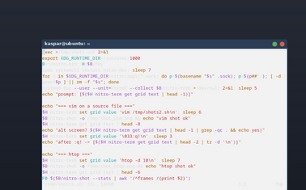
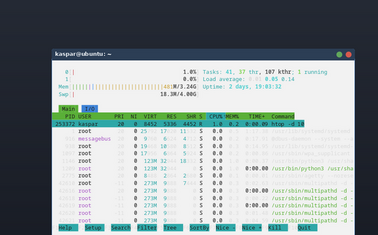

# nitro-term — the terminal

`nitro-term` is the M4-A application: a terminal emulator written against
`nitro-ui`, and the app that makes the test box usable. It exists for two
reasons, and the second is the interesting one.

It is **the hardest test of the design's first claim**. `DESIGN.md` goal
1 says work is proportional to what changed and idle costs nothing. A
calculator changes one label per keypress and a bar changes a clock once
a minute; both are easy. A terminal is not, because the program on the
other end of the pty has never heard of a display server: `yes` writes a
line every microsecond, `htop` repaints eighty rows twice a second, and
`cat` of a binary file changes every cell on screen. Either the claim
survives contact with that or it was a claim about toy workloads.

```text
        ┌──────────────────────────────────────────┐
        │ $ ls --color                             │  TermGrid, named `grid`
        │ Cargo.toml  crates/  docs/               │
        │ $ █                                      │
        └──────────────────────────────────────────┘
             ▲                           │
       bytes │                           │ keys, xterm-encoded
             │                           ▼
        pty master ◄──────────── setsid --ctty $SHELL
```

## The model

Four pieces, each a module, each testable without the one above it.

| module | what it is |
|---|---|
| `pty` | the pseudoterminal and the child shell |
| `vt` | the escape-sequence parser: bytes → grid operations |
| `grid` | rows of cells, scrollback, alt screen, **damage** |
| `widget` | `TermGrid`: grid → scene nodes, and the damage strategy |

### The pty, and why there is no `unsafe`

A terminal's child needs two things that are normally done between the
`fork` and the `exec`: its own session (`setsid`) and the pty as its
controlling terminal (`TIOCSCTTY`). The standard library's door to that
is `CommandExt::pre_exec`, which is `unsafe` — and this tree denies
`unsafe` workspace-wide.

The answer is a program that already does exactly those two syscalls in
exactly that window: util-linux's **`setsid --ctty`**. The child is
spawned as `setsid --ctty $SHELL` with the pty slave as all three
standard descriptors, and the kernel work happens inside a process we did
not have to write.

This is the same shape of argument `nitro-launcher` makes in
`src/spawn.rs` — there the conclusion was that `process_group(0)` is the
safe half of `setsid` and the only half a launcher needs. A terminal
needs the other half too, so it pays for it with a dependency on a
binary rather than with an `unsafe` block.

**If `setsid` is missing**, the terminal still starts: a plain `Command`
with `process_group(0)`, a warning on stderr, and `has_job_control()`
answering `false`. What is lost is job control — Ctrl-C reaches nothing,
because there is no foreground process group to signal. That is a real
degradation and it is reported rather than hidden.

### The grid, and what damage means here

`Grid` is `Vec<Cell>` rows plus a scrollback ring (10 000 lines by
default, `--scrollback N`), an alternate screen with no scrollback, and
per-row damage recorded as a **column span**: every write widens
`(min_col, max_col)` for its row, and `clear_damage` resets it once the
damage has been drawn.

The span is not decoration. It is the contract between the model and the
widget: a byte stream marks spans, the widget reads them, and every
`SetText` on the wire is traceable back to a cell that actually changed.

## The damage strategy

This is the part worth reading, because it is where the milestone's claim
is either kept or lost. Three mechanisms, in the order they matter.

**1. A Text node per same-style run, in a stable slot.** A row is split
into maximal runs of cells sharing a style (`Grid::row_runs`). Each run
becomes one `SetText`; each run whose background is not the window's also
gets one rect. The slot number is `row * 64 + k` (32 runs, each with a rect and a text node), so a run keeps the same
scene node from frame to frame, and the toolkit's per-slot cache does the
diffing: **a run that produced the same bytes as last time costs nothing
on the wire**, even though `paint` walked over it.

A run with the *default* background gets no rect at all — the window's
backdrop is already that colour. Most of a normal screen is default
background, so this is most of the rects.

Its companion is **back colour erase**, and a BCE-erased run *does* get a
rect — which is what makes a status bar a bar. When a program erases
(ED, EL, ECH, ICH, DCH, or any scroll: LF, RI, SU, SD, IL, DL) the cells
left behind carry the pen's *background* rather than the default one.
`tmux` draws its status line as a background-setting SGR, then an EL,
then the labels; without BCE the colour would stop where the text stops
and the rest of the row would fall back to the window's backdrop, which
is exactly how the bug looked. Only the background survives an erase —
an underline must not stretch to the right margin — except that `SGR 7`
erases with the *foreground* and keeps the inverse bit, because no cell
colour can name "the terminal's text colour". Resize, RIS and entering
the alternate screen deliberately keep plain blanks: the pen in force
there is an accident of whatever last printed, not an instruction.

One consequence worth knowing: a scrolled-off row is stored in the
scrollback trimmed of its trailing blanks, and a BCE-painted cell is not
blank, so a full-width painted row is stored at full width. That is
correct — the colour is real content — and bounded by what the program
actually painted; ordinary shell output is unaffected.

**2. A row that did not change is not walked.** `paint` asks
`Grid::row_dirty` first, and for a clean row calls `PaintCx::keep`, which
tells the framework the row's slots are unchanged without re-deriving
them. No run splitting, no string comparison, no allocation. On a
keystroke that is one row out of fifty.

`keep` is new in `nitro-ui` and is the one general thing this app needed
from the toolkit. Every built-in widget's slots are its *parts* — a
button that stops drawing a focus ring wants the ring destroyed, which is
what "a slot the paint did not emit is destroyed" gives it. A terminal's
slots are its *content*, and it needs a third answer: not "emit" and not
"omit" but "unchanged". See `docs/ui.md`.

**3. A commit carries a screenful, not a line.** Bytes are drained from
the pty the moment they arrive — the child must never block on a full
pipe — and a single drain reads at most `DRAIN_CHUNK`, 256 KiB or about
four screenfuls, before handing the loop back. That bound is what paces
the scene: `seq 1 1000000` is ~6.9 MB and costs a few dozen commits, not
a million.

The *upper* bound is the server's rather than ours. It coalesces flips,
so however many commits arrive the glass changes at most once per
refresh, and the intermediate grids were never visible to anybody.

A frame callback is still requested and counted — it is how the app knows
how often the screen really changed — but it is deliberately **not**
load-bearing for painting, and that is a correction the hardware forced
rather than a preference. The tidier design, and the one this document
claimed until the box contradicted it, is to mark the widget for paint
*only* from the frame callback, so that the scene is touched exactly once
per `Frame`. It freezes the screen. A `RequestFrame` is one-in-flight
(`Ui::request_frame` early-returns while one is outstanding), so painting
becomes strictly dependent on the answer arriving — and a server
coalescing flips under load is precisely when it does not. Measured:
**four frames in twelve seconds** of steady output, with consecutive
framebuffer readbacks byte-identical while `hey … get grid text` showed
the model advancing. The grid moved; the display did not.

The lesson is worth more than the paragraph it cost. "Once per frame" is
a claim about the *display*, and the display is the server's to pace; a
client that tries to enforce it a second time is adding a dependency, not
a guarantee. `a_commit_carries_a_screenful_not_a_line` asserts the bound
the client actually provides.

And when nothing is happening, nothing is asked for: no frame is
requested when the grid has no damage, so the app sits in `epoll_wait`
with no timer and no callback pending.

### The trap in the third mechanism

"Read until `WouldBlock`, then take a frame" is wrong, and the first
throughput measurement is what caught it. `WouldBlock` never arrives
while the writer is faster than the reader, so `cat` of a 5 MB file was
consumed in **one** drain and produced **one** commit. By the letter of
the pacing claim that is a perfect score; what it actually describes is a
terminal that showed nothing for two and a half seconds and then jumped
to the end.

So a drain reads at most 256 KiB — about four screens of dense output —
and hands the loop back. The pacing argument is untouched (a frame still
has more than it can show), but the screen now keeps up with the stream
instead of waiting for it to finish.
`a_fast_writer_does_not_starve_the_screen` asserts it, and it is the one
test in the file that argues for *more* work rather than less.

## What a keystroke costs

Measured from outside, by counting mutations through the harness's tap
(`one_keystroke_costs_two_mutations`):

| | mutations |
|---|---|
| the **first** key on a row | 4 — `CreateNode`, `SetBounds`, `SetText`, and the cursor's `SetBounds` |
| **every key after it** | **2** — `SetText` for the run, `SetBounds` for the cursor |

The first key on a row is where that row's text node comes into
existence; it happens once per row rather than once per key.

Getting the steady state to two took one non-obvious decision. A text
node's box runs to the **end of the row**, not to the end of its run. The
width is not visible — a run is drawn left-aligned and unwrapped, so the
glyphs stop where the string does whatever box they sit in — but it *is*
diffed, and a box sized to the run grows by one cell per typed character,
which put a `SetBounds` next to every `SetText`. Sized to the row, the
box is identical on every repaint and only the string moves.

## The numbers

Measured on the test box (Pentium G3240, 2 cores, no AVX2, HDMI 1920×1080
@60; `docs/testbox.md`), against `nitro-dev` running the full desktop.

### Throughput

The terminal is 80×24 in a 720×420 window. The console reference is the
same command on tty1 (`chvt 1`), at the same 1920×1080, which is the
honest comparison: the kernel's own terminal, drawing the same text with
no compositor in the way.

| | nitro-term | Linux console (tty1) |
|---|---|---|
| `time seq 1 1000000` | **0.44 s** | 129.5 s |
| lines/s | **≈ 2 260 000** | ≈ 7 700 |
| `time cat` (5 MB, 88 235 lines) | **0.11 s** | 4.14 s |
| MB/s | **≈ 47** | ≈ 1.2 |
| frames the server drew during `seq` | 30 | — |
| `paint_us_mean` during it | 520 µs | — |
| `damage_px_mean` during it | 255 746 px | — |

**nitro-term is ~290× faster than the Linux console on `seq` and ~38×
on `cat`**, and the reason is the whole point of the design rather than
anything clever in the terminal: the console draws every line, and
nitro-term draws **thirty frames**. A million lines scroll past in 0.44 s
because 999 970 of them were never rasterized — they were parsed into the
grid, overwritten by the next line, and the screen was sampled at the
refresh rate. The console has no such freedom: it is the thing doing the
drawing, so its throughput *is* its draw rate, and it spent 129 seconds at
99 % CPU proving it.

That also means the honest way to read "2.26 M lines/s" is as a
**parse-and-discard** rate, not a draw rate. What the user sees is 30
frames of legible text; what the child experiences is a terminal that
never makes it wait.

### Keystroke input-to-photon

`docs/latency.md`'s method: `ydotool` at ~4 keys/s into `cat`, which
echoes each character, so the measured interval covers the whole loop —
key → server → client → pty → `cat` → pty → grid → `SetText` → raster →
flip. All 60 keystrokes echoed.

| | |
|---|---|
| i2p mean | **12.6 ms** |
| i2p min | 1.8 ms |
| i2p max | 22.7 ms |
| frames for 60 keys | 124 |
| `paint_us_mean` | 21 µs |
| `damage_px_mean` | 13 203 px |

Inside one 16.7 ms refresh at the mean, under two at the maximum. It sits
next to `nitro-calc`'s 12–14 ms (`docs/budget.md`) — and it should, since
both are one small text change per key; the terminal adds a pty round
trip through `cat` and a shell, which is most of the gap to
`nitro-demo`'s 9.3 ms pointer figure.

One methodological note, because it cost three runs. The server's `i2p_*`
counters are **cumulative min/mean/max with no reset**, so anything else
that generated input pollutes them permanently. The closed-loop pointer
move used to focus the window costs about a second of `ydotool` round
trips, and it landed in the same counters — reporting a 1 051 ms
"keystroke". The fix is to restart the server so the keystrokes are the
only input it has ever seen, and to skip the click entirely: the server
focuses a window it has just placed, which is what makes a launched app
typable without one.

### Idle

| | |
|---|---|
| 30 s at a shell prompt | **0 frames, 0 CPU ticks** (server: 0 ticks) |
| threads | 1 |
| voluntary / involuntary context switches over the window | 18 / 7 |

Zero, not "nearly zero": no frame is requested when the grid has no
damage, so the app is in `epoll_wait` with no timer and no callback
pending. The desktop around it was also at 0 frames for the same 30 s.

With **`htop -d 10` running** (2 refreshes/s):

| | |
|---|---|
| frames over 20 s | **54** (htop asked for ~40) |
| `damage_px_mean` | 219 148 px, against 302 400 px of window |
| `paint_us_mean` | 1 151 µs |
| `text_runs` | 239 |

Frames track **htop's refresh rate, not the display's** — 2.7/s against a
60 Hz screen. The damage is 72 % of the window because htop really does
rewrite almost all of it (every CPU meter, every row's CPU%/MEM%/TIME+),
so this is the honest number rather than a flattering one; the per-row
damage bit earns its keep on a shell prompt, not under htop.

### Memory and size

| | | budget |
|---|---|---|
| RSS, fresh 80×24 | **3 324 kB** | — |
| RSS, 10 000 scrollback lines filled | **4 212 kB** | ≤ 6 MB — **ok**, 70 % |
| of which `RssAnon` | 1 628 kB | |
| binary | **650 136 bytes** | ≤ 900 KB — **ok**, 72 % |
| server RSS, before / after | 18 416 / 18 852 kB | |
| `atlas_pages` | **1**, before and after | |
| `glyphs_cached` | 100 → 176 | |

The scrollback costs **0.9 MB for 10 000 lines** and the whole process
sits at 4.2 MB against a 6 MB target. For scale, `nitro-calc` is 2.7 MB,
so a terminal with a full 10 000-line history is 1.5 MB more app than a
calculator.

**A terminal barely moves the server**, which is the answer to the
question this milestone actually asked: 18.4 → 18.9 MB, and
**`atlas_pages` stays at 1**. A terminal is the heaviest text client
there is, and it added 76 glyphs to a cache that already had 100 — because
a terminal draws the *same* ASCII repeatedly, at one size, in one family.
The per-run `SetText` design puts no pressure on the atlas at all: the
run count is what grows (239 under htop), and a run is a string, not a
glyph.

### Where the numbers moved, and why

Four defects were found by running it on the box and none by the test
suite, which is worth recording as honestly as the numbers:

| what | before | after |
|---|---|---|
| RSS with 10 000 scrollback lines | 29 436 kB | **4 212 kB** |
| — of that, the cursor slot at `Slot::MAX` | 11 780 kB | 0 |
| — of that, untrimmed scrollback rows | 12 800 kB | 900 kB |
| idle, 30 s at a prompt | 12 frames | **0 frames** |
| `hey nitro-term get grid text` | empty | the screen |
| `hey nitro-term set grid value 'ls\n'` | nothing happened | runs `ls` |

The two memory bugs are the instructive pair, because the second hid
behind the first and both were invisible to a unit test. Parking the
cursor's paint slot at `Slot::MAX` made the framework's **dense** slot
vector allocate 65 536 entries — 11.8 MB, present even with
`--scrollback 0`, which is what finally cleared the scrollback of
suspicion. And a scrollback row trimmed *in place* with `shrink_to_fit`
left the allocator holding a full-width hole that the next blank row, one
cell longer, could not reuse: every row was two cells long and RSS still
grew by a full row per line. Only a measurement of the process could tell
those apart, which is why
`a_full_scrollback_costs_what_its_text_costs` reads `/proc/self/status`.

### Screenshots

`vim` on a shell script and `htop`, both cropped to the window.





Both are visually correct. vim shows syntax highlighting (comments,
strings and keywords in distinct colours), the status line, the `~`
end-of-buffer column and the ruler; the alternate screen enters and
leaves cleanly, restoring the shell's scrollback underneath. htop shows
its CPU and memory meters, the inverse-video column header, per-row
colours and the function-key bar — which between them exercise inverse,
bold, 256-colour foregrounds and backgrounds, and a scroll region.

The server draws the window decoration and the titlebar (`kaspar@ubuntu:
~`), which is the OSC 0/2 title arriving from the shell.

## Dependencies

`vte` (+ `arrayvec`, `memchr`) and `rustix`, on top of `nitro-ui`. The
argument for `vte` is in `DEPENDENCIES.md`; the short form is that it is
the state machine and not the terminal — it assigns no meaning to what it
parses, so every escape sequence's *effect* is ours and is tested here.

## Limitations

Each of these is a real feature rather than a missing case, and each is
recorded because the spec asks for them rather than because they are
regrets.

* **No clipboard.** `Ctrl+Shift+C`/`V` are deliberately unbound. A
  clipboard is a server-side concept — a selection owner, and a protocol
  for offering and requesting types — and nitro does not have one yet.
  The *bracketed paste* plumbing is in place and tested (`keys::paste`,
  DECSET 2004), so the day there is a selection owner the terminal side
  is one call.
* **No scrollback rewrap.** Resizing reflows the screen but not the
  history: a narrowed window truncates old lines rather than re-wrapping
  them. Rewrap means re-deciding where every historical line broke, which
  needs the scrollback to store *logical* lines rather than rows — a
  different data structure, not a missing loop.
* **No mouse reporting.** A program that asks for mouse events (DECSET
  1000/1002/1006) does not get them; the wheel scrolls the scrollback
  instead. The sequences are parsed and ignored, so nothing breaks.
* **No sixel, no inline images, no ligatures, no bidi.** The first two
  need a wire op; the last two are the server's text layer rather than
  the terminal's.
* **32 style runs per row.** A row with more distinct style runs than
  that draws the first 32. It takes a colour-test pattern to reach — real
  output is a handful of runs per row — and the alternative, allocating
  slots dynamically, would make one row's node numbering depend on
  another's, which is exactly what the per-slot diff cannot tolerate.
* **A wide character is width 2 from a hand-rolled table.** East Asian
  Wide/Fullwidth plus the emoji blocks, taken whole; a rare dingbat may
  be one column wrong. The alternative is a Unicode-width dependency
  whose table we would have to trust anyway.
* **Combining marks are dropped** rather than composed onto the previous
  cell. They take no cell, so nothing shifts; the mark is simply not
  drawn.
* **No reflow of the cursor's logical line on resize**, and no
  `SIGWINCH`-time redraw beyond what the child chooses to send.
* **A scripted `send` types; it does not paste.** `hey … set grid value`
  writes the bytes as keystrokes even when the program has asked for
  bracketed paste, because the markers tell readline "this is data, do
  not execute it" — which made every scripted command sit unrun on the
  prompt under bash 5.1+. The `paste_text` action keeps the bracketed
  path for the day there is a real clipboard.
* **`hey`'s value argument takes C-style escapes** (`\n`, `\t`, `\e`,
  `\0`, `\\`), because a control character cannot be written on a
  command line any other way and a terminal's scripted input is mostly
  control characters. An unknown escape keeps both of its characters.

## Was the per-run `SetText` the bottleneck?

The spec asked for this to be measured and, if it were, for an issue
proposing a cell-grid wire op behind a caps bit. **It is not**, so no
issue is filed and the wire is unchanged.

The worst case available is htop, which rewrites nearly the whole screen
twice a second in colour: **239 text runs**, `paint_us_mean` 1 151 µs,
2.7 frames/s. A frame's worth of `SetText`s costs the server about a
millisecond of paint on a Haswell Pentium, against a 16 667 µs budget —
7 % of a refresh. The atlas is untouched (`atlas_pages` 1, 76 new glyphs
for the whole session), because a terminal draws the same ASCII over and
over at one size in one family.

The number that would justify a cell-grid op is a frame where the
`SetText` count itself dominates, and the measurement says the opposite:
at 47 MB/s of throughput the terminal is limited by how fast the *child*
can write, and the scene update is 30 commits for a million lines. A
wire op that traded strings for a cell array would save marshalling that
is not on the critical path, at the cost of a second text representation
in the protocol and a capability bit to negotiate it.

Worth revisiting if a full-screen 24-bit colour program (a TUI with a
gradient, `cmatrix -b`) pushes the run count past ~1 000 per frame, since
the cost is linear in runs and this measurement stops at 239.
