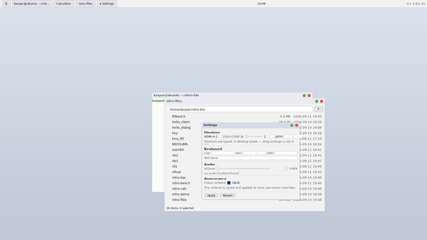
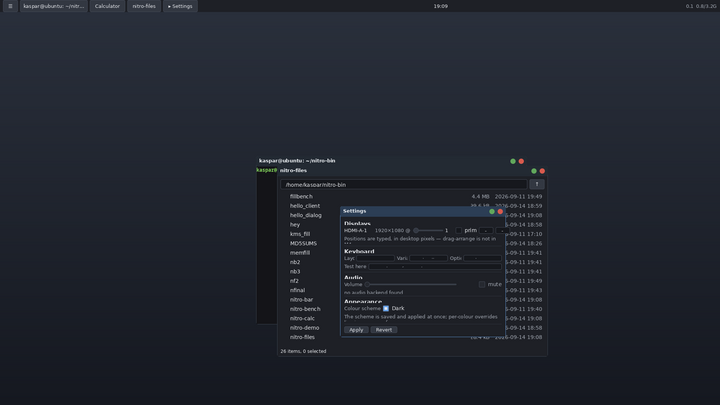

# Colours: roles, schemes and the switch

Nothing on a nitro desktop picks a colour. An app asks for a **role** —
`Accent`, `TextDim`, `TitleBarActive`, `Ansi1` — and the **server**
answers with whatever the user's scheme says. One line in `server.conf`
moves every pixel of chrome on the screen, in one frame, without
restarting anything.

This document is the role table, the configuration keys, the wire op, the
lint rule that keeps it true, and how to add a role.

```console
$ sed -i 's/^theme.scheme = .*/theme.scheme = dark/' ~/.config/nitro/server.conf
# the whole desktop switches: decorations, bar, terminal, wallpaper, dialogs
```

The same desktop, one `sed` apart, on the test box — bar, terminal,
file manager, settings dialog, window decorations and wallpaper, with
nothing restarted:





Measured on that switch: **99.9 % of the screen changed** (2 071 530 of
2 073 600 pixels), in **three frames**, and every client was back to
**0 CPU ticks** a minute later.

## Why roles and not colours

The obvious design is a `Theme` struct of named colours that each app
copies and tweaks. nitro had exactly that until M4-F, and it had the
three failure modes such a design always has:

* **Drift.** `nitro-term` shipped its own sixteen ANSI colours, the
  window manager its own `BAR_ACTIVE`, the wallpaper its own gradient.
  Three palettes, three opinions about "dark", no way to reconcile them.
* **Unreachable colours.** A `Color::rgb(0x33, 0x88, 0xff)` inside a
  widget is a colour no user setting can ever change. It does not look
  wrong until somebody switches scheme, and by then there are fifty.
* **No switch.** There was nowhere to *put* one. A central colour
  setting needs a central place colours come from, and there wasn't one.

A role fixes all three at once because it is a **name for a meaning**
rather than a value. `Accent` is "the one colour that says this is the
interesting thing"; what colour that is, is the desktop's business.

## The table

`nitro_core::palette::Role`, in wire order. The **key** column is both
the `server.conf` key (with `theme.` in front) and what the control
socket's `theme` command prints, so a colour read out of a running
desktop can be pasted straight back into a file.

| role (key) | what it is for | light | dark |
|---|---|---|---|
| `window_background` | the background of an ordinary window or panel | `#f2f2f2` | `#1e2026` |
| `surface` | a raised surface on it: a card, a popup, a list's rows | `#ffffff` | `#272a32` |
| `modal_background` | the scrim over everything behind a modal — the one role whose alpha matters | `#20202499` | `#08090cb0` |
| `text` | default text | `#1a1a1a` | `#e6e8ec` |
| `text_dim` | secondary text: a hint, a units suffix, a disabled label | `#5e5e5e` | `#a2a8b2` |
| `text_on_accent` | text drawn on top of `accent` | `#ffffff` | `#0c1016` |
| `button_text` | text on a button face | `#121216` | `#e6e8ec` |
| `placeholder` | the greyed prompt in an empty field | `#6b6b6b` | `#9096a0` |
| `accent` | the one "this is the interesting thing" colour | `#0f5fbe` | `#6ca8f0` |
| `accent_hover` | accent under the pointer | `#126ed8` | `#8abcf6` |
| `accent_active` | accent while pressed | `#0b4c99` | `#528ed6` |
| `button` | a button's face | `#e4e4e8` | `#333842` |
| `button_hover` | under the pointer | `#d6d9e4` | `#3e4450` |
| `button_active` | while pressed | `#c0c6d8` | `#4b5361` |
| `button_disabled` | when disabled | `#ececee` | `#262930` |
| `border` | the outline of a panel, button or field | `#c2c2c8` | `#444a56` |
| `focus` | the focus ring | `#0f5fbe` | `#6ca8f0` |
| `selection` | selected text's highlight | `#b3d4ff` | `#2d4c74` |
| `field` | the background of an editable field | `#ffffff` | `#16181d` |
| `caret` | the caret in a text field | `#1a1a1a` | `#e6e8ec` |
| `track` | a slider's unfilled track, and a separator line | `#d4d4da` | `#3a404a` |
| `danger` | destructive: a delete button, an error | `#b3261a` | `#f26d63` |
| `warning` | something is off, nothing is lost | `#8a5500` | `#e3b341` |
| `success` | it worked | `#1e6b2c` | `#6fcf6a` |
| `title_bar_active` | the focused window's title bar (server-drawn) | `#d6dde8` | `#2c3e55` |
| `title_bar_inactive` | an unfocused window's title bar | `#eaecf0` | `#232a33` |
| `title_text_active` | its title text | `#171c24` | `#f0f4f8` |
| `title_text_inactive` | an unfocused window's title text | `#555c66` | `#9aa4b0` |
| `window_border_active` | the focused window's frame border — **a shade of its own title bar**, see below | `#8c9aae` | `#4d6788` |
| `window_border_inactive` | an unfocused one's, by the same rule | `#b6bbc4` | `#39424e` |
| `title_close` | the close button's **hover** disc — red only while the pointer is on it | `#d95b4e` | `#d95b4e` |
| `title_maximize` | **no longer painted**; kept because a role index is a wire index | `#62a85c` | `#62a85c` |
| `resize_hint` | the frame edge, while the pointer is in its resize band — **not** the accent, see below | `#003a80` | `#b8dcff` |
| `title_button_hover` | the disc under a hovered minimize or maximize button | `#b3c0d4` | `#465c78` |
| `desktop_top` | top of the wallpaper gradient — **and of the server's own uncovered desktop** | `#dce3ed` | `#2a303c` |
| `desktop_bottom` | bottom of both | `#bec7d4` | `#151820` |
| `terminal_background` | a terminal's default background (`SGR 49`) | `#fbfbf8` | `#141418` |
| `terminal_text` | its default foreground (`SGR 39`) | `#1c1c1c` | `#dcdcdc` |
| `terminal_cursor` | its cursor block | `#1c1c1c` | `#dcdcdc` |
| `ansi0` … `ansi15` | the sixteen ANSI colours, 0–7 normal and 8–15 bright | see below | see below |

The ANSI sixteen:

| role | light | dark | role | light | dark |
|---|---|---|---|---|---|
| `ansi0` (black) | `#2b2b2b` | `#1c1c1c` | `ansi8` (br. black) | `#6e6e6e` | `#5c5c5c` |
| `ansi1` (red) | `#a31d1d` | `#cc333c` | `ansi9` (br. red) | `#c42b1c` | `#f25b63` |
| `ansi2` (green) | `#2b661f` | `#5ab038` | `ansi10` (br. green) | `#357d24` | `#84d65c` |
| `ansi3` (yellow) | `#7a5400` | `#c89b27` | `ansi11` (br. yellow) | `#8f6600` | `#f0c44c` |
| `ansi4` (blue) | `#1b4fa8` | `#3d82d6` | `ansi12` (br. blue) | `#1f61c4` | `#67a8f0` |
| `ansi5` (magenta) | `#82289c` | `#a653c4` | `ansi13` (br. magenta) | `#9b31ba` | `#c982e8` |
| `ansi6` (cyan) | `#0f636b` | `#2fa8a8` | `ansi14` (br. cyan) | `#11757f` | `#55d0d0` |
| `ansi7` (white) | `#555555` | `#c8c8c8` | `ansi15` (br. white) | `#1c1c1c` | `#f2f2f2` |

The light scheme's ANSI colours are **darkened**, and that is not a
stylistic choice: the familiar saturated sixteen are picked for a dark
background, and `ls --color`'s blue directory on paper is genuinely
unreadable. Choosing the terminal's background *is* choosing whether the
ANSI colours work at all, so the two travel together.

The 256-colour cube (`SGR 38;5;n`, n ≥ 16) is **not** in the table: it is
xterm's arithmetic, computed on demand by `Palette::ansi_indexed`, and
every program that emits `38;5;n` assumes those exact values. Truecolor
(`38;2;r;g;b`) is passed through literally. Both are *content* — the
program running in the terminal chose that colour, and a desktop theme
has no business overriding it.

### What the tests hold the table to

`crates/nitro-core/src/palette.rs` asserts, for **both** schemes:

* every role has a value;
* every text/background pair meets **WCAG AA** — 4.5:1 for body text
  (`text` on `window_background`, `surface`, `field`; `button_text` on
  `button`; `text_on_accent` on `accent`; both title-text pairs;
  `terminal_text` on `terminal_background`) and 3:1 for secondary text
  (`text_dim`, `placeholder`);
* the twelve chromatic ANSI colours clear 3:1 against their own
  `terminal_background`. The four greys (0, 7, 8, 15) are exempt, because
  by ANSI convention one of them *is* the scheme's background colour;
* each **frame border is a shade of its own title bar** — see below;
* `resize_hint` clears 3:1 against **everything a frame edge can sit
  beside** — both borders, both title bars, both desktop stops and the
  window background (`the_resize_hint_reads_against_everything_beside_it`);
* every colour round-trips through `#rrggbb`/`#rrggbbaa`.

The contrast maths is the WCAG formula, implemented in twenty lines
(`luminance`, `contrast`) rather than eyeballed. A "nicer" grey that
quietly makes a label unreadable fails the build.

### A frame border is its own title bar's edge

The two `window_border_*` roles are the only ones in the table with a
**relational** rule as well as a value, and #3724 is why. They used to be
blues — `#6d8eb8` light, `#5a8dc8` dark — unrelated to the pale-blue
title bars they outlined, and a user on the test box read the result as
two frames rather than one: *"there seems to be a frame around the bottom
left and right window sides, but that is a bit wider than the title bar,
and a different color"*. The geometry half of that is fixed in
`docs/wm.md`; this is the colour half.

The rule: a 1-px outline around a filled shape is that shape's **edge**.
So each border is its own bar darkened (light scheme) or lightened (dark),
far enough to read as an outline and no further.
`a_frame_border_is_its_own_title_bars_shade` holds it to two checkable
claims rather than to taste:

* each border sits in a **1.25–2.6:1** band against its own bar — the
  floor is "an outline exists", the ceiling is what the old blue failed
  at 2.9:1;
* the two borders are **sorted the way their two bars are**: whichever
  bar is the lighter has the lighter border. A single accent used for
  both, which is what this replaced, cannot satisfy that.

The obvious third claim — each border is *nearer* its own bar than the
other — is deliberately not asserted: the light scheme's two bars are
1.16:1 apart, closer to each other than either is to its border, so the
comparison would measure rounding rather than design.

The focus signal did not move to the border, it stayed where it always
was: the **title bar's own colour**, which is 28 px of window against the
border's one.

`resize_hint` is the one colour that *replaces* a border, and it is
deliberately **not the accent** any more. It was (`#0f5fbe` / `#6ca8f0`),
on the reasoning that the accent is the "interesting thing" colour — but
the focused border is itself a blue shade of a blue bar, so an
accent-blue stroke over it was a 2.2:1 (light) / 2.35:1 (dark) shade
shift the box could not see at arm's length on a 1080p panel (#565). Navy
on the light scheme and pale sky on the dark are the same family, far
enough along it to be a different *thing* on the edge: ≥3.8:1 against
the active border and well above that against everything else.

**Cursors are the exception to the whole table.** The software cursor is
black-outlined white in both schemes and has no role. It is the one thing
that must stay legible over content the desktop does not control — a
photo, a terminal, a client's own black window — and a dark-scheme cursor
inverted to white-on-black would vanish against exactly the dark content
the dark scheme exists for.

The art itself constructs nothing the lint objects to: it is bytes, and
the two values it maps them to are `Color::BLACK` and `Color::WHITE`,
which the lint does not count as colours for the reason its header gives.
There *is* one `Color::rgba(…)` in `cursor.rs`, in the magnified paint
path, and it carries a `// lint-colors: allow` pragma: it reads a pixel
back out of the already-converted mask to fill a block with, which is
arithmetic on a value chosen above rather than a choice of its own. That
is exactly the case the per-line escape hatch exists for.

## The switch: `server.conf`

Two kinds of key, both read by the same parser as everything else in
`docs/settings.md`, and both live on the reload path (inotify, `SIGHUP`,
or `nitro-hey`'s `reload`):

```text
theme.scheme = dark          # light | dark. Default: light.
theme.accent = #6ca8f0       # one role, overriding the scheme
theme.ansi1  = cc333c        # the `#` is optional
theme.modal_background = #08090cb0    # eight digits for alpha
```

`theme.scheme` picks a built-in palette; each `theme.<role>` line
overrides exactly that one role on top of it. Role keys are the table
above. A key naming no role, or a value that is not six or eight hex
digits, is **warned about and skipped** — the line is lost, the rest of
the file applies, and the desktop keeps running. That is the rule the
whole config parser is built on: a bad line cannot take the desktop down.

**The default is light**, deliberately. Every screenshot in `docs/` was
taken on it, and a desktop that changes its whole appearance because a
file is missing is a desktop that cannot be supported over the phone.

**A missing file means defaults.** Deleting `server.conf` restores the
light scheme within a frame, the same as writing `theme.scheme = light`
would. (This was issue #558: the config watch asked for
`CLOSE_WRITE|MOVED_TO|CREATE` only, so `rm server.conf` was not an event
at all and a stale scheme stayed in force until something else triggered
a reload.)

### The `#` in a colour is not a comment

`server.conf` treats `#` as starting a comment when it is at the start of
a line or after whitespace — which is exactly where a colour literal's
`#` sits. So both parsers (the server's and `nitro-settings`') make one
narrow exception: **a `#` followed by six or eight hex digits and then
whitespace is a value**. A trailing comment after a colour still works,
because `# blue` is not hex digits:

```text
theme.accent = #6ca8f0   # the dark scheme's blue — still a comment
```

The one thing it costs is a comment whose entire text is six or eight hex
characters (`scale = 2 #beefed` keeps the `#beefed`, which then fails to
parse as a scale and is warned about). Both implementations have a test
pinning this, because a value truncated in one and not the other would be
a setting that silently changed meaning between the app and the
compositor — and would make `nitro-settings`' Apply *delete* a user's
colour.

### Reading the current palette

```console
$ nitro-hey ... # or straight at the control socket:
$ printf 'theme\n' | socat - UNIX-CONNECT:$XDG_RUNTIME_DIR/nitro/control.sock
ok dark 3
window_background #1e2026
surface #272a32
...
```

`ok <scheme> <serial>` then one `role #rrggbb[aa]` line per role, in role
order, then a blank line. The role names are the configuration keys, so
any line of that output is one `theme.` prefix away from being the config
that pins it.

## The wire: `Theme`, behind caps `THEME`

The server sends `Theme { serial: u32, colors: vec<Color> }` (op
`0x8004`) to every client — wire **and** shell socket — immediately after
`Welcome`, and again whenever the palette changes. Full byte layout in
`docs/wire.md`.

Three properties worth knowing:

* **It arrives first.** A client's first paint happens before its first
  `Configure` comes back, so a palette one round trip later would mean
  every app flashes its built-in defaults for a frame.
* **An unchanged palette is silence.** A reload that only moved
  `keyboard.layout` sends nothing and repaints nothing; `Ui::set_palette`
  drops an equal palette without marking the tree.
* **The colour count is on the wire**, so appending a role is compatible
  in both directions: a shorter message leaves the roles it did not carry
  at their defaults, a longer one has its tail ignored. Which is why
  roles are **only ever appended** — a role's position is its wire index.

## Writing an app

```rust,ignore
use nitro_ui::{ColorRole, Ui};

// A built-in widget: nothing to do. `Theme` is a view on the palette,
// and a button already reads `theme.button`.
let go = ui.build(button("Go"));

// A label whose colour is a role — this is what an app writes instead
// of `.color(ui.theme().text_disabled)`, which reads the palette once
// at build time and then never moves again.
let hint = ui.build(label("optional").color_role(ColorRole::TextDim));

// A custom widget, in `paint`:
fn paint(&mut self, cx: &mut PaintCx<'_, S>) {
    cx.fill_rect(0, cx.bounds, cx.color(ColorRole::Surface));
}

// Something derived, rebuilt when the desktop switches:
ui.on_theme(|s: &mut S, ui: &mut Ui<S>| {
    s.cached = ui.color(ColorRole::Accent);
});
```

`App::theme(..)` still exists, for an app that wants its own *metrics* —
font size, radius, paddings. Those are not colours and a scheme switch
leaves them alone (`Theme::with_palette`). An app does not normally call
it.

### The three toolkit entry points

| you want | you call |
|---|---|
| a built-in widget's colours | nothing; they follow the palette |
| one colour by role, in a paint | `cx.color(ColorRole::X)` |
| one colour by role, anywhere else | `ui.color(ColorRole::X)` |
| a label in a role's colour | `.color_role(ColorRole::X)` |
| to react to a switch | `ui.on_theme(..)` |

## The lint

`deploy/lint-colors.sh` fails the build on `Color::rgb(`, `Color::rgba(`,
`Color::from_u32(` or a bare `0xRRGGBB` literal in `crates/*/src/**`,
outside an allow-list. It runs from `just lint-colors`, from `just
clippy`, and from the default recipe.

```console
$ just lint-colors
lint-colors: 137 file(s), no hard-coded colours
```

`Color::BLACK`, `Color::WHITE` and `Color::TRANSPARENT` are allowed:
they are the identity values a compositing API needs (a fully transparent
border, an opaque clear), they cannot drift from a scheme, and forbidding
them would only produce a role called "black".

Allowed wholesale: the palette itself, the rasteriser and scene graph
(they blend colours, they do not choose any), the wire codec, the
PPM/PNG decoders, `nitro-term/src/vt.rs` (the SGR tables), the demo
scene, and the server's readback path. Test modules are skipped — a test
asserting on a pixel has to name one, and its colours never reach a
screen.

For a single line, `// lint-colors: allow — <reason>` on it or in the
comment above skips it. There are two in the tree, both for the same
honest reason: a colour that is **the user's or the program's**, not the
desktop's (`SGR 38;2;r;g;b`, and `nitro-wallpaper --color`).

## Adding a role

1. **Append** it to the `roles!` table in
   `crates/nitro-core/src/palette.rs` — never insert in the middle, the
   position is the wire index. Give it a doc comment and a
   `snake_case` key.
2. Give it a value in **both** `Palette::light()` and `Palette::dark()`.
   Both constructors list every variant, so a missing one is a compile
   error; a role set in neither is caught by
   `every_role_has_a_value_in_both_schemes`.
3. If it is text on something, add the pair to
   `text_is_readable_on_what_it_sits_on` so the contrast is checked.
4. Add a row to the table above.
5. That is all. `theme.<your_key>` is configurable the same day
   (`every_role_is_configurable_by_its_key` asserts it), the wire's `N`
   grows in place, the control socket prints it, and older clients
   ignore it.

The thing *not* to do is add a colour to an app because no role fits. If
a widget needs a colour the table does not name, the table is missing a
meaning — add it here, where the user's switch can reach it.

### What an *unused* role is for, and why it stays

`title_maximize` names nothing on screen any more. The frame's buttons
became symbolic glyphs in #3715 (`docs/wm.md`), so there is no green
circle left for it to colour, and `title_close` changed meaning from
"what a close button looks like" to "what it looks like when a click
would close the window".

The role is kept anyway, and the reason is the rule above read backwards:
**a role's position is its wire index**, so removing one renumbers every
role after it. A client one release behind would go on reading the table
by index and get its whole lower half shifted — every terminal's ANSI
colours wrong, silently, on a desktop that looked fine to everyone who
had upgraded. An unused role costs four bytes in the `Theme` message and
a row in this table; a renumbered one costs a wire break.

So the rule is: roles are appended, never inserted, and **never removed**.
One that stops being used is documented as unused rather than deleted. If
the table ever accumulates enough of them to matter, that is a versioned
`Theme` message, not a quiet deletion.

`title_button_hover` is a role rather than a reuse of `button_hover` for
the complementary reason, and it is worth recording because reuse was the
first instinct: the two sit on different backgrounds. In the light scheme
`button_hover` is `#d6d9e4` and `title_bar_active` is `#d6dde8` — a
difference of two units in one channel, which is an affordance nobody can
see. A hover disc has to read against a *title bar*, and that is a
different meaning from a button face on a window background.
