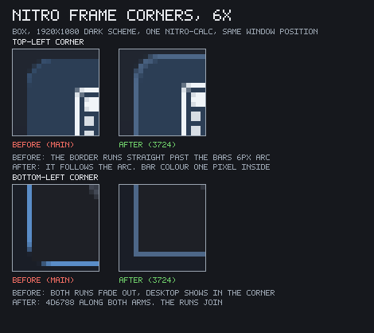

# Window management

How the server places, decorates, moves, focuses and stacks top-level
windows. M3-A. The implementation is `crates/nitro-server/src/wm.rs`
(policy, all of it unit-testable without a server) plus the window half of
`crates/nitro-scene` (the frame group, the state, the limits); the wire
side is the `WM` capability bit in `docs/wire.md`.

Two decisions shape everything below, and both were made deliberately:

* **Decorations are server-side, and opt-out.** The server draws the title
  bar, the border and the buttons, as scene nodes it owns. A client that
  wants its own passes `UNDECORATED` and gets a bare group.
* **The server moves and resizes windows with zero client round-trips.** A
  drag is one scene mutation per motion event plus one *one-way*
  `Configure` telling the client where it now is; nothing is ever asked of
  the client and nothing is waited for. The frame scheduler already
  throttles those `Configure`s to one per frame.

## Frame groups

A window is a *content* group owned by its client. When the window is
decorated the server wraps that group in a **frame group** it owns under
`ClientId::SERVER`:

```
frame group  (server)          ← Window::root(),  the whole window
├── title bar rect  (server)   ← rounded top corners, bordered
├── background rect (server)   ← the body below it; square, bordered
├── app icon        (server)   ← the window's app_id, resolved server-side
├── title text      (server)   ← elided with "…"
├── close    disc + x     (server)
├── maximize disc + square(server)   ← absent when FIXED_SIZE
├── minimize disc + dash  (server)
└── content group   (client)   ← Window::content(), offset by the insets
```

**Eleven nodes**, nine on a `FIXED_SIZE` window. That is the figure
`docs/budget.md` multiplies by the 240 bytes a `Node` costs, and
`a_frame_costs_eleven_scene_nodes_and_a_fixed_window_nine` pins it, so a
frame that quietly grew would move the budget line loudly instead.

Each node earns its place by being a thing no other node can be. A rect
has a fill and no artwork; an icon has artwork and no fill; a text node
holds a shaped run. So a button that is a glyph on a disc is two nodes,
and the alternative — **one** disc moved to whichever button is hovered,
since only one ever is — was considered and not taken: a disc whose
bounds change on every hover damages its old rectangle *and* its new one,
where three fixed discs each damage only themselves. That is twice the
pixels per hover, on the motion path.

The client's `NodeId` names the **content** group, before and after
framing: `Scene::frame_window` mints a new root *above* the existing node
and leaves that node's key alone, so every `CreateNode { parent: window }`
still lands inside the client's own group and a client can never create a
node on top of its own title bar. The decorations are the content group's
*siblings*, inserted before it, so the client always paints over its own
frame's background and never over the bar.

Geometry, in logical units:

| | |
|---|---|
| title bar height | 28 |
| border | 1, **all four sides**, one continuous outline |
| top corner radius | 6 |
| bottom corners | square, so the border's two runs meet exactly |
| application icon | 16 × 16, 8 from the left edge, 6 before the title |
| button | 14 × 14, 8 apart, close rightmost; a 10 px glyph centred in each |
| resize grab band | 6 outside the frame edge, inwards only to the border (or the title bar, at the top) |
| corner reach | 24 along either edge from a corner: the band there grabs **both** edges |
| resize hint | the border repaints in `resize_hint` while the pointer is in the band |
| cursor shape | the band's own: `size_hor`, `size_ver`, `size_fdiag`, `size_bdiag`; `move` during a title drag |
| button hover | the disc under the pointer's button paints; every other disc is transparent |

The title's box is what is left: it starts after the icon and stops one
gap short of the leftmost button, so a long title is elided rather than
running under either. The icon took 22 logical pixels off its left end,
which means a narrow window elides sooner than it did before M4 — the
right trade, because a title bar with no icon and a fully spelled title
says less at a glance than one with an icon and an ellipsis.

**A frame with no room for the icon drops it.** A window can be dragged
to the 64 × 32 content floor, which is a 66-pixel frame — narrower than
three buttons and their gaps, so the icon's box (starting 8 in) and the
leftmost button (starting at 0) would be composited on top of each
other. Clipping is the honest failure and overlap is not: an overlapped
icon is two shapes nobody can read, where a dropped one is a title bar
visibly too small for it. #3709 established that rule for the toolkit's
flex solver by getting it wrong — it traded a squashing bug for an
overlap bug, and the review called the trade the worse regression. The
buttons are what a squeezed frame keeps, because they are its controls;
the icon is what it spends.

### The icons, and why the buttons stopped being circles

Until #3715 the buttons were a red circle and a green one, and the
application had no icon anywhere in its own frame. Both are fixed by the
same mechanism: the frame is scene nodes the **server** owns, and the
server owns the icon engine too, so a decoration can hold an icon exactly
as a client's widget can.

**The application icon** is the window's `app_id`, resolved through the
full three-step lookup (`docs/icons.md`): the icon theme, then
`<app_id>.desktop`'s `Icon=`, then that name symbolic-or-theme. So
`nitro-calc` shows a calculator and `firefox` shows Firefox's own PNG.
The fallback when nothing resolves is the `window` glyph, tinted like the
title — and it happens **synchronously**, in the same call: a client that
names a missing icon is told `BadIcon` and sends its fallback a message
later, but the server *is* the resolver, so the node is never briefly
blank. A window whose `app_id` changes after mapping (`SetAppId` is legal
at any time, and `nitro-term` uses it) re-resolves.

**The buttons** are `x`, `square` and `dash` from the symbolic set,
tinted like the title, on a disc that is **transparent until hovered**.
`square` rather than `arrows-angle-expand` for maximize because four
diagonal arrowheads and their tails inside a ten-pixel box turn to mush
at scale 1, where one outlined rectangle's four strokes land on whole
pixels — and because the square is what the button *does* rather than a
metaphor for it.

The red did not disappear; it moved. `title_close` is the close button's
**hover** disc, so the most destructive control on the window is the one
that looks ordinary until you point at it, and then unmistakably does
not. Minimize and maximize hover in `title_button_hover`, a role of its
own because a title bar is not a window background — `docs/theme.md` has
that argument and the one about why `title_maximize` is kept though it
now paints nothing.

The hover rides the **same motion path** as the resize hint, and the same
single `frame_hit` per motion event: one z-order walk answers both
affordances, and the restyle it causes is `style_only` rather than the
full `restyle`, so crossing a button never shapes text. Both are pinned —
`text_layouts` and `icon_renders` unmoved across a hover and across a
30-step drag.

Being motion-driven, the hover needs clearing wherever a *frame* leaves
under a stationary pointer, and there are exactly two such places.
A window that is **destroyed** clears it in `forget_window`, beside the
resize hint. A window that is **minimized** clears it in `set_state`, and
that one is not hypothetical: the minimize button is the only control
that removes its own window from the screen while the pointer is still on
it, so the frame would go away with its disc filled and an `Alt+Tab`
restore — which moves no pointer — would bring it back lit under a
pointer that is somewhere else.

The insets are `(1, 28, 1, 1)`. `Window::size()` and every `Configure` are
the **content's** size; `Window::frame_size()` adds the insets.
`Configure.position` is the content's origin, so a client holding a
screenshot of the whole output can still crop it to exactly itself.

### One frame, not two: how the border and the bar share an outline

Until #3724 the frame looked like two shapes, and the box said so: *"there
seems to be a frame around the bottom left and right window sides, but
that is a bit wider than the title bar, and a different color"*. Both
halves of that were true, and they had different causes.

The old arrangement was a **full-height background rect** carrying the
border, with the title bar painted on top of it. Two consequences:

* At the top the border ran straight down past the bar's 6-px rounded
  corner — a line beside the bar rather than around it, which is exactly
  what "a frame around the window" means when you can see both.
* At the bottom the corners were rounded and the *client's content is
  not*. A rounded stroke is drawn at fractional coverage, so the two runs
  faded out before meeting while the client's square corner painted
  through the gap: a 1–2 px desktop-coloured notch in each bottom corner.

The frame is now laid out so the two rects' strokes are **one outline**,
with no new node — still eleven per frame, nine on a `FIXED_SIZE` one:

```text
  ╭───────────╮     the bar: rounded (radius 6), bordered, and
  │   title   │     grown 6 px past the top inset so its own
  ├───────────┤  ←  bottom arcs fall behind the body
  │           │     y = 28: the body's top edge — the seam, and
  │  client   │     the one row where both strokes land
  │           │
  └───────────┘     square bottom corners: whole-pixel geometry,
                   so the two runs *join*
```

The bar overhangs because a rect node has **one radius for all four
corners**: a bar rounded at the top is rounded at the bottom too, so its
lower arcs and its bottom stroke are pushed below the inset, where
something must cover them. What is left on screen is a bar rounded at the
top and square where it meets the client, which is the shape it always
appeared to be.

**What covers them is the frame's own body — and the first cut got this
wrong in a way worth recording.** It had the body start at the corner
radius and leaned on the *client's content group*, the last sibling, to
hide the overhang. That holds for a client that fills its content rect,
which every `nitro-ui` app does and the protocol requires of nobody. A
window with a root group and no content at all showed a **192-px run of
the bar's bottom stroke** lying across its own first rows. So the body
starts at `TITLE_H` and is created *after* the bar, which is why the node
list above has the bar first: siblings paint in creation order, the frame
hides its own overhang, and the client is not part of the argument.
`a_client_that_paints_nothing_does_not_show_the_bars_overhang` is that
case, and it fails on the old geometry.

The rule it is an instance of: **a server-drawn decoration may not depend
on a client drawing anything.** The frame is the server's answer to "what
does a window look like", and a client that draws nothing is a client
exercising a right the protocol gives it, not a client misbehaving.

The bottom corners are square rather than rounded-to-match because a
rounded corner cannot be made continuous here without also clipping the
client, and clipping a client's corners is a much bigger change than this
is: it would mean the server deciding the shape of somebody else's
pixels. Square corners are whole-pixel geometry — the vertical and
horizontal runs are the same 1-px stroke of the same rect — so there is
no antialiasing to fade out and nothing to leave a gap.

**And the colour.** `window_border_active` was `#6d8eb8`, a mid blue
against the `#d6dde8` pale-blue bar. That is a *different colour*, which
is the other half of what the eye reads as a second frame. Both border
roles are now shades of their own title bar (`docs/theme.md`), and the
focus signal lives where it always did — in the title bar itself, which
is 28 px of window rather than one. The rule is checkable rather than
tasteful: `a_frame_border_is_its_own_title_bars_shade` holds each border
to a contrast band against its own bar (visible as an outline, never as a
second colour) and requires the two borders to be sorted the way their
two bars are.

Pinned from the outside by
`the_frame_border_is_one_continuous_shape_with_the_title_bar`: the pixel
at `(frame.x, frame.y + bar_height/2)` is `border_color`, the one inside
it is bar colour, and eight pixels along **both** arms of **both** bottom
corners are border with no desktop pixel in the run.

And from the box, at 6×, same window position in both arms:



The top row is the "wider than the title bar" half — the border running
straight past the bar's arc on the left, following it on the right. The
bottom row is the notch: on the left both runs fade out before they meet
and the desktop shows through the corner, on the right the same 1-px
stroke turns and carries on.


### Why the band is lopsided, and why it is now visible

The band **straddles** the frame edge, but not symmetrically: six pixels
outwards, and inwards only as far as the frame's own border — one pixel on
the sides and the bottom, the title bar at the top. The obvious
implementation, six pixels either side, is wrong: with a 1-px border it
steals the outermost six pixels of the *client's* content, and a button
flush against the window edge becomes unclickable
(`the_resize_band_never_steals_the_clients_content`). The outward six are
what make a 1-px border grabbable, and they cost the client nothing,
because those pixels are not its.

So pressing *on* the visible border has always resized. What was missing
was any way to know that, and #3713 is a user on real hardware reporting
exactly that failure: "resizing does not work (by grabbing a border)". The
border is one pixel wide, the band around it is invisible, and cursor
shapes are still deferred — so there was nothing on screen to aim at and
nothing to say when you had hit it.

The fix is to make the band *visible* rather than bigger: while the
pointer is anywhere a press would start a resize, the frame's border
repaints in the `resize_hint` role (`docs/theme.md`). It is the pixel the
user is already aiming at, it costs no scene node — the border is one the
frame already had — and it steals nothing from the client. Only a window
that can actually be resized lights up: a `FIXED_SIZE` window has no bands
at all, so offering it a grab that does nothing would be worse than
offering none.

The hint **stays** now that cursor shapes have landed (#3724), and is not
redundant with them: both answer "a press here resizes", one at the
pointer and one at the edge, and the one at the edge is the one that says
*which* edge. It is left at 1 px — widening it to 2 would move the border
out from under the pointer as the pointer arrived, which is a worse
affordance than a thin one that stays put. #565 (the hint's visibility)
therefore stays **open**: the cursor shape is the larger half of its
answer and is now in, and what is left of it is a colour question the
palette can settle without moving any geometry.

### Corners you can hit

A corner used to be exactly the intersection of two bands: a **6 × 6
patch**, most of it outside the window. The box, on a real mouse: *"it is
very hard to hit the corner of a window (to resize it in two
dimensions)"*.

Fitts's law says why, and says which term to buy. Difficulty goes as
`log2(distance / width + 1)`, and distance is the user's business — width
is ours. At a typical hand speed of about a pixel per millisecond, a 6-px
target gives roughly **6 ms** to stop in, which is inside a person's
correction latency: you find a 6 × 6 corner by hunting for it, not by
aiming at it.

So `CORNER_REACH = 24`: within the band, any point closer than 24 logical
pixels to a frame corner **along either edge** resolves to that corner.
The bottom-right corner is grabbable from a 24-px stretch of the right
edge *and* a 24-px stretch of the bottom edge — an **L**, four times the
reach in each direction, and the shape is what makes it free:

```text
     │                        │
     │    client content      │─┐
     │                        │ │  24 px: the corner's
     │                        │ │  vertical arm
     └───────────────────────┘─┘
                    └────────┘
                      24 px: the horizontal arm
```

A 24 × 24 *square* would have bought the same width and taken 24 px of
the client's content at every corner, which is precisely what
`the_resize_band_never_steals_the_clients_content` exists to forbid. The
L lies along the band the edges already own, so the only thing it takes
over is single-edge resizing within 24 px of a corner — and the rest of
each edge still offers that
(`an_edge_past_the_corner_reach_still_grabs_one_axis`). The band's
**inward** reach is unchanged: still the frame's own border, the title
bar at the top.

A frame shorter or narrower than twice the reach does **not** claim both
corners of an edge at once: "nearer the top and nearer the bottom" is not
a corner, it is a window with no middle, so the nearer one wins
(`a_tiny_frame_does_not_grab_two_corners_at_once`, run against the
64 × 32 content floor).

The corner is also *discoverable* now, which the patch never was: the
cursor turns into the matching diagonal while the pointer is anywhere in
the L, and the `resize_hint` border lights on the two edges meeting
there.

### Cursor shapes

The pointer shows one of six shapes, and the **server** picks it
(`crates/nitro-server/src/cursor.rs`):

| where the pointer is | shape |
|---|---|
| anywhere else | the arrow (`left_ptr`) |
| a left or right band | `size_hor` ↔ |
| a top or bottom band | `size_ver` ↕ |
| a top-left / bottom-right corner | `size_fdiag` ╲ |
| a top-right / bottom-left corner | `size_bdiag` ╱ |
| a drag in flight | the drag's own: `move` for a title drag, the grabbed edges' shape for a resize |

Three properties, each of which was a review finding on #3713 or #3715
before it was a rule here:

* **The same hit test.** The shape comes off the *same* single
  `frame_hit` per motion event that already answers the resize hint and
  the button hover — not a fourth z-order walk.
* **Cursor damage only.** A shape change damages the old shape's rect ∪
  the new one's (they differ: the arrow's hotspot is its tip, every other
  shape's is its middle) and touches no scene node, shapes no text and
  rasterises no icon.
  `hovering_a_band_changes_the_cursor_and_nothing_else` runs 30 motions
  along a frame edge and pins `text_layouts` and `icon_renders` at **+0**.
* **Only where a press would work.** A `FIXED_SIZE` window's edges keep
  the arrow, for the same reason its border does not light up.

A **drag in flight** keeps its own shape rather than re-deriving one from
whatever is under the pointer, because during a drag the pointer is
routinely nowhere near the frame it is moving.

The arrow itself was redrawn. The old art ran a **four-pixel** tail out of
the notch three columns too far right, which reads as a check mark — the
box's *"the mouse pointer tail is weird (off angle). I'd prefer a regular
mouse pointer"*. It is now the canonical `left_ptr`: tip at (0, 0), a
vertical left edge, a diagonal right edge to the shoulder, and a **2-px
tail at exactly 45°**, each row shifted one column from the row above
(`the_tails_run_is_a_forty_five_degree_diagonal`). The shape was checked
against X11's own `left_ptr` by decoding
`/usr/share/icons/Adwaita/cursors/left_ptr`'s 24-px frame and comparing
silhouettes; no file is vendored, the art is transcribed.

**Cursors are not themed**, in either scheme, and that is the one
deliberate exception to "every colour is a role". The pointer must stay
legible over content the desktop does not control — a photo, a terminal,
a client's own black window — and a dark-scheme cursor inverted to
white-on-black would vanish against exactly the dark content the dark
scheme exists for. Black outline, white fill, both schemes.

**Scale.** The cursor is painted in *device* pixels, so at `scale = 2` a
24-px arrow would be physically half-size. It is painted at
`round(scale)`× instead — a 2× output gets a 48-device-pixel cursor —
with **nearest-neighbour blocks** rather than `Canvas::blit`'s scaled
path, which is bilinear and would resample the 1-px outline into a grey
smear. `Cursor::rect_scaled` is what both the paint and the damage derive
from, so they cannot disagree, and the factor is per **output**: the
pointer can cross from a 2× screen to a 1× one.

Clients still **cannot request a shape**: that is a `SetCursor` wire
message, deferred to M5 with its argument in `docs/wire.md`.

### Which windows resize

Every decorated window except a `FIXED_SIZE` one — and no shipped app sets
that flag, so the calculator, the settings window, the file manager and
the terminal all resize by their edges and corners. `FIXED_SIZE` is also
visible in the frame *before* you try it: such a window has two buttons
rather than three — no maximize — and now no lit border either.

### Hit regions

Front to back through the z-order, skipping windows that are not on
screen — minimized, or hidden by their own client with `SetVisible`:

| region | pointer action |
|---|---|
| title bar | press-drag moves; double click toggles maximize |
| close button | `Closed` to the client on release *inside the button* |
| maximize button | toggle maximize on release inside the button |
| minimize button | minimize on release inside the button |
| edge / corner band | press-drag resizes those edges |
| content | the client's, routed as `PointerButton` / `PointerMotion` |

A button fires on **release inside itself**, which is what lets a user
change their mind by sliding off it before letting go. That matters most
for the newest of the three: a minimize that fired on press would be a
window the user cannot stop putting away.

**Minimize is a button since #3715, and was an action long before.**
`Region::Minimize` and everything behind it — the demote, the focus
handover, the `Alt+Tab` that brings it back — shipped in M3-A and were
reachable only by `Super+H`. `buttons()` returned close and maximize, so
the frame offered no way to do the one thing a user does to a window more
often than any other. A `FIXED_SIZE` window keeps close and minimize and
loses only maximize: putting a window away is something any window can
do, and only *maximize* would be a lie on one that cannot be resized.

**A hidden window is not a hit target.** This walk is separate from the
scene's own hit test — the scene only knows about *painted* nodes and
would never see a resize band outside a window at all — so the two have to
be told the same thing about who is on screen, and #3713 is what it looks
like when they are not. The launcher is a centred 600×400 `Overlay`,
created visible and hidden on its loop's first turn with `SetVisible`; its
window *state* stays `Normal`, so a walk that skipped only `Minimized`
found an invisible rectangle in front of everything and returned its
`Content`. Every title-bar drag, frame button and resize band under it did
nothing, while content clicks — which go through the scene's hit test,
which does honour visibility — kept working. The test of "on screen" is
the window's **root** node, not the client's content group: a client that
hides its own content still has a frame, and that frame still drags.

Cursor *shapes* are **done in #3724**: a resize band shows the double
arrow for the edges it pulls, a title drag shows the move cross, and
everything else shows the arrow. The border's `resize_hint` colour stays
beside them rather than being replaced — see §Cursor shapes above.

## Interaction

### Pointer

* Click anywhere in a window raises it (within the `Normal` layer only —
  a click must not pull a panel out from under a menu) and focuses it.
* A click on nothing changes nothing: a press that hit-tests to no window
  — bare desktop, or a `NO_FOCUS` one that cannot take the keyboard —
  leaves the focus and the MRU exactly where they were. Focus is only ever
  handed on, never dropped on the floor.
* `Super` + left-drag moves, `Super` + right-drag resizes from the nearest
  corner — on any window, decorated or not. That is the whole of what an
  undecorated window loses by opting out.
* A drag in flight owns every motion: the window follows the pointer and
  the client is never consulted. Both a move and a resize send one
  one-way `Configure` per motion — a move because `Configure.position` is
  what a client crops a screenshot with, so a pure move still changes what
  it must be told. Neither blocks on a reply.
* Dragging a maximized window by its title bar restores it first, under
  the cursor, so the restore rectangle is not silently discarded.

### Keyboard

Server-global, and deliberately confined to three chord families nothing
else can reasonably claim: `Ctrl+Alt` (the console escape hatches every
Linux user already knows), `Alt+Tab` (which no application may have,
because it is how you leave one) and `Super` (reserved for the desktop by
convention).

| chord | action |
|---|---|
| `Ctrl+Alt+Backspace` | quit the server (development safety valve) |
| `Ctrl+Alt+F1`…`F12` | switch VT |
| `Alt+Tab` / `Alt+Shift+Tab` | cycle focus in MRU order |
| `Super+Q` | close the focused window |
| `Super+M` | toggle maximize |
| `Super+F` | toggle fullscreen |
| `Super+H` | minimize |
| `Super+←` / `Super+→` | tile to that half of the work area |

`Super+Enter` was **reserved** here in M3-A for "the launcher", and is no
longer a compositor chord: M3-B's shell socket lets the launcher claim it
with `BindKey`, and a chord this table still claimed could never reach the
shell. A shell client's bindings sit between this table and the focused
client — see `docs/shell.md`.

`Ctrl+Super+…` is deliberately *not* a window-management chord: an
application may reasonably want it, and the `Super` table must not swallow
it.

### Focus and MRU

Click-to-focus; focus follows the raise. The focused window gets
`Focus { true }` and the previous one `Focus { false }`; keyboard input
goes to the focused window and nowhere else. A `NO_FOCUS` window never
takes focus (this is what the launcher and the bar are for), and neither
does a minimized one.

Focus moves on its own in exactly three places, all of them "the keyboard
must not be dropped on the floor": a new window on the `Normal` layer
takes it, minimizing the focused window hands it to the next focusable
entry in the MRU list, and closing the focused window does the same.

The **MRU list** is every window, most-recently-used first, minimized ones
included — that is precisely what lets `Alt+Tab` bring a minimized window
back. A new window joins at the *back*: it exists but has never been used,
so `Alt+Tab` reaches it last.

`Alt+Tab` is a *cycle*, not a step. While `Alt` is held the focus moves
but the MRU list is **not** reordered, so `Alt+Tab+Tab` reaches the third
window rather than bouncing between two; the list is reordered and the
window raised when `Alt` comes up. The first press of a cycle lands on the
second entry, which is what makes a single `Alt+Tab` a toggle between the
last two windows.

## States

`Normal`, `Maximized`, `Fullscreen`, `Minimized` — set by the client with
`SetWindowState`, by the user with a shortcut or a button, and reported
back with a `WindowState` event whenever it actually changed.

| state | geometry | decorations |
|---|---|---|
| `Normal` | the remembered rectangle | shown |
| `Maximized` | the output's work area | shown |
| `Fullscreen` | the whole output | hidden |
| `Minimized` | unchanged | — (the window is hidden) |

Entering `Maximized` or `Fullscreen` from `Normal` remembers the frame
position and content size; leaving puts them back, clamped into the work
area in case the output changed underneath. `Minimized` does not move
anything, so un-minimizing lands where the window was.

Fullscreen **hides** the decorations rather than destroying them: the
frame group stays, its insets go to zero, and leaving fullscreen puts them
back. Adding or removing a frame for real would restructure the tree under
a live client.

A `FIXED_SIZE` window silently refuses `Maximized` and `Fullscreen`, and
gets neither resize bands nor a maximize button — though it keeps close
and minimize. Silently, because the
protocol has no per-request error: every error is fatal, and killing a
connection over "you cannot maximize this" would be absurd.

`Minimized` is not a soft close: the window keeps its geometry, its place
in the z-order and its place in the focus-cycling order. Only `Closed`
ends a window — and the server does not tear a window down itself when the
user presses the close button. It sends `Closed` and the window goes when
the client destroys its root, because a `Closed` the client has not acted
on is a chance to save.

### Limits

`SetWindowLimits { min, max }` bounds the **content** size. A zero
component means "no limit" on that axis; a `max` below `min` is clamped up
rather than refused. Every server-initiated resize goes through the clamp,
and a drag additionally cannot go below a 64 × 32 content floor, so a
client that declares nothing still cannot be resized into nothing.

## Work area and placement

The **work area** is a per-output rectangle in logical units: everything a
maximized or newly placed window may use. `wm::work_area` gives the
output's own logical rectangle; since M3-B the shell's **exclusive zones**
are subtracted from it, in exactly one place — `Server::local_work_area`,
which every window-manager call site goes through. `wm::work_area` stays a
pure function of the scene, and `docs/shell.md` has the zone rules (they
add per edge, and a hidden or dead bar's zone is released).

New windows are placed **centred-cascade**: the first window's frame is
centred in the work area, each later one steps 28 px down and right, and
the walk starts over once it would leave the area. Every result is clamped
inside the work area and rounded to whole logical pixels — a window at a
half pixel puts every edge and glyph in it between device pixels, which is
both blurrier and more expensive to rasterize than it is worth.

The cascade length adapts: it walks only as many steps as actually fit
between the centre and the bottom-right corner, because past that point
every window clamps to the same place and a longer walk would just pile
them up against the edge.

## Multi-output

Outputs are laid out **left to right in connector order** unless the user
says otherwise. A row is the arrangement that needs no policy, and
connector order is the only ordering the kernel offers, so it is the
default; since M4-C `output.<connector>.position` in `server.conf`
overrides it per connector, and an output the file does not mention is
placed after the last positioned one, in connector order. See
`docs/settings.md`.

A configured position moves the output in **both** spaces — the desktop
(logical) layout windows are placed in, and the device-pixel rectangle
the pointer is clamped to and hit-tested against. Half-doing it would be
worse than not doing it at all: with the desktop layout following the
file while the device layout stayed in connector order, the pointer would
cross between screens somewhere other than a dragged window does. Both
are computed in one pass so they cannot diverge.

The device rect is the position times *that output's own* scale, so the
two layouts are a faithful image of each other **when the outputs share a
scale** — every single-monitor desk, and every uniform-DPI multi-monitor
one. Mixing scales *and* typing explicit positions can overlap them in
device space: a 1920-wide output at 2× is 960 logical units across, so a
neighbour configured at `position = 960,0` at 1× puts its device rect
inside the first's. A pointer in the overlapping strip belongs to
whichever output is found first. Packing scaled outputs without gaps or
overlaps means *choosing* device positions rather than deriving them,
which is a job for drag-arrange — where the user can see what they are
arranging — and is deferred with it.

* The pointer moves across freely: it is clamped to the *union* of the
  outputs, not to one of them.
* A window belongs to the output containing its **centre**. That is the
  rule a user can predict: a window is on the screen it mostly is on, and
  dragging it more than halfway across hands it over. `Configure.output`
  updates when it does.
* A dragged window may leave its own output. The clamp during a drag is to
  the union, with at least a title bar's width kept on screen, so a window
  can always be grabbed again.

### Scale

Per output, and a **step function**: 1× normally, 2× when the EDID
physical size works out to 192 dpi or more. Fractional scaling is not
offered, because every rectangle in the tree would land between device
pixels and the whole damage contract is built on exact device rects.

Two things override it, in this order: `NITRO_SCALE=<connector>=<f32>,…`
(`NITRO_SCALE=HDMI-A-1=2`) and then `output.<connector>.scale` in
`server.conf`. The environment stays on top because it is the
*development* channel — a `NITRO_SCALE=… just fake` must not be silently
overridden by whatever the box's own config says — and the file beats the
EDID because it is the user's explicit answer to the EDID's guess.

The file is what M3 deferred and M4-C delivered: the persistent output
layout is no longer an environment variable that is obviously temporary.
`NITRO_SCALE` remains, demoted from stop-gap to dev override.

A window's logical geometry does not change with the scale; the output
scale lives in the window root's transform, so the rasterizer never needs
to know about it and a 2× output simply gets twice the device pixels for
the same logical rectangle.

### Hotplug

* **A new output** takes the position `server.conf` gives it, or is
  appended to the right of the row when the file does not name it.
* **A removed output** orphans its windows — the scene unplaces them — so
  they are **migrated onto the primary output** (`output.<c>.primary`,
  else the first connector), clamped into its work area, and
  re-`Configure`d. A maximized or fullscreen window has its
  geometry re-derived for the new output. Leaving them unplaced would be
  much worse than it sounds: an unplaced window is in no z-order at all,
  so no click and no `Alt+Tab` could ever get it back.
* The pointer is re-clamped to whatever outputs remain.

Driven in tests through the fake backend's `simulate_plug` / `unplug`,
which queue an `Event::Hotplug` *and* make the poll fd readable, so an
idle server actually wakes for it.

### Input-device hotplug

Deferred from M1, and done here with the **same kernel uevent socket** the
DRM backend already uses, on the `input` subsystem. libinput's *path*
backend has no idea devices come and go — that is what its udev backend is
for, and udev is a dependency this tree deliberately does not have — so
the server rescans `/dev/input` itself on an `add`/`remove` uevent and
tells libinput which paths appeared and disappeared. A new device's fd
joins the epoll set; a keyboard going away resets the xkb state, because
it may have been holding a modifier whose release will never arrive.

Failure to open the socket is not fatal: a sandbox with no netlink loses
hotplug, not the keyboard it already has.

## Damage

Unchanged, and the reason a drag is cheap: moving a window damages **old ∪
new bounds** and nothing else, so dragging a small window across a 1080p
desktop costs about twice the window's area per frame, not a full-screen
repaint. The frame group's own nodes ride the same rule — they are
ordinary scene nodes, so a title bar that did not change contributes no
damage, and a focus change repaints the bar and the border and nothing
else.

`Minimized` is `visible = false` on the frame group, which is one
`INHERIT` mutation and damages exactly the rectangle the window covered.

## Measured

On the test box (Pentium G3240, i915, HDMI-A-1 1920x1080@60), against
`nitro-calc` and `hello_dialog`, both decorated, driven with `ydotool`.
The `nitro-server` README has the full table; the three numbers that
matter to this document:

* **Idle stays zero.** Six decorated windows, 0 frames and 0 CPU ticks
  over 5 s. Decoration costs the idle case nothing, because a title bar
  that did not change contributes no damage.
* **A drag damages the window, not the screen.** 40 motions dragging a
  225 x 363 frame: `damage_px_mean` 125 785, which is 1.5x the window's
  own 81 675 pixels (consecutive motions inside one frame period
  coalesce) and 6 % of the 2 073 600-pixel screen.
* **Drag input-to-photon is 14.5 ms mean**, inside one 16.7 ms refresh.

RSS with five windows is 11 336 kB against 10 604 kB for the same test on
`main`: window management costs **+732 kB** — the frame nodes, their
shaped titles, and the atlas pages those pull in.

The box has VGA-1 **disconnected**, so the multi-output paths are covered
by the fake backend's `plug`/`unplug` in `crates/nitro-server/tests/wm.rs`
rather than on real hardware.

### The icons and the buttons (#3715)

Same box, dark scheme, scale 1, one `nitro-calc` window. The two claims
that needed pixels rather than counters:

**Nothing is painted behind a button at rest.** Every button's corner is
bar colour, the glyphs are 28 / 26 / 12 px of ink in a 196-px box — a
filled 14 px disc would be ~150 — and a census of the whole title bar
finds **0 px** of `title_close` and **0 px** of `title_maximize`. The old
look is not merely covered up; it is not drawn.

**A hover lights one disc and only one.** Pointer at each button's
centre, counting the button's own 196 px:

| hovered | px changed | `title_close` | `title_button_hover` | the other two |
|---|---|---|---|---|
| close | 160 | **75** | 0 | 0, 0 |
| maximize | 160 | 0 | **79** | 0, 0 |
| minimize | 160 | 0 | **91** | 0, 0 |
| after leaving | — | **0** | **0** | 0, 0 |

And it costs no work beyond the fill: `text_layouts` 142 → 142,
`icon_renders` 7 → 7 across every hover above. A 30-step title-bar drag
is the same story over 91 frames — both counters **+0**.

The three actions, on the server's own counters rather than on a
description: minimize takes `minimized` 0 → 1 and `Alt+Tab` returns it to
0; maximize gives bounds of exactly **0,0,1918,1019**, the work area;
close takes `windows` 4 → 3 and `decorated` 1 → 0, with the client
process gone.

`docs/icons.md` has the resolution half — including the A/B that shows
the bar's three window-list icons going from **0/256 differing pixels**
(three identical `window` glyphs) to 117–129/256 when the `.desktop`
files are installed.

### The cursor, the corners and the frame (#3724)

Box, dark scheme, 1920×1080@119982, scale 1, one `nitro-calc`. Both arms
are the same script against the same live desktop one build apart, and
every cursor claim is a **diff against a control shot with the pointer
parked in a corner** — the cursor is painted into the framebuffer here,
so "there is ink at (x, y)" is not "this ink is the cursor's".

**The arrow's tail.** The old art's notch is six columns wide and the
tail leaves it one column right of where the shoulder ends — the
discontinuity the box read as a check mark. The new one leaves the
shoulder immediately and every row of the run shifts by exactly one:

```text
      before                        after
 12 |#OOOOO######..|          12 |#OOOOOO#####..|
 13 |#OOOO##OO#....|          13 |#OO#OO#.......|
 14 |#OOO#..#OO#...|          14 |#O#.#OO#......|
 15 |#OO#....#OO#..|          15 |##...#OO#.....|
```

**The five shapes**, hovered with no press: `size_hor` on the right edge,
`size_ver` on the bottom, `size_fdiag` at the bottom-right corner with
the pointer **15 px up the right edge**, `size_bdiag` at the bottom-left,
and `move` during a live title drag. On main, all five positions show the
same arrow. A resize shape is visibly **centred** on the pointer where
the arrow hangs off it, which is the hotspot difference on screen.

**The corner grabs both axes.** A press 3 px outside the right edge and
15 px above the bottom gives `dragging 1`, and the content goes
**223×334 → 263×366**: +40 wide *and* +32 tall from one drag.

**The cost.** 30 hover motions along the frame edge, crossing arrow ↔
`size_hor` ↔ `size_fdiag`: `text_layouts` **135 → 135**, `icon_renders`
**7 → 7**.

**The frame, in the pixels the report turns into:**

| | before | after |
|---|---|---|
| `(frame.x, frame.y + 14)` | `2c3e55` — the **bar**, so the border is not beside it | `4d6788` — the border |
| one pixel inside | `2c3e55` | `2c3e55` — bar |
| bottom corner pixel | `1d212c` — neither border (`5a8dc8`) nor desktop (`1e2026`) but a **fade** | `4d6788` |
| 8 px along the bottom edge | desktop colour, the whole run | `4d6788` × 8 |
| 8 px up the side edge | four rows of fade before full border | `4d6788` × 8 |

Two strokes that never met, with the client's square corner in the gap —
and after, sixteen sampled pixels of one colour with no fade anywhere. At
the top-left the border now follows the 6-px arc (`374860 465e7d 4d6788`
across three columns of row 1) where it used to run straight past it.

**Idle stays zero**, 45 s gated to `:02` so the bar's minute tick cannot
land inside the window: **0** and **2** frames with the decorated window
present, **4** and **0** with it absent. The control moves as much as the
arm, which is the point — the residual is the bar's sensors, not the
frame.

**Not measurable on this box:** it is a 1× output, so the `round(scale)`×
magnification is a code path the hardware never enters. That evidence is
`the_cursor_is_painted_at_the_outputs_scale` in the harness, which pins
the 48×48 covered rect and that the ink reaches device row `y + 40` —
which a 24-px arrow cannot.

## What is deferred

* **Workspaces / virtual desktops.** Not in M3 at all. The MRU list and
  the z-order are per *output*, and nothing in the model assumes there is
  only ever one set of them, so this is an addition rather than a rework.
* **Cursor *themes*.** The six shapes are compiled-in ASCII art
  (§Cursor shapes); loading an XCursor theme off the box — a file format,
  a search path and a fallback policy — is not in M4. Nor is
  `SetCursor`, the wire message that would let a *client* ask for a shape
  (an I-beam over a text field, a hand over a link): it is deferred to M5
  with its argument in `docs/wire.md`, because a useful one carries a
  client-supplied bitmap and a hotspot as well as a named shape.
* **Rotation.** Position, scale and the primary flag per connector are
  persistent since M4-C (`server.conf`, `docs/settings.md`); rotation is
  not, because nothing in the scene applies one yet.
* **Drag-arranging the monitor layout.** Positions are persistent and
  editable, but they are *typed* — in `nitro-settings` or in the file.
  Dragging a monitor rectangle into place is not in M4, and it is where
  the device-space packing above gets solved: mixed scales with explicit
  positions can overlap in device pixels, and the fix is to choose those
  positions rather than derive them from logical ones.
* **Window snapping / edge tiling by drag.** `Super+←`/`→` tile; dragging
  a window to a screen edge does not.
* **Per-window opacity and shadows.** The scene supports opacity; the
  frame does not use it.
